# Modern Operating Systems Fourth Edition

## Chapter 3 内存管理

### 3.2 一种存储器抽象: 地址空间

#### 3.2.1 地址空间
将物理地址暴露给进程会到来严重的问题：  
- 如果用户程序可以直接寻址内存的每个字节，他们就可以很容易的破坏操作系统. 
- 想要同时运行多个程序是困难的. 

想要让多个程序同时处于内存中需要解决两个问题:  
- 保护
- 重定位

地址空间是为程序创造的一种抽象内存, 地址空间是一个进程可用于寻址内存的一套地址集合.  
每个进程有一个自己的地址空间.并且这个地址空间独立于其他进程的地址空间。  

最早做到让不同进程有独立的地址空间的方法是 `基址寄存器+界限寄存器`的方式.  

`基址寄存器+界限寄存器`  
使用动态重定位, 简单的把每个进程的地址空间映射到物理内存的不同部分.  

Intel 8088给每个CPU配置两个特殊的硬件寄存器, 通常叫做`基址寄存器`和`界限寄存器`, 将程序装载到内存中的连续的空闲位置, 此时无需重定位, 当其运行时,程序的起始物理地址装载到基址寄存器中, 程序的长度装载到界限寄存器中.  
每次进程访问内存或者读取指令数据时, CPU在发送地址到内存总线之前, 自动把基址加到进程发出的地址上. 同时需要检查结果是否大于界限寄存器值.  

此方法的缺点就是每次内存访问都需要进行加法和比较操作.

#### 3.2.2 交换技术
`交换`就是把一个进程完成调入内存, 运行一段时间, 然后把它存回磁盘.  
以及`虚拟内存`技术, 虚拟内存可以使程序在只有一部分被调入内存的情况下运行(3.3节).  

当一个进程在被重新换入内存时, 需要对其新的地址进行重定位, 因为换出之后, 之前占用的内存区域会被其他进程使用.  

交换在内存中产生多个空闲区(hole), 可通过memory compaction进行整理， 通常不进行这个操作，比较费时.  

进程的数据段应当可以增长，如果进程与一个空闲区相邻，那么可把该空闲区分配给空闲区， 如果相邻的是另一个进程，那么要么把自己移动到足够大的地方，要么把另一个进程换出到磁盘.  

#### 3.2.3 空闲内存管理
`位图`  
一位对应一个分配单元，如4字节是一个分配单元，那么32位需要用1位来标记  
问题是当需要把一个占用K个存储单元的进程换入内存时，存储管理器需要搜索位图，找出k个连续的空闲位.  

`链表`  
维护1个链表，记录`已分配内存段`和`空闲内存段`.  
将所有内存区域通过这个链表连接起来,当一个进程退出时, 可以查看此进程的内存区域与上一个或者下一个内存区域,如果是空闲区域,那么就可以合并成一个空闲区域.  
当需要寻找一块内存时,可以使用`首次适配`算法  

### 3.3 虚拟内存

****

# Computer Organization and Architecture

## PART TWO The Computer System

### Chapter 3 A Top-Level View of Computer Function and Interconnection

#### 3.4 Bus Interconnection

Multiple devices attached to the bus, and a signal transmitted by any one device is available for reception by all other devices attached to the bus.

Only `one device at a time` can successfully transmit.
Typically, a bus consists of multiple `communication pathways`, or `lines`.
Each line is capable of transmitting signals representing binary 1 and binary 0.
多个line组合到一起就可以同时传输多个bit.

A bus that connects mahor computer components(processor, memory, I/O) is called a  `system bus`.

A `system bus` consists, typically, of from about 50 to hundreds of separate lines.
将总线分为3类: data, address, control lines.
除此之外还有`power distribution lines`用来给attached moudles提供power. 

`数据总线`提供多个系统模块建 的数据通路. 这些lines通常称作`data bus`. 
数据总线由3264128甚至更多的lines组成, lines的个数通常就是数据总线的宽度.
每个line只能同时传输一位, 宽度就决定了同一时间数据总线一次可以传输多少数据.
数据总线的宽度可以决定系统的整体性能. 如果使用32位宽度数据总线, 但是指令是64位长, 那么每次内存访问都需要两个指令周期.

地址总线用来指定源和端在数据总线上的数据. 如处理器想要从内存读取一个word(8,16, or 32 bits)数据, 那么处理器将地址放到地址总线上.
地址总线的宽度决定了最大的内存容量. 并且地址总线通常也用于寻址I/O ports. 通常高位部分用于选择一个总线上的特定模块, 低位部分确定对应模块的I/O port.

控制总线用于控制对数据和地址总线的访问和使用.
因为地址和数据总线被所有模块使用, 因此必须要有一个可以控制使用的方式.
控制信号会在各个模块间传递`command`和`timing`信息. 
时间信号指示数据和地址信息的有效性. 命令信号用于指定所要执行的命令.
通常`control lines`包括:  

- memory write
- memory read
- I/O write: causes data on the bus to be output to the addressed I/O port.
- I/O read: caused data from the addressed I/O port to be placed on the bus.
- transfer ACK: 指示当前数据已经流出或者写入了总线.
- bus request: 指示某个模块需要或者总线的控制权.
- bus grant: 某个模块对总线的控制权申请已允许
- interrupt request: Indicating that a 中断未决
- interrupt ACK: 未决中断已经被识别的响应
- clock: 用于同步操作
- reset: 初始化所有模块.

如果某个模块需要发送给别的模块数据, 那么:  
1. 获取总线使用权,
1. 通过总线传输数据

如果某个模块需要request某个数据, 那么:  
1. 获取总线使用权
1. 通过控制总线和地址总线发送这个request给对应的模块. 然后需要等待对方发送数据. 

物理上, 系统总线就是导线, 经典的总线分布, 这些导线都是雕刻在板上, 总线将所有的组件都联系到一起.

`Multiple-bus Hierarchies`

如果一条总线上连接了很多设备，那么性能就会比较差。主要有两个原因。

1. 通常情况下，总线上设备越多，总线就需要越长，因此传播延迟就越高。传播延迟决定了总线协调各个设备之间通信的时间。
1. 当大量数据需要传输时， 总线容量可能会成为瓶颈。可以通过增加bus宽度解决如从32-bit到64bit。但是，由于设备和数据越来越多(图形控制器，网络接口等)， 数据和总线宽度之间的赛跑，单总线设计注定会输。

因此大部分系统都是用多bus设计, 通常以层级方式组织。
典型的结构如图[Traditional Bus Architecture].
有一个local bus连接到处理器和cache memory, 可能也会支持多个本地设备。
`Cache memory 控制器`将`cache`和`local bus`连接，同时也连接到了`system bus`. 而`System bus`连接到了所有的`内存模块`.
cache的使用可以屏蔽处理器直接与内存的频繁交互，因此主存模块可以脱离local bus， 而被放到了system bus上。这样的话，从或到主存的I/O操作都只会在system bus上， 不会直接与处理器交互.

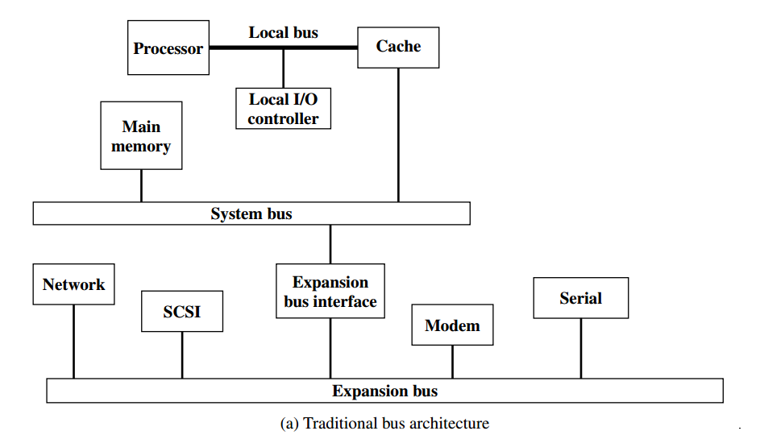

可以直接将I/O控制器与system bus相连。但是为了提高性能，通常与`expansion bus`相连。
`expansion bus` 将system bus和I/O控制器之间的交互的数据缓存在`expansion bus`上。
如此的设计可以让系统支持更多的I/O设备， 并且屏蔽内存直接与处理器交互.

Traditional Bus Architecture图中也画了几个连接在`expansion bus`上的I/O设备：
- network: LANs, WANs
- SCSI (small computer system interface): for local disk drives and other peripherals
- modem:
- serial: printer or scanner

随着I/O设备对性能的要求， 使用了一种更`高速的bus`来整合系统的其他部分，使用一个bridge来连接此`高速bus`和处理器bus.
这种组织叫做: `mezzanine architecure`.如图所示.
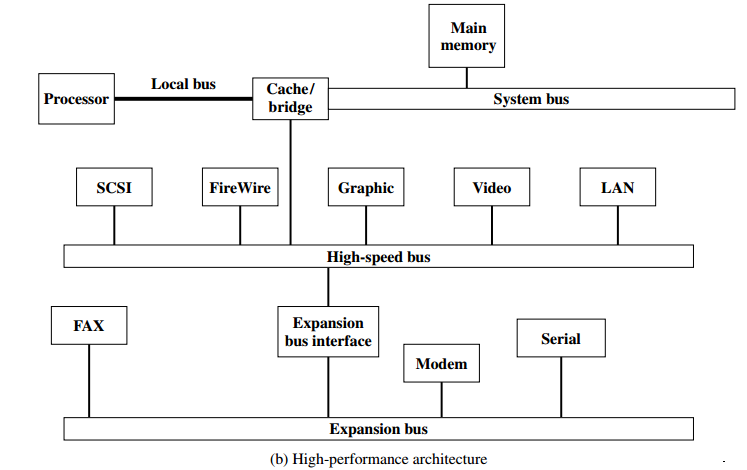

如此布局的优势在于`high-speed bus`把需要高性能的设备整合到处理器附近, 同时又独立于处理器.

`Elements of Bus Design`

有一些关键的参数用来区分不同的BUS 设计.

- Type: Dedicated, Multiplexed
- Bus Width: Address, Data
- Method of Arbitration: Centralized, Distributed
- Data Transfer Type: Read, Write, Read-modify-write, Read-after-write, Block
- Timing: Sync, Async

`Bus Types`

`dedicated bus line`被使用在单个功能上, 或者被使用在计算机组件中的某个物理子集上.

一种功能专用的总线例子就是使用分开的地址和数据总线.
这种方式也不是必须的, 如存在一种总线`Address Valid Control line`,
可以在上面传输地址和数据, 首先是先传输地址到`Address Valid Control line`上,此时其他的每个模块都会尝试拷贝这个地址以确认这个地址是不是自己的.
然后这个地址就从总线上删除了, 之后的数据传输也会服用这个总线, 这种将相同的总线用于不同目的的方式成为`time multiplexing`.

`Time multiplexing`的优势在于可以少使用总线lines, 缺点是需要每个连接在bus上模块实现更复杂的电路.
并且也可能存在某种程度上的性能损失, 因为毕竟一个总线lines上只能跑一个event.

`物理专用总线`的方式是指使用多条总线, 每条总线只连接到所有模块的一个子集.
一个典型的例子就是, 使用I/O总线连接I/O模块, I/O总线通过某种I/O适配模块再连接到`main bus`上.
`物理专用总线`的优势在于高吞吐量, 因为竞争少了. 缺点在于扩大了系统的大小和成本.

`仲裁方式`

可以超过一个模块需要访问总线, 如I/O模块需要不通过发送数据给处理器直接读写内存.
因为同一时间只能有一个模块传送数据, 因此需要一种仲裁方式.
可以分为两类: 集中式和分布式.
集中式方式存在一个硬件，叫做总线控制器或者仲裁器，负责分配总线的时间片.
这个硬件可以是单独的模块或者就是处理器的一部分.
分布式方式的话就没有控制器了,相反,每一个模块都包含了访问控制逻辑, 所有的模块一起通过这个访问控制逻辑来共享总线.
两种方式的目的都需要设计一个主设备, 可以是处理器或者I/O模块, 主设备可以用来启动数据传输(读或写)到其他设备上,这些设备作为从设备.

`TIMING`

`Timing`指用来协调总线上事件的方式. 一般用同步或者异步方式.

`Sync`: 事件的发生取决于时钟. 总线会有一个时钟线, 时钟会以相同频率的用它来传输bit序列.
一个1-0的传输成为一个`时钟周期`或者`总线周期`, 它定义了一个事件槽.
总线上的所有其他设备可以读取这个时钟线, 所有事件都在时钟周期的开始处发生.
有的总线信号可能会在时钟信号的上升沿发生变化（有短暂延迟）.
大部分事件占据单个时钟周期.
如图所示, 处理器在第一个时钟周期在地址线上放置了地址.之后开始检查status line.
一旦地址线稳定后，处理器发送一个地址使能信号。
对于读操作，处理器在第二个时钟周期的开始发送了一个读指令，某个内存模块识别了这个地址，在一个周期之后，将数据放在了数据总线上。处理器读取这个数据，然后丢弃读信号。
如果是写操作，处理器在第二个周期的开始先把数据放在地址线上，然后在数据线稳定之后发送一个写指令，内存模块在第三个周期拷贝数据。

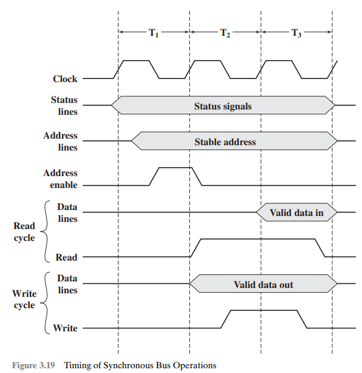

`Async`: 异步模式下，事件的发生随着或者取决于前一个事件的发生。

对于读操作，处理器首先将`地址`和`状态`信号放到总线上.
在等待这两个信号都稳定后，发送一个读指令，指示了地址和控制信号的有效性。
对应的内存模块解析到地址后，将对应的数据放到数据总线上，当数据总线稳定后，内存模块就`asserts the acknowledged line`以通知处理器数据已经就绪.
当`master device`读取了数据后，它`取消(deasserts)`读信号.
这将会导致内存模块去掉数据和`acknowledge lines`信号.
最后，master删除地址信息.

对于写操作，主设备随着状态和地址线信号一起将数据写入数据线，内存模块把数据拷贝之后`assert`确认线(acknowledge line), 主然后去掉写信号，然后内存模块去掉确认信号。

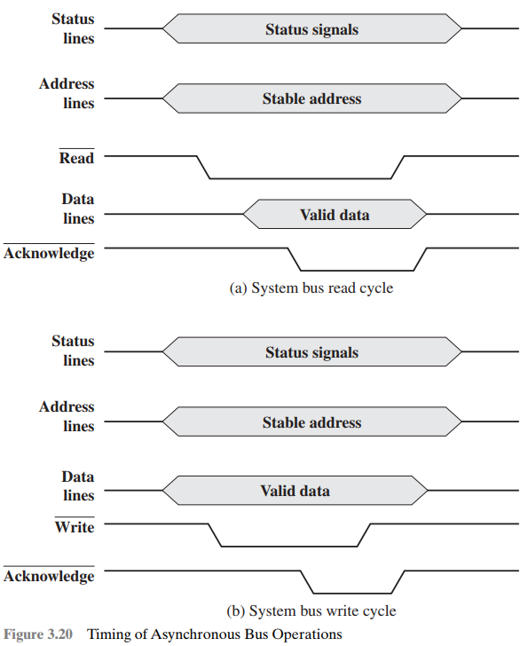

同步方式易于实现和测试，但是灵活性较异步方式差，因为所有设备都是同步的绑定在一个固定的时钟频率上，系统不能发挥高性能设备的优势.
采用异步方式的话,慢设备和块设备可以公用总线.

`BUS 宽度`

宽度影响两个方面, 一个是性能,一个是可以访问的地址空间大小.

`Data Transfer Type`

总线支持多种数据传输方式, 执法写(master to slave)和读(slave to master)操作.
如果是`multiplexed address/data bus`, 总线首先被用来传输地址, 然后传输数据.
对于读操作, 通常master需要等待slave fetch数据并放置到总线上.
不管是读还是写操作, 可能也需要等待仲裁结果来确认谁获取到了总线的控制权.

对于专用地址或者数据总线来说, 地址被放置到地址总线上后会保持直到数据被读取到总线上.
对于写操作, master在地址线稳定之后将数据放到总线.
对于读操作来说, slave它识别出地址并fetch完数据之后将数据放置到总线上.

还有一些总线允许的组合操作,如`read-modify-write`, `read-after-write`, 此地址在操作开始时只`broadcast`一次, 整个操作不可划分, 以放置其他master操作这个数据.

有些总线系统还支持数据块传输, 一次地址周期跟随了多个数据周期. 第一个数据就是所传输的地址对应的, 之后的数据就是地址之后对应的.

#### 3.5 PCI

## PART THREE THE CENTRAL PROCESSING UNIT

****

### Chapter 12 Processor Structure and Function

****

#### 12.1 Porcessor Organization

****

#### 12.2 Register Organization

****

#### 12.3 The Instruction Cycle

- `Fetch`:
- `Execute`:
- `Interrupt`:

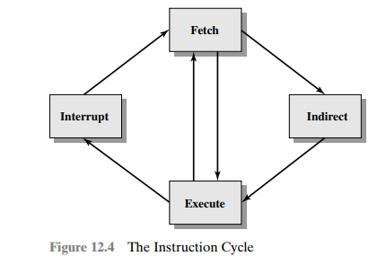

`Indirect cycle`  
在执行指令时需要使用地址去访问内存, 如果使用`indirect addressing`, 那么在生成访问地址时就可能需要访问内存.  
如图12.4中, 在fetch完一个指令之后, 会检查当前指令是否需要访问`indirect addressing`, 如果需要, 那么就进入`indirect cycle`.  

`Data Flow`  
四个基本的寄存器:  
- `MAR`: memory address register
- `MBR`: memory buffer register
- `PC`: program counter
- `IR`: instruction register

首先看`Fetch Cycle`的 数据流:  
`PC`里存着当前要fetch的指令地址, 将该地址传到`MAR`, 然后放到`地址总线`上, 控制单元(CU)请求一个内存读, 内存读取结果会被放到`MBR`, 然后被移动到`IR`, 同时`PC`向前一步.  

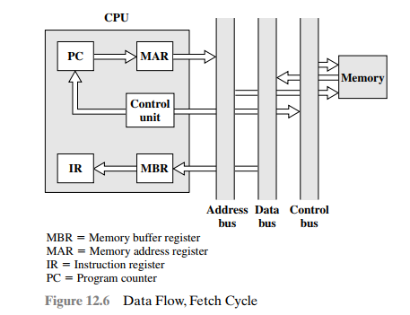

然后`CU`查看`IR`中的指令, 如果`operand`使用的是`indirect addressing`, 那么进入`indirect cycle`:  

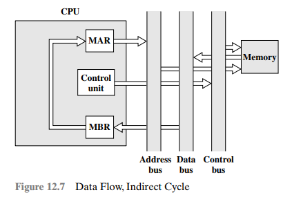

***

#### 12.4 Instruction Pipelining

****

# Memory Barriers: A Hardware View for Software Hackers

## Author 
Paul E. McKenney Linux Technology Center IBM Beaverton April 5, 2009

## Structure of Cache
现代CPU比现代内存系统快得多, 2006年的CPU可以在一纳秒执行10条指令, 但是访问一次内存却需要几十纳秒.  
因此一般CPU上会带有cache.
一般会使用多级cache, 一级cache的访问时间可以接近一个时钟周期, 大一点的二级cache可能需要10个周期.  
数据在CPU cache和内存之间流动时使用的固定长度的块就是: `cache lines`.  `cache line`一般大小是2的指数, 从16-256bytes.  

`cache miss`: 访问一块内存时, 当CPU cache中不存在时就出现了`cache miss`, 当出现cache miss时, CPU可能会`stall` 或者`wait` for `hundreds of cycles` while the item is fetched from memory.

`capacity miss`: 当cache满了之后, 新的访问出现的cache miss叫`capacity miss`, `capacity miss`会导致evicting of existing caches.  

`write miss`

`communication miss`

## Cache Coherence Protocols

## Store Buffers and Invalidate Queues

****

# A Primer on Memory Consistency and Cache Coherence
## 1 Introduction to Consistency and Coherence
许多现代计算机系统和多核芯片都支持硬件层面共享内存.
在共享内存(shared memory)的系统中, 每一个处理器核都可能会读写某个共享的地址空间.
这些设计可以达到像高性能, 低功耗, 低成本的优点.
当然, 如果没有`正确性`的保证, 这些优点就变的一文不值. 正确的共享内存直觉上可能是很简单的事, 其实在定义, 设计和实现一个正确的共享内存系统时都存在很多的微妙的边缘场景需要考虑.
并且这些细节必须在硬件实现上掌握.
做学术的也应该掌握这些细节以使得他们的设计方案是可以正常工作的.

我们和许多其他人都发现将`shared memory correctness`分成两个子问题是很有用的: `consistency` and `coherence`.
计算机系统可以不做此区分, 但是这可以帮我们`divide and conquer`复杂问题, 并且这种区分也揭示了许多真正的`shared-memory` 实现. 

定义`shared memory correctness`是`consistency(memory consistency, memory consistency model, or memory model)`的职责.
`Consistency`的定义为`loads` and `store`(或者内存reads and writes)提供一个规则, 限制它们如何在内存上进行操作. 理想情况下, 此定义是简单且易懂的.
但是此定义还是要比在单线程处理器上定义`memory correctness`要微妙得多.
单核处理器场景下定义的`correctness criterion` 将所有场景分为了两类: 唯一的正确结果和其他不正确的结果.
因为处理器体系结构要求单个线程的执行, 即便在乱序执行情况下, 必须将给定的输入状态转化为明确定义的输出状态.
而`shared-memory consistency model`考虑的是多个线程的读写操作, 通常允许多个正确的执行场景,禁止其他不正确的场景.
存在多个正确的场景是因为ISA(Instruction Set Architecture)允许多线程并发执行, 就会存在合法的不同线程间多指令交互的场景.
大量的正确执行场景复杂化了对一个执行的正确性判断.
不过无论在实现`shared memory`或者写出正确执行的程序上掌握`consistency`还是必要的.

和`consistency`不同, `coherence (cache coherence)` 对于软件在说既不是可见的也不是必须的. 但是作为支撑`consistency model`的一部分, 大量的主流共享内存系统都实现了`coherence protocol`. Coherence是为了寻求让共享内存系统中的cache和单核系统的cache一样功能上不可见. Correct Coherence保证了一个程序员是不可能通过分析load和store操作的结果来确定当前系统是否存在cache的. 这是因为correct coherence确保了cache不会产生新的不同的`功能性`行为(程序员还是可以通过比对存取操作时间来推测是否存在cache的).

在大多数系统中, `coherence protocols`在保证`consistency`上扮演了重要的角色. 因此虽然`consistency`才是本 primer的主角, 第二章首先对`coherence`简单介绍, 第二章的目的是为了解释`consistency model`是如何与`coherent cache`交互的, 但是不会深入到具体的`coherence protocol 实现`, 此部分在6-9章讨论. 在第二章中, 我们定义了一个不变量(invariant) `single-writer--multiple-reader(SWMR)`. SWMR要求任何时候, 对于某一个内存位置, 都只有`一个cache`用来写或者`一个或多个cache`用来读.

### 1.1 Memory Consistency Model
`Consistency Model` 在读写操作上, 抛开cache和coherence, 定义了正确的共享内存行为. 为了说的明白些, 举个例子. 一个大学的某门课程时间地点安排表可以在网站上查阅, 原计划在Room 152, 开课的前一天, `登记员`改成了Room 252, 登记员给`网站管理员`发了个邮件提醒他更新一下网站信息, 几分钟后, 他给注册了这门课的`学生`发了个邮件, 叫他们去`网站`上`查看`一下这个`新的上课地址`. 有可能出现这种场景: `网站管理员`很忙, 慢了一点, 某个刻苦的学生看到邮件立马去看了下网站, 结果还是152房间. 尽管`登记员`是以正确的`写`顺序[(注1)](#这里正确的写顺序是指先写的网站信息-再写的通知信息-主要还是因为从发送写到真正写入需要时间)进行的, 并且最后网站上信息也正确更新了, 但是这个刻苦的学生还是去错了房间. A Consistency Model定义了此行为正确(如果定义为正确, 那么就需要用户做其他事情以保证其不发生)或者不正确(那么系统就需要阻止这种ordering的发生).

Although this contrived example used multiple media, 当共享内存硬件使用了`out-of-order processor cores`, `write buffers`, `prefetching`, and `multiple cache banks`时也会出现此行为. 因此我们需要定义`shared memory correctness` -- 也就是哪些行为是允许的 -- 程序员知道什么行为是可以依赖的， 硬件实现的人知道应该提供哪些行为. 

`shared memory correctness`由`memory consistency model` 或者说`内存模型memory model`指定. 内存模型指定了哪些共享内存行为是被多线程程序执行时所允许的. 当多线程程序以某些数据为输入执行过程中, 内存模型指定了`dynamic loads`所返回的值会是多少, 以及指定了最终内存值会是多少. 和单线程执行不同, 多线程情况下会有多种行为被允许, 这也使得理解`memory consistency model`更困难.

第三章介绍`memory consistency model`的概念以及`sequential consistency SC`, SC是最严格并且最符合直觉的`consistency model`. 第三章首先指定共享内存行为的动机并且精确的定义了什么是`memory consitency model`. 然后深入探究了SC模型, SC要求多线程的执行应当看起来与这些组成线程交叉着顺序执行一样, 就像这些线程是在一个单核处理器上在不同时间片上执行的. 除此之外, 第三章正式定义了SC, 以及研究了如何使用`simple coherence`和`aggresive coherence`来实现SC, 以及MIPS R0000实例学习.

第四章我们越过SC, 更进一步介绍X86 和SPARC系统实现的`memory consistency model`. 此`consistency model`也叫做`total store order(TSO)`. 此模型的出现是因为使用了`FIFO write buffer`(`Write buffer`用于存储本来要写入cache line的数据[注2](basics.md#注2)). 此优化违反了SC, 但是它所带来的性能提升激发了体系结构定义`TSO`以允许此优化. 第四章中还会从SC正式定义TSO, 以及研究如何实现TSO, 以及和SC的区别.

最后第五章介绍`relaxed`或者说`weak` `memory consitency model`. 提出更宽松的模型是因为大部分内存顺序其实都是非必要的. 比如一个线程更新了10个数据, 然后更新一个同步标记, 通常情况下, 程序员不关心这10个数据是否被按顺序更新, 关心的应当是这10个数据的更新一定在同步标记的更新之前发生. `relaxed`内存模型放宽了内存序的限制, 并且提升了性能, 实现上也更简单. 之后, 第五章定义了`relaxed consistency model (XC)`. XC给了程序员更多的灵活性, 在XC模型下, 当程序依赖某种顺序时可以自己使用`FENCE`来实现(以上面的例子就是在更新完10给数据之后, 在写同步flag之前加一个FENCE). 第五章正式定义了XC, 并且说明了如何实现XC(使用了大量的多核间重排序以及`coherence protocol`). The Chapter then discusses a way in which many programmers can avoid thinking about relaxed models directly: if they add enough FENCEs to ensure their program is data-race free(DRF), then most relaxed models will appear SC. With SC for DRF, programmers can get both the (relatively) simple correctness model of SC with the (relatively) higher performance of XC. 如果想更深入了解的话, 此章节区分了acquire和release, 讨论了写原子性和因果关系(causality), 提到了商业例子(IBM Power)以及C++和JAVA中的模型.

回到现实世界中的`consistency`例子, 我们可以发现这个邮件系统, 网站管理员, 发邮件给学生等代表了一个极其宽松的`consistency model`. 为了防止这个刻苦的学生去错了房间, 登记员需要在发给网站管理员邮件之后和发给学生邮件之前加一个FENCE.

##### 注1.  
这里正确的写顺序是指先写的网站信息, 再写的通知信息, 主要还是因为从发送写到真正写入需要时间. 

##### 注2.  
引入`write buffer`或者`store buffer`是因为`cache coherence protocol`在多个CPU之间交互时会导致某个核 STALL(Wait), 引入write buffer可以避免等待(见[Memory Barriers: A Hardware view...](basics.md#store-buffers-and-invalidate-queues)).

### 1.2 Cache Coherence

如果多个核同时访问某个数据的多个副本(cache)并且有一个是写操作, 那么就会出现一致性问题.
考虑一个和`memory consitency model`相似的例子.
一个学生去网站上查看课程的地址位于Room 152 (reads the datum), 并且他把地址记在了自己的笔记本上(cache the datum).
之后, 改成被登记员改成了Room 252(writes to the datum).
此时这个学生的拷贝已经是过时的数据了, 这就是`incoherent` 场景.

读取过时的数据可以通过`coherence protocol`来避免.
此协议通过给分布在此系统中多个参与者定义一些规则来实现.
`coherence protocol`有几个变种, 在第6-9章中介绍.

第六章介绍了下`cache coherence protocols`的大背景, 给之后具体协议做铺垫.
本章介绍大多数`coherence protocol`都存在的问题, 包括cache控制器的分布式操作, 内存控制器以及`MOESI`的coherence 状态: Modified(M), Owned(O), Exclusive(E), Shared(S) and Invalid(I).
重点是, 这一张会提出一种表驱动(table-driven)的方法, 以说明这些协议(e.g. MOESI)中`稳定的`(stable)和`变换中`(transient)的coherence 状态.
在真正的实现中, `变换中的状态`是必须的, 因为现代系统中, 很少能够做到从一个稳定状态到另一个稳定状态的原子变换(e.g. 一次读cache返回 Invalid(I)时, 需要等待其他CPU把数据返回之后才能把Cache设置为Shared状态).
Coherence protocols的复杂性掩藏了这种变换中的状态, 就像处理器核的复杂性掩藏在了微体系结构的状态中一样.

第七章包含了监听cache coherence protocols, 这是当前商业化产品中主要使用的协议.
当出现cache miss时, CPU核的cache控制器会申请总线仲裁,并广播这个请求到共享总线.
共享总线保证了所有的cache 控制器都能够以相同的顺序觉察到请求, 因此每个控制器都可以协调他们自己的请求以维护全局的一致状态.
但是, 监听也会使问题变得更复杂, 因为系统中可能有多条总线, 并且现代总线可能会非原子的处理请求.
现代总线一般会有一个仲裁队列, 可以发送单发请求的回复, 可能有流水线延迟, 乱序等.所有这些功能会导致更多的`transient coherence states`.
本章也提到了几个例子`Sun UltraEnterprise E10000`和`IBM Power5`.

第八章深入研究了`directory cache coherence`协议.此协议比其他依赖于广播的监听协议支持更多的核.
有个笑话是这么说的: 所有的计算机问题都可以通过引入一层间接层解决.
`目录协议`就是这么做的: 一次`cache miss`可以向请求下层cache请求改地址, 下层cache就维护了这个目录, 这个目录就记录了地址与cache的对应关系.
基于此, 控制器可以自己回复请求者对应的cache或者询问其他控制器.
每个消息都只会有一个目的地(no broadcast or multicast).
但是从一个 stable coherence state 到另一个稳定的coherence state有很多`transient coherence state`, 这些状态产生的消息个数是系统中参与者个数是成比例的.
这一章首先介绍了下基本的目录协议, 然后讨论怎么处理MOESI状态 E 和 O, 分布式目录, 请求时更少等待, 可能的目录条目形式.
这一章也探究了如何设计目录, 包括目录缓存技术。
以及几个例子, SGI Origin 2000, AMD Hyper-Transport, HyperTransport Assist, Intel QuickPath Interconnect(QPI).

第九章讨论几个coherence 的高级话题。
为了方便介绍，前面的章节都故意的将coherence限制在简单的系统模型上。
第九章介绍更复杂的系统模型和优化，重点在监听和目录协议的常见问题。
初始话题包括 怎么处理：`instruction caches`, `multilevel caches`, `write-through caches`, `translation lookaside buffers(TLBs)`, `coherent direct memory access(DMA)`, `virtual caches`以及`hierarchical coherence protocols`.
最后讨论性能优化(targeting migratory sharing and false sharing)和directly maintaining the SWMR invariant with token coherence.

### 1.3 A Consistency and Coherence QUIZ
- In a system that maintains sequential consistency, a core must issue coherence requests in program order. True or false? (Answer is in Section 3.8)
- The memory consistency model specifies the legal orderings of coherence transactions. True or false? (Section 3.8)
- To perform an atomic read–modify–write instruction (e.g., test-and-set), a core must always communicate with the other cores. True or false? (Section 3.9)
-  In a TSO system with multithreaded cores, threads may bypass values out of the write buffer, regardless of which thread wrote the value. True or false? (Section 4.4)
- A programmer who writes properly synchronized code relative to the high-level language’s consistency model (e.g., Java) does not need to consider the architecture’s memory consistency model. True or false? (Section 5.9)
- In an MSI snooping protocol, a cache block may only be in one of three coherence states. True or false? (Section 7.2)
- A snooping cache coherence protocol requires the cores to communicate on a bus. True or false? (Section 7.6)

### 1.4 What this Primer Does not DO
- Synchronization. Coherence makes caches invisible. Consistency can make shared memory look like a single memory module. Nevertheless, programmers will probably need locks, barriers, and other synchronization techniques to make their programs useful
- Commercial Relaxed Consistency Models. This primer does not cover all the subtleties of the ARM and PowerPC memory models, but does describe which mechanisms they provide to enforce order.
- Parallel programming. This primer does not discuss parallel programming models, methodologies, or tools.
- ...

## 2 Coherence Basics
本章我们介绍coherence基本信息以方便理解consistency model如何与cache交互的.
2.1节介绍一个本书使用的系统模型. 这是一个简单的模型, 不过足以解释这些问题, 第九章才会描述更复杂的系统模型.
2.2节介绍需要解决的cache coherence 问题和这些问题是怎么产生的.
2.3精确定义cache coherence.

### 2.1 Baseline System Model
本书中的模型使用多核处理器, 共享内存.
所有的核都可以load store所有的物理地址.
系统模型基线是一个多核处理器芯片和片外主存.如图:

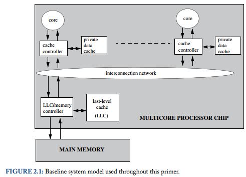

多核处理器包含了多个单线程核, 每个核有私有cache, 共享缓存(last-level cache LLC).
本书中指代的cache是指私有cache, 非LLC.
每个核的cache通过`物理地址`访问, 采用`写回策略`.
LLC虽然在芯片上, 但是其实就是一个内存侧的缓存, 因此不会引入coherence 问题.
LLC可以减少内存访问延迟增大内存的有效带宽. 也作为片上的内存控制器.

此系统模型基线省略了很多功能, 包括:
- instruction caches
- multiple-level caches
- caches shared among multiple cores
- virtually addressed caches
- TLBs
- coherent direct memory access(DMA)

也省略了多个多核芯片的场景.

### 2.2 The Problem: How Incoherence Could Possibly Occur
Incoherence 出现的概率只和一个基本问题有关: 有多个参与者会访问cache和memory.
在现代系统中, 这些参与者就是处理器核, DMA引擎和一些读写cache和memory的外部设备.
在本书接下来的部分, 我们只关注处理器核作为参与者, 但是记住还有其他参与者的存在.

下图介绍了一个incoherence的例子.

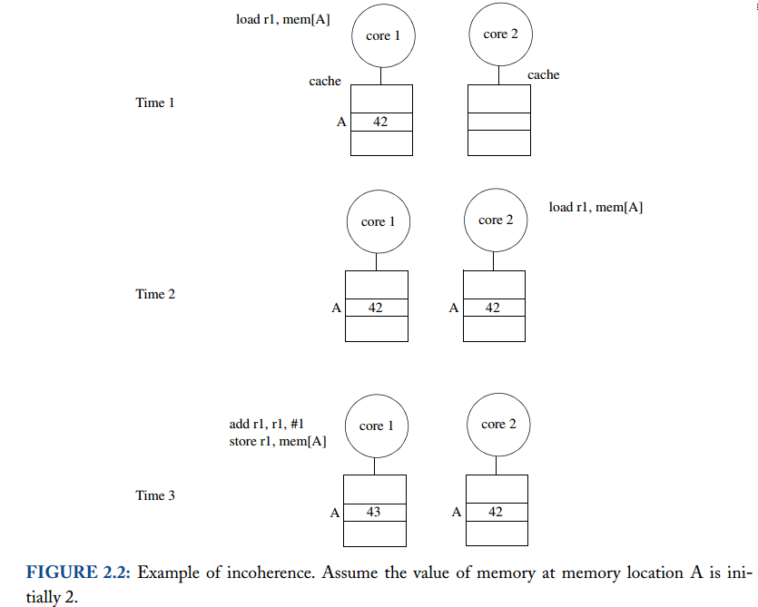

一开始, 内存地址A的值是42, 然后Core1和Core2都从内存load到自己的cache.
在时间3时, Core1将自己的cache中这个值改为43, 这使得Core2 cache中的值变得过时或者说Incoherent.
为了防止这种incoherence, 必须使用cache coherence protocol来规范化core的操作, 如在core1看到值成为43时, core2不应该看到旧值42.
Cache coherence protocol的设计和实现是第7-9章的主要内容.

### 2.3 Defining Coherence
2.2介绍的例子中直觉上不正确的地方在于多个参与者在同一时间观察同一个数据得到的值是不一样的.
本节, 我们将会把这种直觉转化为精确的coherence定义.
关于coherence的定义已经有很多版本.
我们倾向于给出一个更能够洞察coherence协议设计的定义.

coherence定义的基础是`single-writer-multiple-reader(SWMR)`条件.
对任意内存地址, 任何时刻, 要么只有一个核写(或者读), 要么多个核读.
可以通过下图来说明这个定义.

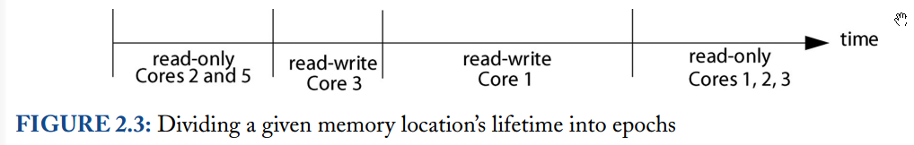

我们将一个内存地址的生命周期分为几个阶段(epoch).
每个阶段要么是单个核有读写访问, 要么有多个核(或者0)有只读访问.

除SWMR条件外, coherence需要另一条件: 某个内存地址的值是正确`传播的`(`propagated`).
还是看图2.3, 虽然SWMR条件满足了, 但是在第一个只读阶段, Core2和Core5是可以读到不同的值的, 那么这个系统就不是coherent的.
类似的, 如果Core1在第三阶段没有读到Core3写入的值, 或者Core1,2,3在第四阶段没有读到Core1写入的值, 那么也是Incoherent的.

因此, coherence的定义必须扩大SWMR条件, 添加一个`数据值条件(data value invariant)`.
`数据值条件`与该值如何从一个阶段传播到下个阶段有关.
此条件可以表述为: 某个内存地址的值在某一个阶段开始时的值应等于上一个该值的read-write 阶段结束时的值.

还存在许多这两个条件的相似解释.
一个不错的例子是使用tokens来解释SMWR条件[5]:
对每个memory location,存在固定个数的tokens至少是core的个数.
如果某个core有所有的token, 那么它可以写此地址, 如果有一个或者多个token, 那么它可以读.
因此任何时刻都不可能出现一个写和其他读同时存在的现象.

$$Coherence ~ ~~~Invariants$$

1. `Single-Writer, Multiple-Read(SWMR) Invariant.` For any memory location A, at any given time, there exists only a single core that may write to A(and can also read it) or some number of cores that may only read A.
1. `Data-Value Invariant`. The value of the memory location at the start of an epoch is the same as the value of the memory location at the end of its last read-write epoch.

#### 2.3.1 Maintaining the Coherence Invariants

绝大多数的coherence协议称为`invalidate protocols`, 通过显示实现来维护这两个条件.

如果a core想读某个地址, 它发送消息给其他cores以获取当前值, 并且保证没有其他cores将该地址cache为`read-write`状态.
这些消息会结束当前活跃的`read-write`阶段, 开启下一个`read-only`阶段.

如果a core想写某个地址, 如果这个core还没有将该值cache为`read-only`, 它将发送消息给其他cores以获取当前值, 以确保其他cores没有将改制cache为read-only或者read-write.
这些消息会结束其他活跃的`read-write`和`read-only`阶段,开启下一个`read-write`阶段.

#### 2.3.2 The Granularity of Coherence

A core可以执行 loads and stores at various granularities, often ranging from 1-64 bytes.
In theory, coherence可以在最细粒度执行load/store.
但是, coherence通常在cache blocks的粒度上维护.
实际上, the SWMR条件可以表述为: `对任意内存block`, 要么只有一个写, 要么多个读.
在平常的系统中, 一般不可能出现某个核写某个块的第一个字节, 同时其他核写这个块内的其他字节.
虽然使用cache-block粒度的协议很常见,并且也是本书假设的粒度, 但是我们需要直到还有很多协议在更细粒度上维护coherence.

****

$$Sidebar:~~Consistency-Like~~Definitions~~of~~Choherence$$

我们使用的coherence定义指定了两个条件，包括不同核对某个内存地址的访问权限和拥有特定权限的核之间怎么传递数据的值。
还有另一种定义，此定义集中在loads and stores操作, 类似于memory consistency models指定loads/stores 的`architecturally` visible orderings.

一个和consistency很像的描述coherence的方式与sequential consistency(SC)相关.
SC会在第三章详述. SC要求多线程执行的对不同地址的所有loads/stores操作必须是一个`Total Order(TO)`, 且此TO与 `Program Order(PO)`相同.
每个Load操作获取的值是在TO上最近的一次Store存入的值.

和定义SC类比的Coherence定义是这样描述的: Coherence要求所有线程对单个地址的loads/stores的顺序必须是一个TO, 并且TO与PO相同.

这两个定义可以看出Coherence和Consistency的差别: Consistency是针对所有内存地址, 而Coherence只针对单个内存地址.

另一个coherence的定义[1,2]定义了两个条件:

1. 每一次store的结果总是保证最终被所有核看到.
1. 对同一个地址的写操作是串行化执行的(所有核看到的顺序是一样的)

IBM 的Power架构使用了与此定义类似的定义, 某个核多个Store操作可能会被某些核看到(即可以在load时获取到新值), 同时存在某些核无法看到.

另一个coherence的定义是由Hennessy和patterson定义的[3].
此定义包含三个条件:

1. 某个核在load某个地址时, 所得到的值如果没有其他核写入过,那么就是上一次自己写入的值.
1. 某个核读取A时获取的值 .... 这个定义不大好,就不翻了.

****

#### 2.3.3 The Scope of Coherence

Coherence无论使用哪种定义都由特定的scope.
体系结构设计师必须知道什么时候适用,什么时候不适用.
有两个重要的scope问题:

1. Coherence 适用于所有在共享地址空间使用blocks的存储结构. 这些结构包括了L1 data cache, L2 cache, shared last-level cache(LLC), and main memory. 也包括L1 instruction cache和 Translation lookaside buffers(TLBs).
1. Coherence和体系结构无关(coherence is not architecturally visible). 严格的说, 系统可以是incoherent,但是只要服从于memory consistency model, 那么也是正确的(不过很难想象出一个系统是consistent但是不是coherent的)。还有一个更重要的推论：memory consistency model对coherence或者使用的协议没有限制。尽管如此，3-5章讨论的consistency model的正确性实现依赖于某些常见的coherence属性，所以我们在介绍consistency model之前介绍了coherence。

### 2.4 REFERENCES
[1] K. Gharachorloo. Memory Consistency Models for Shared-Memory Multiprocessors. PhD thesis, Computer System Laboratory, Stanford University, Dec. 1995.

[2] K. Gharachorloo, D. Lenoski, J. Laudon, P. Gibbons, A. Gupta, and J. Hennessy. Memory Consistency and Event Ordering in Scalable Shared-Memory. In Proceedings of the 17th Annual International Symposium on Computer Architecture, pp. 15–26, May 1990.

[3] J. L. Hennessy and D. A. Patterson. Computer Architecture: A Quantitative Approach.  Morgan Kaufmann, fourth edition, 2007.

[4] IBM. Power ISA Version 2.06 Revision B. http://www.power.org/resources/downloads/ PowerISA_V2.06B_V2_PUBLIC.pdf, July 2010.

[5] M. M. K. Martin, M. D. Hill, and D. A. Wood. Token Coherence: Decoupling Performance and Correctness. In Proceedings of the 30th Annual International Symposium on Computer Architecture, June 2003. doi:10.1109/ISCA.2003.1206999

## 3. Memory Consistency Motivation and Sequential Consistency
本章深入讨论memory consistency model. Memory consistency model 为程序员和硬件设计师实现者了共享内存系统的行为.
这些模型将行为的正确定义使得程序员知道可以依赖哪些行为，硬件实现者知道应该提供哪些行为.
首先我们给出定义内存行为的动机(3.1), 即memory consistency model应该做到什么(3.2), 然后对比consistency和coherence(3.3).

然后，我们研究下相对符合直觉的的`sequential consistency(SC)`.
SC很重要，因为他是很多程序员期望的共享内存行为，并且为理解更宽松的memory consistency models(将在之后的两个章节介绍)打下基础.
首先3.4介绍SC的基本概念. 3.5介绍正式定义. 3.5介绍SC的实现, 从简单实现开始 that serve as operational models(3.6).
3.7介绍基于cache coherence的基本实现.
3.8介绍基于cache coherence的优化实现.
3.9介绍atomic操作的实现.
3.10介绍MIPS R10000.

### 3.1 Problems with Shared Memory Behavior

看个例子, 本章所有的例子中所有的变量都初始化为0.

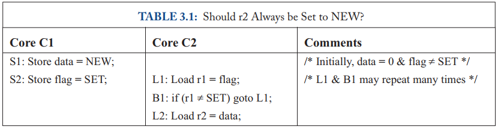

大多数程序员都期望C2's 寄存器r2值应该为`NEW`.
然而r2在如今的某些系统中可以是0.

硬件可以通过将C1的S1, S2重排序使得C2 load的值为0.
这种重排序看起来是正确的, 因为毕竟S1和S2操作的是不同地址.
非硬件专家可能愿意相信这种重排序会发生(如使用了非FIFO write buffer).

当重排序发生时, 可能的执行顺序是: S2, L1, L2, S1.
如图:

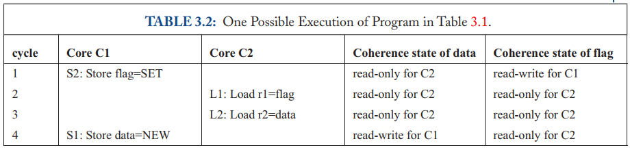

此执行满足SWMR属性, 所以incoherence并不是出现错误结果的内在原因.

****
$$SideBar: How~a~Core~Might~Reorder~Memory~Accesses$$
这里介绍下现今的处理器核乱序执行的几种方式.
Modern cores可能会乱序执行多个内存操作. 不过介绍两个内存操作的乱序执行足矣。
大多数情况下，我们只需要介绍一个核乱序执行两个内存操作，分别对两个地址。
比如sequential execution model，要求对同一地址的执行顺序必须和program order(PO)一致.
将可能的乱序执行分为三类.

- `Store-store reordering`
两次Store在非FIFO的CPU write buffer可能会被重排序, 使得这两个store操作的结束顺序和开始顺序不一致.
比如第一个和Store在cache miss了, 第二个store命中了cache, 或者和之前的某个Store合并了。
需要注意的是，这种reordering即便指令的执行是以program order执行的也会出现.
Reordering 对不同地址的store操作在单线程条件下没有效果。
但是在多线程情况下，就会有有问题。
Note that the problem is not fixed even if the write buffer drains into a perfectly coherent memory hierarchy.
Coherence will make all caches invisible, but the stores are already reordered.

- `Load-load reordering`
Modern dynamically-scheduled cores 可能会不以PO执行，如表3.1中的C2可以将L1和L2乱序执行，在多线程情况下reordering core2的L1和L2和reorderingCore1中的S1和S2一样的效果。如果没有B1的这种情况更可能发生。

- `Load-store and store-load reordering`
Out-of-order cores 可能会重排序单个线程的loads和stores(to different addresses).
Reordering 一个先执行的load和一个后执行的store(load-store reordering)会出现很多不正确的行为. 如在释放了锁之后load 某个值(假设store就是unlock操作).
Table 3-3说明一个Store-load reordering.
将C1的S1和L1以及C2的S2和L2重排序会产生反直觉的结果: r1和r2的结果都是0.
Store-load reordering在FIFO write buffer的实现中由于`local bypassing`也会出现. 即便指令是以PO执行的.

****

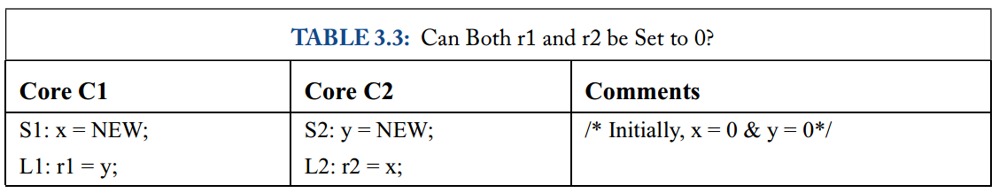

我们考虑另一个很重要的例子，此例子受`Dekker's algorithm`启发， 是为了保证互斥关系，见表3-3.
执行结束后， r1, r2被允许的值是什么？
直觉上会有三种情况:

- (r1,r2) = (0, NEW) for execution S1,L1,S2,L2
- (r1,r2) = (NEW, 0) for S2,L2,S1,L1
- (r1,r2) = (NEW, NEW) for S1,S2,L1,L2

Surprisingly, 大多数硬件，如X86系统, 从Intel和AMD,都允许(r1,r2)=(0,0).
因为他们使用了FIFO write buffers以提高性能.

与表3.1的的例子一样, 所有这些执行都满足cache coherence, 即便是(r1,r2) = (0,0).

有些读者可能会反对这个例子,因为它是非确定的(多种结果都是允许的), 因此可能是一个令人迷惑的编程习惯.
但是, 首先, 所有当前的多核处理器都默认就是非确定的.
所有体系结构都允许多种可能的多线程并发交互执行.
这种确定性的感觉有时候是存在的, 但是并不一直存在.
如通过正确的软件同步元语可以实现.
因此在讨论共享内存行为时, 必须考虑其非确定性.

并且, 内存行为是定义在所有程序的所有可能的执行上的, 包括哪些不正确的,故意为之的隐晦场景(for non-blocking sync algorithms).
第五章我们将看到用高级语言可以使得某些执行成为未定义行为.

### 3.2 What is a Memory Consistency Model?
The examples in the last sub-section illustrate that shared memory behavior is subtle, giving value to precisely defining 

- (a) 程序员可以期望的行为
- (b) 实现者可以使用哪些优化

A Memory consistency model disambiguates these issues.

Memory consistency model或者简单点memory model是指多线程程序在共享内存环境执行时所允许的行为的规范说明.
对于一个多线程程序使用特定的输入在执行时, memory model指定了那些`dynamic loads`可能返回的值或者某个内存最终的状态会是什么.
和单线程执行不同, 多线程执行时, 多种行为都可以认为是正确的. 正如接下介绍的SC.

通常, memory consistency model(MC)通过一些规则将`executions`分为两类, 一类是服从MC(MC executions)的, 一类是不服从MC的(non-MC executions). 
这种分类同时也将实现分为了两类.
An `MC 实现`是指那些只允许MC executions系统, a `non-MC 实现`允许两种executions.

最后, 我们其实一直在模糊`the level of programming`.

我们最初假设程序就是在硬件指令集体系结构上的可执行文件, 并且我们假设内存访问是通过物理地址访问的(我们不考虑虚拟内存和地址转换).
在第五章, 我们将会讨论哪些高级语言的问题(HLLs).
到时候我们会看到, 编译器给变量分配的寄存器会影响HLL memory model, 这种方式与硬件将内存访问重排序相似.

### 3.3 Consistency VS. Coherence
第二章定义了cache coherence有两个条件. 这里重复一下.
- The Single-Writer-Multiple-Reader(SWMR) 保证了任意时刻, 对某一个地址要么只有一个写或读, 要么有一个或者多个读.
- Data-Value 保证了对内存地址的更新会被正确传递, 即对内存值的cache总是能够反映最新的值.

可能有人会觉得cache coherence定义了shared memory behavior. 其实不然, 有三点理由:

- cache coherence的目的是为了让多核系统中cache的不可见性表现的和单核系统行为一样. 既然都不可见了, 那还能定义什么行为呢?
- Coherence 通常一次只管一个cache block. 在对多个cache blocks访问的交互上不关心. 而程序访问变量一般都通过很多的cache blocks.
- 可以实现一种没有coherence甚至cache的内存系统的.

虽然coherence并不是必须的, 但是大部分shared memory systems都基于coherent caches 实现了memory consistency model.
尽管如此, 我们认为应该将consistency实现和coherence实现分开.
为此, 接下来介绍的memory consistency 实现把coherence当做子过程调用.
比如, 会使用SWMR条件, 但是不关系是怎么实现的.

总结:
- Cache coherence不等于memory consistency
- A memory consistency 实现可以将cache coherence当做一个黑盒来使用.

### 3.4 Basic Idea of Sequential Consistency (SC)
最符合直觉的memory consistency model是`sequential consistency(SC)`.
SC最初由Lamport正式定义[8].
Lamport认为, 如果一个单核处理器执行的结果和将这些操作以PO执行的结果相同, 那么就是`Sequential`的.
如果一个多核处理器任何执行的结果和将每个核的执行以某种连续顺序执行的结果相同, 并且每个核的执行都是符合PO的, 那么称为`Sequential consistent`的.
这里定义的`Total Order(TO)` 就称为`MEMORY ORDER`.
在SC中, memory order反应了每个核的PO.
不过其他的consistency models的memory order可以和PO不一样.

下图是根据表3-1中例子的一个SC执行.
中间的下箭头表示Memory Order($<_m$), 每个核的下箭头表示它自己的PO($<_p$)

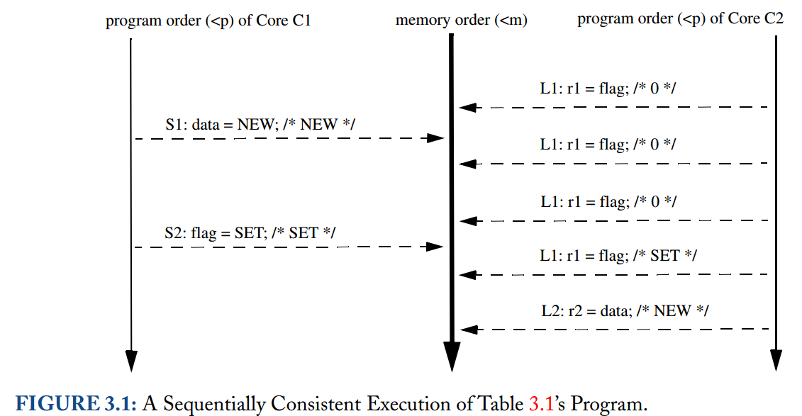

SC的Memory order和PO一致，即:

$$\forall op_1 <_p op_2 \rightarrow op_1 <_m op_2$$

此次执行的结果是r2为NEW，其实表3.1程序所有的执行r2都是NEW。

这个例子解释了SC。如果你觉得r2一定是NEW, 你可能已经独立发明了SC，虽然没有Lamport精确.

图3.2更好的解释了SC, 图中说明了表3.3中4中执行顺序。
图3.2(a-c)都是SC执行, 分别对应(r1,r2)=(0,NEW),(NEW,0),(NEW,NEW).
结果为(NEW,NEW)也有四种执行顺序,分别是{S1,S2,L1,L2}, {S1,S2,L2,L2}, {S2,S1,L1,L2}, {S2,S1,L2,L1}, 图3.2(c)仅是第一个执行顺序.
因此图3.2(a-c)一共是6种执行顺序.

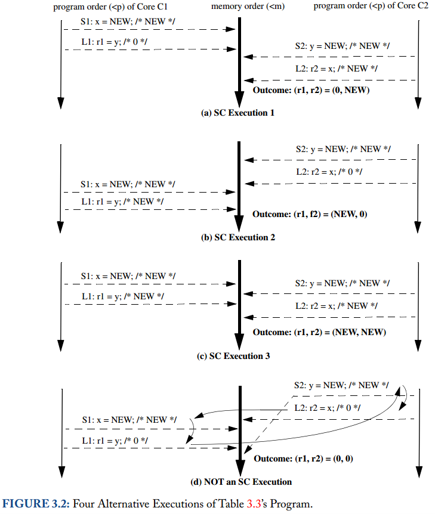

图3.2(d)是一个non-SC执行,结果为(r1,r2)=(0,0).
当memory order和PO相同时不可能得出此结果.

PO是: $S1 <_p L1$, $S2 <_p L2$

但是Memroy Order是: $L1 <_m S2$ (so r1 is 0), $L2 <_m S1$ (so r2 is 0)

把PO和Memory Order连到一起会发现其实形成了一个环, 这明显不是一个Total Order.

因此一个SC的实现必须允许前六种执行, 第7中执行必须禁止.

同时我们也发现了一个consistency和coherence关键区别.
Coherence作用于单个block, 而consistency作用于所有的blocks.
在第七章中我们会看到`snooping system(使用监听协议的系统)`保证了对所有blocks的coherence请求是一个TO. 虽然Coherence只需要对单个block的coherence请求是TO就行了.这种更加严格的限制在监听协议中实现SC是必须的.

### 3.5 A Little SC Formalism
本节, 我们更精确的定义SC, 以方便和之后介绍的更宽松的consistency model做对比.
我们使用`Weaver`和`Germond`定义中的notation: $L(a), S(a)$表示对地址a的load和Store, Orders $<_p, <_m$表示PO和内存序.
$<_p$是针对单核的一个TO, 它是指每个核逻辑上顺序执行操作的顺序.
$<_m$是全局的TO, 是指所有核内存操作的一个顺序.

****
An `SC execution`要求:
1. `所有核`对`所有地址`的Load/Store操作的Memroy Order必须和PO一致, 共有四种情况:
- If $L(a) <_p L(b) \rightarrow L(a) <_m L(b)$ /*Load->Load*/
- If $L(a) <_p S(b) \rightarrow L(a) <_m S(b)$ /*Load->Store*/
- If $S(a) <_p S(b) \rightarrow S(a) <_m S(b)$ /*Store->Store*/
- If $S(a) <_p L(b) \rightarrow S(a) <_m L(b)$ /*Store->Load*/
2. 每一次Load操作获取的值是在Global Memory Order中的上一次Store该地址的值.

$Value \enspace of \enspace L(a) = Value \enspace of \enspace MAX <_m \{S(a) | S(a) <_m L(a)\}$, 其中$MAX<_m$表示latest in memory.
****
Atomic read-modify-write(RMW)指令会对允许的executions做更多限制,将在3.9介绍.
如每次执行`test-and-set`指令, test的load操作, set的Store操作都必须保证在Memory Order上是连续的(consecutively)(没有其他对`任何地址`的内存操作).

我们通过表3.4总结SC, 此表展示了consistency model对program order的限制.
比如, 如果在PO上, 一个load操作之后跟了一个Store操作,即Operation 1是Load, Operation 2是Store, 那么在表中这两个操作的交叉点就有一个X.
即这两个操作必须以PO执行.

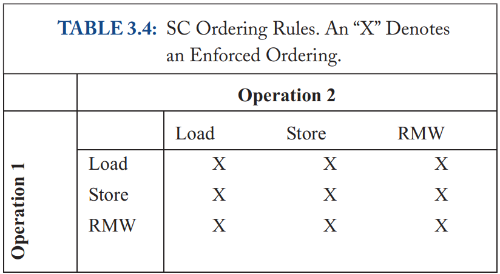

对SC来说, 所有的操作都必须以PO执行. 在后两章介绍的其他的consistency models, 对这些顺序会有更宽松的限制.

An SC implementation 只允许SC executions.
严格的说, 这是一个safety 属性(do no harm), 同时SC impl也需要liveness属性(do some good). 一个SC实现应该至少允许每个程序都可以有一个SC execution. 也就是说防止饥饿和增加公平性也是很有必要的. 不过这些不是这里需要讨论的.

### 3.6 Naive SC Implementations

SC有两个简单的实现可以更简单的理解SC所允许的executions.

#### The Multitasking Uniprocessor

首先, 可以将一个用户级多线程程序放到一个顺序执行的核上.
线程T1的指令在核C1上执行, 直到上下文切换到线程T2.
在做上下文切换时, 任何pending内存操作必须在切换到其他线程之前结束.
可以看到所有的SC规则都满足.

#### The Switch
第二个, 可以这么实现SC, 使用a set of cores Ci, a single switch, and memory. 如图3.3.

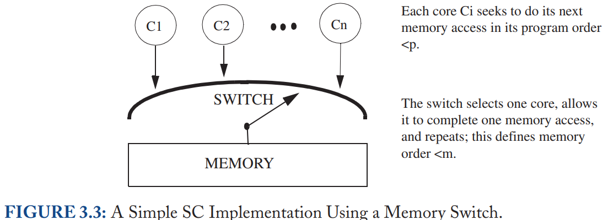

我们假设每个核将内存操作都以PO传给switch.
每个核可以使用任何优化手段, 此手段不会影响每个核向switch传递内存操作的顺序.
如, 可以使用`5-stage` `in order`流水线, 带`分支预测`.

我们假设the switch每次选择一个核, 让load或者store操作完整执行, 然后重复上述过程只要还有请求存在.
The switch可以以任意方式选择核执行, 只要不会有饥饿现象.

#### Assessment(两种方法的评估)
好消息是这两种方式是可以实际实现的模型, 且定义了
- 允许的SC executions
- SC 实现的黄金准则.

The Switch方式也证明了实现SC可以不需要cache和Coherence.

坏消息是, 随着核增多时, 性能都不怎么样, 而这些不利因素让某些人觉得SC不可能实现true paralell execution. 其实不然, 走着瞧.

### 3.7 A Basic Impl with Cache Coherence

Cache Coherence使得SC实现可以将non-conflicting loads and stores完全在并发下执行. (conflicting操作是指对同一地址的多个操作中至少有一个Store操作)

这里, 我们将coherence视为一个黑盒, coherence实现了SWMR.
在使用level-one(L1) cache场景下，我们使用：
- state `modified(M)` 表示可以被单个核读写的`L1 block`.
- state `shared(S)`表示可以被一个或多个核读取的`L1 block`.
- `GetM`和`GetS`表示以`M`或者`S`的方式获取某个`block`的`coherence request`.

我们还不需要深入的了解coherence是怎么实现的.第六章及后几章会介绍.

图3.4(a)将图3.3中的`switch and memory`替换成了一个`cache-coherent memory system`的黑盒.
每个核都保证发送request给此`cache-coherent memory system`时都遵循`PO`.
此`memory system`对同一个核都是在完全结束上一个请求之后才会处理下一个请求.

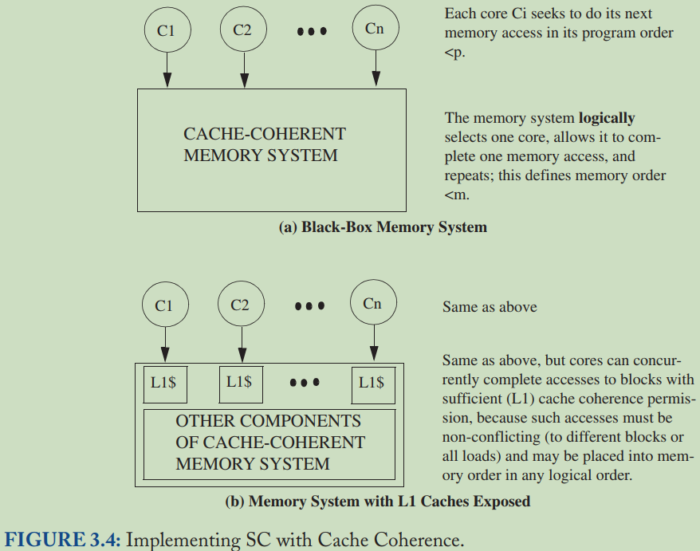

图3.4(b)将memory system这个黑盒打开了一点, 加上了L1 cache.
此内存系统可以在某个核对某个block有正确的coherence permission时允许load或者store操作(state M or S时可以读, M时写).
并且, 此内存系统可以并发的响应不同核的请求, 主要对应的L1 cache有正确的permissions.
比如, 图3.5(a)画的的时在四个核进行内存操作之前的cache状态.
这四个操作都没有冲突, 所以可以完全可以使用各自的L1 cache来并发的完成操作.
图3.5(b), 我们可以随机的给这些操作排个序, 就可以obtain a legal SC execution model.
更一般的说, 那个可以直接由L1 cache满足的操作(如想读, L1已经是S状态, 想写, L1已经是M状态)总是可以被并发执行, 因为coherence保证SWMR, 也就不会存在冲突的操作.

Assessment

We have created an implementation of SC that:

- 完整使用了cache在latency和bandwidth上的优势.
- 和所使用的cache coherence一样具有可扩展性.
- 将实现cores和实现coherence区分开来.

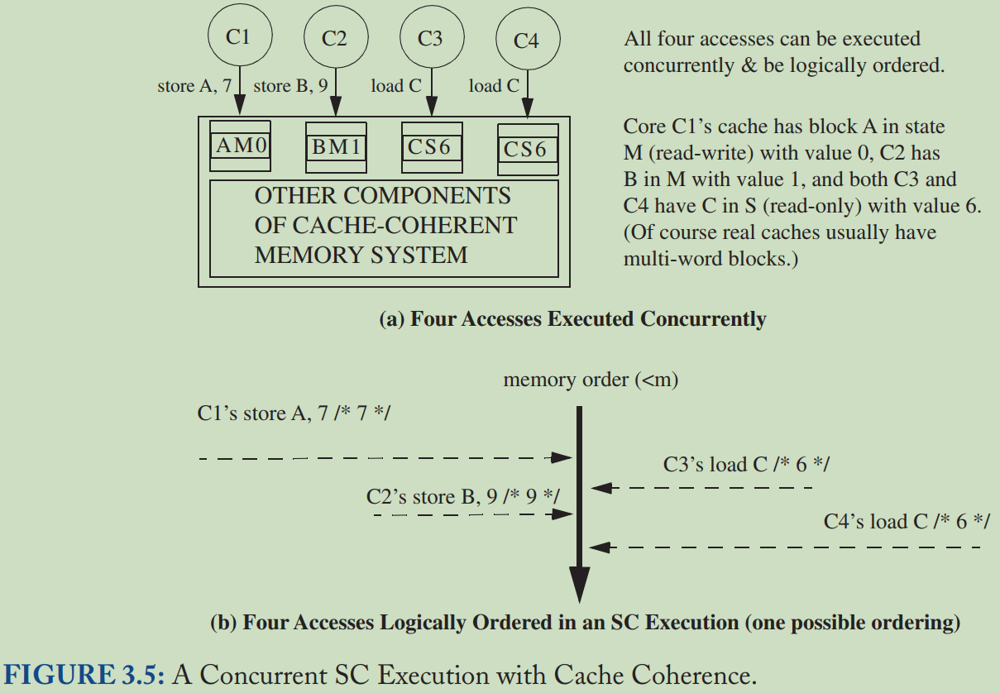

### 3.8 Optimized SC Implementations with Cache Coherence

大多数真正的核实现都比我们介绍的基本的使用cache coherence实现SC更复杂.
一般处理器都会使用如: `prefetching`, `speculative execution`, `multithreading`等特性以提高性能并容忍内存访问的延迟.
这些特性都和内存接口交互, 接下来我们讨论这些特性如何影响SC的实现.

#### `Non-Binding Prefetching`

A 对block B 的`non-binding prefetch` 是指一个对`coherent memory system`的请求, 以改变B在所有cache中的coherence state.
或者说, prefetches是通过软件, core hardware, 或者cache hardware发起的请求, 以改变L1 cache中block B的状态来允许之后的loads或者stores操作, 比如可以通过GetS请求以允许读取, GetM请求以允许写入.
重要的是: `non-binding prefetch`不会改变寄存器或者block B的状态.
`non-binding prefetch`的效果只限制在`cache-coherent memory system`内.
因此`non-binding prefetch`对于memory consistency model来说就是`no-op`.

`只要loads和stores都是以PO执行的就行, 具体成功获取到coherence permission的顺序是无关紧要的.`

实现上可以使用`non-binding prefetch`, 并且对memory consistency model无任何影响.

#### `Speculative Cores`

考虑一个核执行所有指令都以PO. 但是使用了分支预测. 因此可能在分支预测失败时发生回退.
这种回退的loads或者stores操作可以被做成和`non-binding prefetches`一样 . 这样也就满足了SC.
一个预测的Load操作可以被放到L1 cache中, 要么未命中(分支预测失败), 那么其实也就多了一次`non-binding GetS prefetch`.
要么命中了, 那么直接返回对应的值.
如果这个Load被回退了, 处理器丢弃寄存器修改, 抹去load操作的任何功能效果, 使得和没有发生过一样.
但是不会undo `non-binding prefetch`, 因为undo操作是没有必要的, 并且如果之后的指令会读取这个地址, 那么读取操作就不用发送GetS请求了.
对于Store操作, 处理器可能会发送一个`non-binding GetM prefetch`, 但是store操作在真正commit之前不会写入cache中.

****
`Flashback to Quiz Question1:` In a system that maintains SC, a core must issue coherence requests in program order. True or false?

`Answer`: False! A core may issue coherence requests in any order.
****

#### `Dynamically Scheduled Cores`

很多现代处理器动态的乱序发射指令, 比静态的以PO发射指令的处理器性能要高.
一个单核处理器如果使用乱序`scheduling`, 那么就必须保证`true data dependences`.
但是在多核处理器中, `dynamic scheduling`引入了一个新问题: `memory consistency speculation`.
比如两个Loads操作, L1 L2, L2地址时使用L1的地址计算来.
很多处理器会预测性的先执行L2, 然后L1, 这些处理器预测这种reordering不会被其他核看到. 如果看到了就违反了SC.

这种预测为了保证满足SC就需要处理器检查这种预测是否是正确的.
Gharachorloo [4]提出了两个技术来执行这种检查.
第一个: 预测执行了L2之后, 在L2 commit之前, 核可以检查该访问的block是否已经离开cache, 只要此block还在cache中, 那么就可以保证在load操作执行和commit之间值未发生变化.
为了执行这种检查, 核可以通过跟踪每次被evicted出去的block和收到的coherence requests, 和L2操作的地址进行比较.
收到GetM coherence request表示另一个核可能会乱序观察到L2操作, 并且会回退该预测操作.

第二种检查方式是：在核已经准备要commit该load操作时，重新执行(replay)每一个`speculative load`.
如果在commit load时获取的值和之前做`speculative load`时的值不同， 那么当前预测是错误的。
在上面的例子中，如果replay load操作获取的值和之前的load操作获取的值不同，那么`load-load reordering`就导致了其他核可能看到不一样的执行顺序，当前预测执行需要被回滚.

#### `Non-Binding Prefetching in Dynamically Schedulled Cores`

`Dynamically scheduled` core 可能会碰到load 或者 store时以非PO出现cache miss.
比如, 假设PO是: Load A, Store B, Store C.
The core可能会以`out of order`方式执行non-binding prefetches, 如GetM C,然后GetS A和GetM B并发执行.
`SC并不受non-binding prefetches的顺序影响.`
`SC只要求一个core的load和store操作在访问其L1 cache时是以PO访问的`
`而 Coherence保证了在收到loads和stores操作的时候, L1 cache处于正确的状态`

即 SC(或者任何其他的memory consistency model):

- 指示了loads和stores操作在coherent memory上执行的顺序, 但是
- 并不指示`coherence activity`的顺序.(如GetM等请求)

****
`Flashback to Quiz Question 2:` The memory consistency model specifies the legal orderings of coherence transactions. True or false?

`Answer:` False!
****

#### `Multithreading`

多线程核的执行应该在逻辑上和以下情况相同: 多个核通过一个switch共享L1 cache, cache可以选择给哪个核提供服务.
另外,每个cache可以支持并发的接受非冲突的请求. 因为它一定是以某种顺序执行的.
有一个挑战是要保证线程T1直到其他核的线程能够读取之前, 不能读取到同一个核的其他线程T2的store值.
Thus, while thread T1 may read the value as soon as thread T2 inserts the store in the memory order(e.g., by writing it to a cache block in state M), it cannot read the value from a shared `load-store queue` in the processor core.

### 3.9 Atomic Operations with SC

写多线程程序时, 经常需要同步多个线程的操作, 这种同步操作经常使用原子操作.
原子操作如指令`read-modify-write(RMW)`, `test-and-set`, `fetch-and-incrment`, `compare-and-swap`.
这些同步指令可以用来实现`spin-locks`以及其他同步元语.
比如实现一个`spin-lock`, 可以使用RMW来原子的检查锁是否unlock了, 然后进行lock.
为了让RMW是原子的, RMW的读写操作必须是连续执行的, 并且顺序是在SC要求下的TO.

在微处理器体系结构中实现原子操作指令是`conceptually straightforward`的, 但是原始的实现会带来原子指令的性能问题.
简单且正确的实现应当首先`lock the memory system`(防止其他核访问该内存), 然后执行读写操作. 这个实现虽然正确并且符合直觉, 但是牺牲了性能.

RMW的更激进实现应当充分利用SC的特性: 仅要求所有请求满足一个TO.
于是RMW就可以这么实现: 首先某个核将自己的cache中某个内存block的状态设置为M(如果此block还不在cache中时), 然后这个核就可以直接读写自己cache了, 而不需要任何coherence messages或者总线锁.
然后在store之后开始等待其他核发来的对当前block的coherence requests.
此处的等待不会产生死锁, 因为store操作一定是会完成的.

****
`Flashback to Quiz Question 3:` To perfrom an atomic read-modify-write instruction, a core must always communicate with the other cores. True or false?

`Answer`: False!
****

一个更优化的RMW实现在不违反原子性的前提下，可以在load和store操作之间允许更多的时间。
当某个block在cache中是`read-only`状态时，RMW的Load部分可以直接执行，同时cache controller发起升级到`read-write`状态的请求.
当成功切换到`read-write`状态之后，RMW的Store部分可以执行。
只要原子性能够保证，这种实现就是正确的.
为了检查原子性是否得到了保证，可以通过检查此cache中的block是否在load和store之间的时间内被evict出去. 此`speculation support`和检查SC是否`mis-speculation`类似(Section 3.8).

### 3.10 Putting It All Together: MIPS R10000

The MIPS R10000[18]是一个`venerable`,但是简洁商业化的预测微处理器实现，它基于`cache-coherent memory hierarchy`实现了SC.
此处我们主要研究下R10000是怎么实现memory consistency的.

R10000是一个四路超标量RISC处理器，包含了分支预测和乱序执行.
支持`writeback L1 data/instruction cache`, 同时支持统一(off-chip)的L2 cache.

此芯片的主要系统总线接口支持4个核的`cache coherence`.图3.6.

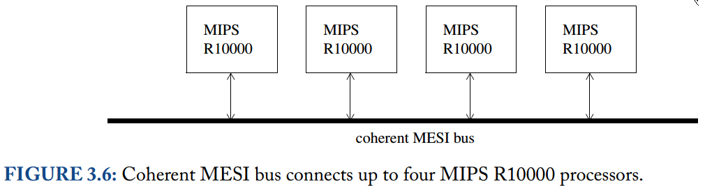

在执行时，R10000以`PO`发起loads和stores操作到`address queue`.
Load操作在写入实际地址或者cache之前会从上一次store获取值.
Loads和Store操作都是以PO 进行commit的，然后回去`address queue`中删除对应的entry.
如果要commit一个store操作，L1 cache必须已经获得了M状态，并且写入操作必须和commit是一个原子操作.

重要的是，在对cache block做eviction操作时，可能由于coherence invalidation或者给其他block腾空间，如果此cache block包含了在`address queue`中的某个load操作的地址, eviction时会将load操作和之后的所有指令都回滚, 然后重新执行.
因此当load最后commit的时候，所load的block需要在开始执行直到commit期间持续存在与cache中，所以load操作获得的值和commit时获取的一样.
因为Store实际上是在commit的时候写入值, R10000逻辑上都是以PO发起load和store请求到coherent memory system的, 因此也就实现了SC.

### 3.11 FURTHER READING REGARDING SC

## 4. Total Store Order and X86 Memory Model

一个广泛实现的memory consistency model是`total store order(TSO)`. 如SPARC和x86.
首先通过介绍SC的限制来介绍TSO/486的动机4.1.
然后正式介绍TSO，以及怎么实现TSO.之后介绍原子操作实现和强制指令顺序。

### 4.1 Motivation for TSO/x86

处理器常使用`write(store) buffer`来存储committed store的值，直到剩下的内存系统可以处理此store操作.
当store commit时，值被放入store buffer中，当此block在cache中状态为read-write coherence state时，可以从store buffer中取出，写入cache.
即store buffer用来存储哪些还没有获取到read-write coherence 状态的block的值. 因此store buffer隐藏了store miss导致的延迟.因为在store miss时，stall住某个核是没有必要的，因为store操作不需要任何其他信息，并且无论如何该值都会被写入到内存。

对一个单核处理器来说，可以通过保证load操作返回的值就是最近一次store存入的值来使得write buffer架构上不可见, 即便write buffer中对当前地址的store操作不止一个.
这种行为通常是通过`bypassing`的方式将`最近`的一次store操作返回给load操作, `最近`是通过PO决定的, 或者当store在write buffer中时拖延load操作.

在构造多核处理器时, 似乎使用多个核是很自然的, 每个核都使用自己的write buffer bypassing, 并且认为write buffers还是架构上不可见的.

其实这种观点是错误的. 考虑表3.3的例子, assume a multicore processor with `in-order` cores, 每个核有自己的write buffer, 以以下顺序执行代码:

- Core C1 执行S1时, 会将`NEW` 存入write buffer
- 同样的, core C2执行 S2时也会将`NEW`存入自己的write buffer.
- 然后, 两个核都执行预测Load操作, L1 L2都获取到了旧值0;
- 最终, 两个核的write buffer都使用`NEW`刷新内存.

结果就是(r1,r2) = (0,0).
此执行结果不符合SC, 如果没有write buffer, 那么是符合SC的, 但是加上write buffer却不符合SC了, 因此多核处理器下, write buffer在架构上不再是不可见的了.

然后由于write buffer给我们带来了很大的性能提升, 导致大家都不愿意去关闭write buffer.
另一个让write buffer再次invisible的方式是使用激进的SC预测实现, 不过这样增加了复杂度, 在SC违反检测和处理错误预测上会浪费很多电.

SPARC 和 x86 采取的措施是放弃SC, 直接给每个核都使用FIFO write buffer.
此新model, `TSO`, 允许结果: (r1,r2)=(0,0).
此模型可能会令很多人感到吃惊, 不过此模型在大多数情况下和SC行为一样, 并且对所有的场景都进行了明确的定义.

### 4.2 Basic Idea of TSO/x86

如前面介绍的, SC要求四种load和store的组合操作上的顺序都要符合PO, TSO其实就是把 STORE->LOAD这条排除了.

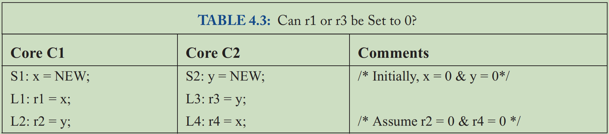
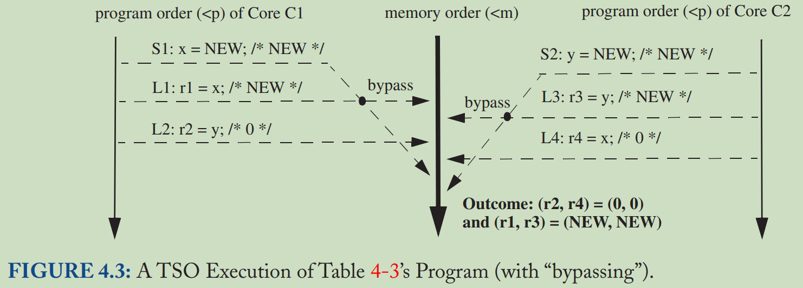

看上图的例子, C1的L1操作和C2的L3操作返回的值一定是刚刚自己存入的值, 因为有write buffer bypassing. 即单个核内部是保留了Sequential 机制的, 每个核必须能够看到自己的更改, 虽然此时可能别的核还都不能看到.

然而, C1的L2操作和C2的L4操作就不一定了, 其执行完全有可能和Figure4.3中一样, 导致返回的结果都为0;

### 4.3 A Little TSO Formalism And An X86 Conjecture

A TSO Execution requires:

- (1) 所有核的loads和stores操作的memory order和PO一致. 即使store和load操作的是不同的地址. 一共有四种场景:
  - $If ~ L(a) <_p L(b) \rightarrow L(a) <_m L(b) // Load -> Load$
  - $If ~ L(a) <_p S(b) \rightarrow L(a) <_m S(b) // Load -> Store$
  - $If ~ S(a) <_p S(b) \rightarrow S(a) <_m S(b) // Store -> Store$
  - $\sout {If ~ S(a) <_p L(b) \rightarrow S(a) <_m L(b) // Store -> Load}$ //Change 1: Enable FIFO Write buffer

- (2) 每个Load操作获取的值时上次store存入的值:  
$\sout {Value \space of \space L(a) = Value \space of \space MAX_{<_m} \{S(a) | S(a) <_m L(a)\}}$ // Change 2: Need Bypassing
$Value \space of \space L(a) = Value \space of \space MAX_{<_m}\{S(a)|S(a) <_m L(a) \space \bold{or \space S(a) <_p L(a)}\}$  
上面那个难以理解的公式是在说: Load操作的值是上一次Store操作存入的值:

  1. 该Store操作就是在Memory order上仅次于此Load操作的操作.  
  1. 在PO上此Store操作在Load操作之前, 但是在Memory Order上, 可能Store操作在Load操作之后. 并且此规则优先匹配(write buffer Bypassing覆盖了其他行为).

- (3) 使用FENCES来加强(1): Change 4: FENCES Order Everything  
任何操作与FENCE组合如 $OP <_p FENCE$ OR $FENCE <_p OP$ 都可以得到相同的Memory Order

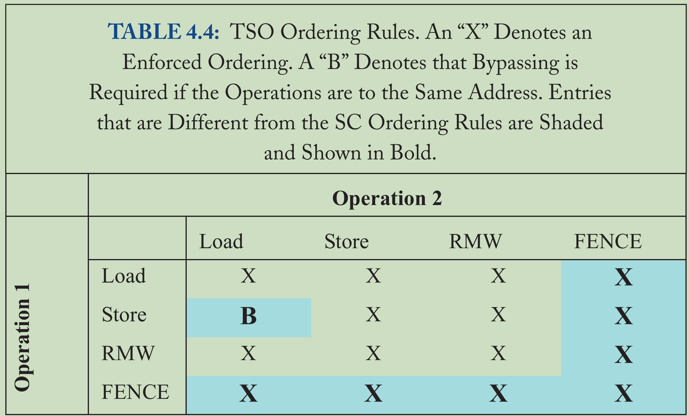

上图可以看出, 除了Store-Load操作和新加入的FENCE操作以外,其他和SC是一致的.
FENCES Order Everything, 这个没什么好说的了.
Store-Load操作交汇处B的意义是ByPassing, 即Store-Load操作的Memroy Order不要求和PO一致, 并且在一个核的Store和Load操作通过Bypassing可以使得虽然Store和Load操作的Memory Order不满足PO(即$Store <_p Load$, 但是$Load <_m Store$), 但是也可以使得Load操作获取的值就是Store存入的值, 如果是多个核的Store-Load, 那么Load操作获取的值一定是某个在Memory Order上在Load操作之前的Store操作, 即$Store <_m Load$.

### 4.4 Implementing TSO/x86

TSO的实现和SC类似, 不过给每个核加了一个`FIFO Store buffer`.

Memory Switch的方式实现如图4.4(a)所示: 

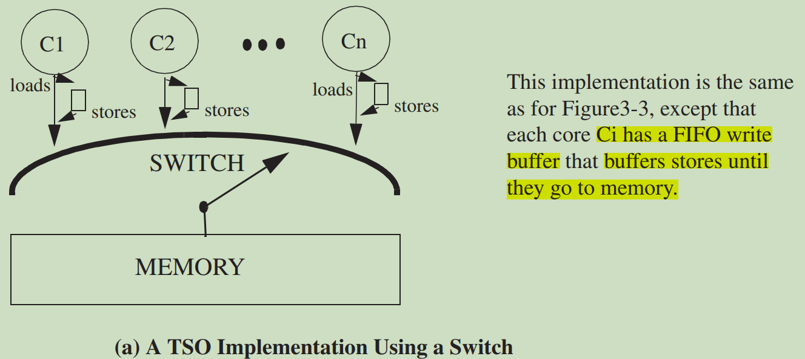
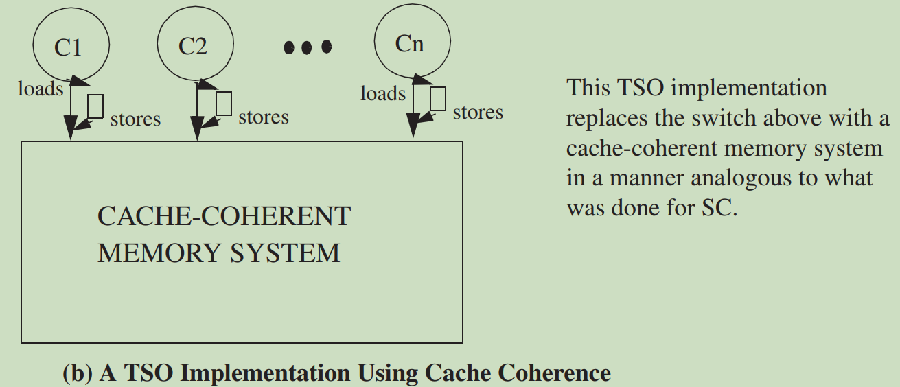

Switch实现要求:

- Loads 和Stores `leave` each core in that core's PO.
- A Load either bypasses a value from the write buffer or awaits the switch as before.
- A store enters the tail of the FIFO write buffer or stalls the core if the buffer is full
- When the switch selects core Ci, 那么要么执行下一个Load操作, 要么就执行write buffer头部的一个Store操作.

3.7节的SC实现中, 我们提到Switch可以替换为一个Cache coherent memory system.
并且处理器核可以是`speculative and/or multithreeaded and that non-binding prefetches could be initiated by cores, caches, or software`.

如图4.4(b)所示的, 将Switch替换为一个`cache coherent memory system`得到的结论可以和SC一样, 所有其他SC的属性, TSO也具有.
当前大多数的实现其实也就是在SC实现的基础上加上FIFO Write buffer.

多线程给TSO带来了一个新的关于write buffer的问题.
TSO write buffer对于每个线程来说都是私有的, 因此同一个core的某个线程的Load操作不能通过bypassing得到该核的其他线程的Store操作存入的值.
这种逻辑上的分开可以通过`per-thread-context` write buffer实现,或者使用共享的write buffer, 到那时tagged by thread-context id, 然后只有在tag match的时候允许bypassing.

****
`Flashback to Quiz Quiestion 4:` In a TSO system with multithreads cores, threads may bypass values out of the write buffer, regardless of which thread wrote the value. True or False?

`Answer:` False! A thread may bypass values that it has written, but other threads may not see the value until the store is inserted into the memory order.
****

### 4.5 Atomic Instructions and FENCEs with TSO

支持TSO的系统必须提供原子操作指令, 以及FENCEs指令.
在本节, 将会介绍如何在支持TSO的系统中实现原子操作指令以及FENCE指令.

#### 4.5.1 Atomic Instructions

在TSO中实现RMW指令的问题和SC中类似, 关键的区别是TSO可以允许load操作获取到之前的Store操作存入write buffer的值.
对RMW的影响就是`write`操作可能会写入write buffer.

我们考虑TSO中RMW指令就是一个Load操作紧跟着一个Store操作.
其中的Load操作不能越过之前的Load操作.
一种猜想是RMW的Load操作可能越过之前的某个Store操作, 但是这是不合法的, 因为如果RMW的Load操作越过了此Store操作, 那么RMW的Store也会越过此Store操作, 因为RMW是一个原子操作. 但是Store和Store操作必须保证顺序的, 因此此类现象不会发生.

因此, RMW的Load操作必须等到之前的Store操作完成(exited the write buffer), 原子操作RMW会`drains the write buffer` before it can perform the load part.
并且, 为了让RMW中的Store操作能够立即执行, 在执行Load部分时, 会直接获取`read-write coherence permissions`, 而不仅仅是`read coherence permission`.
最后, 为了保证原子性, cache controller 可能在load和store期间不会放弃coherence permission.

对上述实现也有一些优化. 如果write buffer中的地址当前core拥有`read-write` 权限, 并且直到RMW commit时保持该权限, 那么其实可以不用从write buffer中清除.
或者可以使用MIPS R10000一样的Load Speculation检查.

#### 4.5.2 FENCEs

支持TSO的系统对program order上的Store+Load操作没有要求执行时有一样的memory order.
但是却要求Load操作获取的值就是Store存入的值(显然, 当前只考虑`单个核内执行`, 因为只有单个核内的执行才会有明确的PO).

对于那些显示需要此两个操作的顺序的场景,可以通过FENCE指令来强制顺序.
FENCE的原理就是要求在FENCE之前的指令必须在FENCE之后的指令先被`ORDER`(先被ORDER的意义是先进入Memory Order).
因此, 实现了TSO的系统中, FENCE指令可以阻止Load操作的值是之前的Store bypassing的结果.

## 5 Relaxed Memroy Consistency

### 5.1 Motivation

#### 5.1.1 Opportunities to Reorder Memory Operation

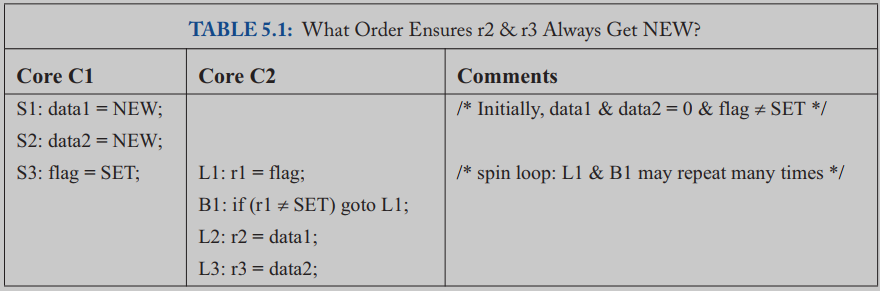

如表5.1所示, 大多数程序员都期望r2一定等于NEW, 因为S1在S3之前, S3在L1读取到为SET之前. 然后L2又在L1之后, 因此:

$$S1 \rightarrow S3 \rightarrow L1 \space loads \space SET \rightarrow L2$$

同样的, 大多数程序也期望r3一定也等于NEW, 因为:
$$S2 \rightarrow S3 \rightarrow L1 \space loads \space SET \rightarrow L3$$

除了上述的两个顺序之外, SC和TSO还要求:
$S1 \rightarrow S2$ and $L2 \rightarrow L3$.
保留这些顺序会限制对性能的优化, 然而这些另外的顺序对程序的正确执行是无关紧要的.

表5.2是两个核使用同一个锁进入了两个critical section.
Core C1在critical section1内的Lli和S1j的顺序是未知的.
同样, Core C2的critical section2内的L2i和S2j的顺序也是未定义的.

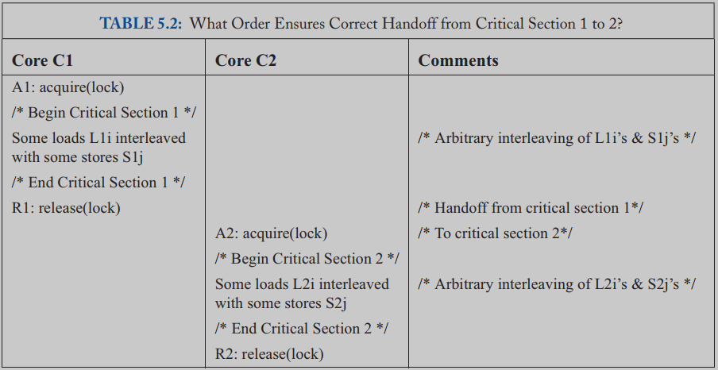

Proper operations不会依赖于每一个critical section内的Loads和Stores操作的顺序, 除非他们都操作同一个地址.

如果Proper operations不依赖于这些顺序, 那么就可以不限制这些顺序以得到更高的性能.

#### 5.1.2 Opportunities to Exploit Reordering

我们假设relaxed memory consistency model可以允许所有内存操作的重排序, 除非他们之间有FENCE.
因此此模型要求程序员指定哪些操作是需要限定顺序的.

##### 5.1.2.1 Non-FIFO, Coalescing Write Buffer

回想TSO使用了FIFO write buffer以提升性能. 它是通过隐藏部分或所有store操作开始执行到Commit的延迟.
使用non-FIFO write buffer可以允许联合多个writes(两个非连续执行的store操作对同一个地址时可以合并为一个).
但是, 非FIFO write buffer中合并多个Store操作违反了TSO中Store和Store顺序.

##### 5.1.2.2 Simpler Support for Core Speculation

SC中在speculation时,需要检查evicted cache blocks与哪些已经Load的但是还没有commit的地址进行比较,如果发现mi-speculation, 那么就要回滚.
而relaxed memory consistency model不需要这种比较.

##### 5.1.2.3 Coupling Consistency and Coherence

### 5.2 An Example Relaxed Consistency Model(XC)

XC assumes that a global memory order exists, as is tru for the strong models of SC and TSO.

#### 5.2.1 The basic Idea of the XC Model

XC只保证LOAD/STORE操作和FENCE的memory order和PO一致.
XC对同一个地址的操作维护了和TSO一样的规则:

- LOAD -> LOAD to same address
- LOAD -> STORE to same address
- STORE -> STORE to the same address

上面的规则可以防止出现比较奇怪的现象, 如STORE->STORE规则:
假如某个critical section执行A=1 then A=2, 如果没有STORE->STORE规则,那么有可能出现结束时A=1.
LOAD->LOAD规则, 加入B初始值为0, 某个线程执行了B=1, 那么当前线程执行r1=B, 然后r2=B, 不能得到r1=1, r2=0这样的结果. 仿佛B的值从新值变成了旧值.

XC也保证了load操作能够立即看到自己store操作存入的值,就和TSO的 write buffer bypassing一样.

#### 5.2.2 Examples Using FENCEs Under XC

#### Formalizing XC

An XC execution requires the following:

1. All cores insert their loads, stores, and FENCEs into the order $<_m$ respecting:
  - $If \space L(a) <_p FENCE \rightarrow L(a) <_m FENCE$ // Load -> FENCE
  - $If \space S(a) <_p FENCE \rightarrow S(a) <_m FENCE$ // Store -> FENCE  
  ...
即仅有FENCE和其他所有操作都有 $<_p \rightarrow <_m$

2. All cores insert their loads and stores to the same address into the order $<_m$ respecting:
  - $If L(a) <_p L'(a) \rightarrow L(a) <_m L'(a)$
  - $If L(a) <_p S(a) \rightarrow L(a) <_m S(a)$
  - $If S(a) <_p S'(a) \rightarrow S(a) <_m S'(a)$

3. Every load gets its value from the last store before it to the same address:
  Value of $L(a) = Value \space of \space MAX_{<_m} \{S(a) | S(a) <_m L(a) or S(a) <_p L(a)\}$ Like TSO

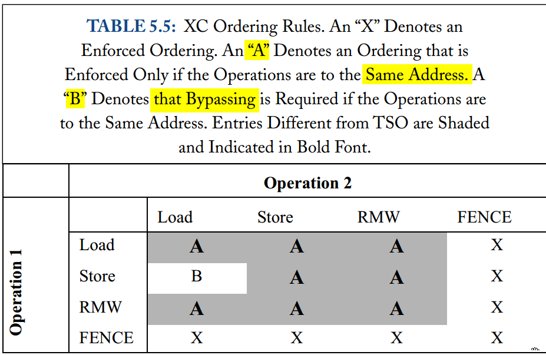

### 5.3 Implementing XC

#### 5.3.1 Atomic Instructions with XC

实现XC的原子操作RMW有很多种方式.
RMW的实现取决于如何实现XC,本节我们假设XC系统使用`dynamically scheduled cores`, 每个核通过一个`NON-FIFO coalescing write buffer`连接到`memory system`.

回忆一下TSO关于原子操作的实现, 在执行原子操作之前, 首先core drains the write buffer, 获取当前block的read-write coherence权限, 然后执行load和Store, 因为该block已经是read-write权限,因此store执行是直接写到cache, bypassing write buffer.
在 Load和Store之间, 如果当前核收到其他coherence request, 此核也不能将evict此block, 必须推迟到RMW的store执行之后.

如此实现肯定太过保守,牺牲了部分性能.
在XC里, drain write buffer是非必要的, 因为XC允许RMW的load和store部分越过之前的store操作.
于是简单的获取到read-write权限之后,直接执行load和store部分已经足够, 只要期间不释放该block的coherence 权限就可以.

在实现锁同步上XC和TSO有重要 区别.
TSO: RMW用于获取锁, store操作可以用于释放锁.
XC: 情况更复杂, 获取锁操作时, XC并不要求RMW指令不会与critical section内的指令乱序执行, 为了避免这种场景, 所获取操作之后必须加一个FENCE.
相似的, 释放锁操作也不会保证与上面的critical section内的指令乱序执行, 为了避免此情形, 释放锁之前也必须加一个FENCE.

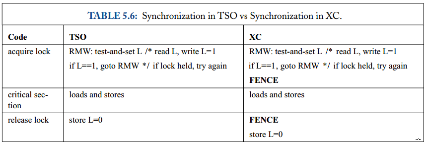

#### 5.3.2 FENCEs with XC

