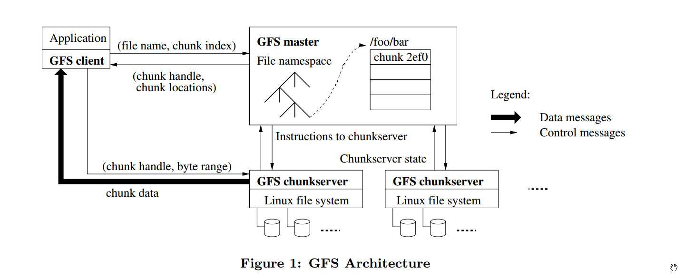
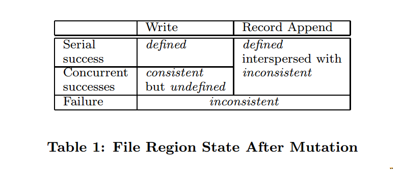
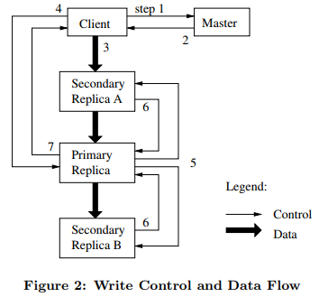
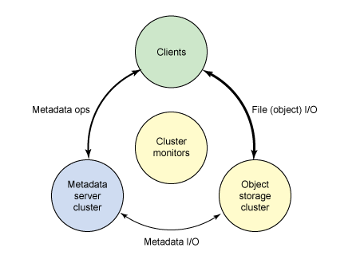
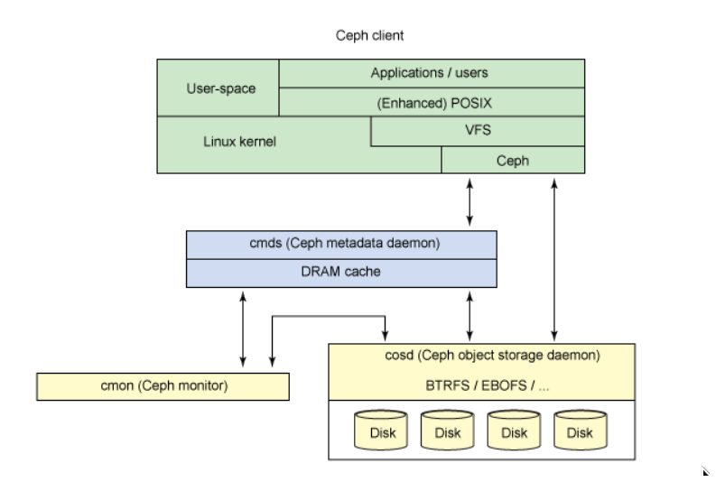

# Google File System

`key words`:

- Big, Fast
- Global
- Sharding
- Automatic recovery
- Deployed in Single data center
- Big sequential access(not random)
- Relaxed consistency model

Most files are mutated by appending rather than overwriting existing data.  
Randon writes are practically non-existent.  
Once written, the files are only read, and often sequentially.  

Neither the client nor the chunkservers caches file data.  
clients do cache metadata.  

## `Master Server`  

GFS have one `single master`.  
all meta data is kept in master's memory.  
Master Data  

- namespace
- access control information
- file name -> array of chunk handles
- chunk locations  
Master does not keep a persistent record of which chunkservers have a replica of a given chunk.  
It simply polls chunkservers for that info at startup.  
The master can keep itself up-to-date thereafter, 因为他控制了所有的chunk分配, 并且在monitor过程中通过HeartBeat Message更新这些信息.  
- handle -> list of chunk servers  
version number for every chunk server  
who is the primary chunk server and it's lease expiration time.  
- write LOG, CHECKPOINTS to Disk  
Logs are replicated on multiple remote machines.  
Master Server will respond to a client operation only after flushing the corresponding log record to disk both locally and remotedly.  
The Master batches several log records together before flushing.  
The Master checkpoints its state whenever the log grows beyond a certain size.  
The checkpoint is in a compact B-tree like form and can be directly mapped into memory.  
创建检查点的时候不影响正常的file mutations, 创建新的检查点时,master会切换一个log file, 并且使用一个新线程来创建检查点, 因此新的检查点会包含在此之前的所有mutation.  
创建检查点结束之后,会被写入本地磁盘以及远程磁盘.  
恢复的时候只需要读取最近的检查点,并且应用之后的日志.  

`Namespaces` and `file-to-chunk mapping` are also kept persistent by logging mutations to an `operation log` stored on the master's local disk and replicated on `remote machines`.  

`chunk locations` is only in memory.  

Master Functions  

- chunk lease management
- garbage collection of orphaned chunks
- chunk migration between chunkservers
- using heartbeat messages to monitor and instruct the chunkservers and collect states

## MASTER OPERATION

### `NameSpace Management and Locking`

GFS logically represents its namespace as a `lookup table` mapping full pathnames to metadata.  
With `prefix compression`.  
Each node in the namespace tree has an associated read-write lock.  
创建, 删除, rename,snapshot需要拿写锁,读取时拿读锁.
如,创建`/d1/d2/foo`, 需要拿`/d1`, `/d1/d2`的写锁,拿`/d1/d2/foo`的读锁.  

### `Replica Placement`

Spread chunk replicas across racks.  

### `Creation, Re-replication, Rebalancing`

`Creation`  
Master在创建新的chunk时考虑到:  

1. 每个chunk server的磁盘使用情况
2. 限制每个chunk server最近创建的chunk个数.  
由于业务场景大概率是创建完成之后就立马写入大量数据.  
3. spread replicas across racks.  

`Re-replication`  
当某个chunk的可用replicas个数掉到目标值之下或者用户调高了目标值时,master需要添加replicas个数.  
master给这些任务排了个优先级. 如差两个replicas的chunk会比差一个replica的chunk优先做`re-replication`.  
Master会挑选最高优先级的chunk做`Clone`操作.  
Master会通知某些chunkserver 从现有的replica上同步数据.  

`Rebalancing`  
Moves replicas for better disk space and load balancing.  

### `GARBAGE COLLECTION`

删除操作GFS不会立马回收磁盘资源,而是做了个rename,把数据藏起来了,之后会慢慢回收磁盘资源.  
In a similar regualr scan of the chunk namespace, the master identifies `orphaned chunks`(those not reachable from any file) and erases the metadata for those chunks.  

### `STALE REPLIC DETECTION`

Master maintains a `chunk version number` to distinguish between up-to-date and stale replicas.  
每当master grants a new lease on a chunk, `chunk version number`加1, 并且通知所有`up-to-date replicas`.  
Master 以及所有replicas会记录下version number,写入磁盘.  
此过程在提供写入之前完成.  

当某个replica错过了某次的`chunk version number + 1`, 那么他就是一个stale replica.  
Master 会在这些replica重启之后(如果他是挂了的话)收到replica发来的reports, reports 中包含他们现有的chunks and it's version number.  
Master removes stale replicas in it's regular garbage collection.  

As another `safeguard`, the master includes the chunk version number when it informs clients which chunkserver holds a lease on a chunk or when it instructs a chunkserver to read the chunk from another chunkserver in a cloning operation.  
The client or the chunkserver verifies the version number when it performs the operation so that it is always accessing up-to-date data.

### `READ OPERATION`  

1. name, offset ----> Master Server
2. Master Server Sends chunk handle and list of chunk servers to client  
client can cache the results  
3. Client talk to the chunk servers
4. chunk server returns the data

### `WRITE OPERATION`  

If no Primary on Master Server:  

- Find up to date replicas
- Pick one as primary, others as Secondaryes
- increments the version number of this chunk
- tell the primary and secondarys the new version number, and a lease
- Master writes version number to it's own disk
- master tells the client the primary and the secondarys chunk servers  

now client knows who to talk to  

- client talk to the primary to append the data
- primary picks the offset to append the data
- all replicas told to write data at the offset  
if all "succeed" then return to client OK  
else return NO to client

## `SNAPSHOT AND RECORD APPEND`  

### Snapshot

To make a copy of a file or a directory tree.  
With `copy-on-write`.  

1. When the master receives a snapshot request, it first revokes any outstanding leases one the chunks in the files it is about to snapshot.  
2. It ensures that any subsequent writes to these chunks will require an  interaction with the master to find the lease holder.  
3. After the leases have been revoked or expired, Master logs the opreation to disk.
Then applies this log record to its in-memory state by duplicating the metadata for the source file or directory tree.  The newly created snapshot file point to the same chunks as the source files.
4. Snapshot 结束之后,客户端读取此chunk时,master收到客户端请求之后,  
Master发现chunk C的reference count大于1,于是退出回复客户端,  
之后让每一个chunkserver做一个chunk $C$ 的拷贝$C'$, 之后的读取都从$C'$读取就可以了.  

### Record Append

GFS appends data to the file at least once atomically (i.e., as one continuous sequence of bytes) at an offset of GFS's choosing and returns that offset to the client.  
It's like `O_APPEND` to a file.  
It's often server as `multiple-producer/single-consumer` queues or contain `merged results from many different clients`.  
如果一条record写入会超过当前写入chunk的最大大小, 那么primary会首先pad 当前chunk 达到最大大小,然后通知secondaries也这样做,然后通知客户端在下一个chunk位置重试.

## `CONSISTENCY MODEL`

A relaxed consistency model.  

### Guarantees by GFS

- File namespace mutations(e.g., `file creation`) are atomic.  
They are handled exclusively by the master. (namespace locking)  
执行顺序由master写入的日志顺序来确定.  
- `CONSISTENT`  
A file region is `CONSISTENT` if all clients will always see the same data, 无论从哪个replica读取。  
- `DEFINED`  
After a file data mutation, if it is `CONSISTENT` and clients will see what the mutation writes `in its entirety`. (`DEFINED` is also `CONSISTENT`)  
example: If mutation succeeds without interference from concurrent writers, then the affected region is `DEFINED`  
也就是说所有的client都会读到相同的内容，并且内容就是`当前mutation所写入的内容`.  
- `UNDEFINED`  
成功进行的并发mutations会导致操作的数据是`UNDEFINED`, 不过肯定是`CONSISTENT`.  
所有client读到的数据是一样的,但是内容上`不能反映出是那一次mutation的修改`.  
Typically, it consists of `mingled fragments(交错的碎片)` from multiple mutations.
- `UNCONSITENT`  
A failed mutation makes the region `INCONSISTENT`.  
表现在不同的client在不同时间可能读到不同的数据.  

`Data mutations`:  

- write  
A write causes the data to be written at the application-specifid offset.
- record appends  
A record append cuases data to be appended `atomically` `at least once` even in present of concurrent mutations, but at the offset of GFS's choosing. The `offset` is returned to th e client and marks the beginning of a defined region that contains the record.  

可能某些mutations会在个别replica上执行失败,其他replica上执行成功.  
因为偏移是由`replicas中的primary`确定的,因此每一个replica在当前chunk写入的位置需要是相同的.  
于是那些写入失败的replica,在当前需要写入的位置是空白的,GFS会添加`padding`.  
失败之后,客户端可能还会接着重试,重试会在每个replica上又都执行一遍,于是某些replica上可能有重复的数据.  
当出现`INCONSISTENT`场景时就会有`padding` 或者 `duplicated records`.  

### Impliations for Applications

由于客户端会cache chunk locations, 于是客户端可能会从`stale replica`读取数据.  
`stale replica`: 可能丢失了某些mutation的replica.  
client cache有一个timeout,因此读取到`stale replica`的时间窗口会被这个超时限制.  

写入的数据record包含了checksums. A reader可以使用checksum识别并且丢弃多余的padding以及record fragments.  
如果客户端不接受重复数据那么，它可以自己使用the unique identifiers in the records来过滤.这些功能包含在了Client 库中.  

## SYSTEM INTERACTIONS

### Leases and Mutation Order

每一次mutation都是在所有的replica上执行的.  
The mater grants a chunk lease to one of the replicas as the `Primary`.  
The primary picks a serial order for all mutations to the chunk.  
As long as the chunk is being mutated, the primary can request and typically receive `externsions` from the master indefinitely.  
Master 也可能会收回lease,比如某个文件被重命名了.  

### Control Flow

1. Client asks the master which chunkserver holds the current lease for the chunk and the locations of the other replics.  
if no one has a lease, the master grants one to a replic it chose.  
2. The Master replies with the identity of the primary and the locations of the secondary replics.  
The client caches this data for futer mutations.  
Client will contact the Master again only when the primary becomes unreachable or replies that 当前primary 的lease已经过期了.  
3. Client pushes the data to all the replicas.
Each chunkserver will store the data in an internal LRU buffer cache.  
4. 当所有replicas都回复ACK之后,客户端`send a write request to the primary`.  
The primary assigns consecutive serial numbers to all the mutations it receives, possibly from multiple clients.  
The primary applies the mutation to its own local state in serial number order.  
5. The primary forwards the write request to all secondary replicas.  
Each secondary replica applies以相同的顺序应用.  
6. The Secondaries all 回复primary他们都已经执行完了.  
7. The Primary 返回给客户端.  
任何错误都会返回给客户端.  
发生错误时,可能是primary已经成功了,但是某些secondary replicas失败了.  
此时被修改的region处于`INCONSISTENT` state.  
失败发生时,客户端库会尝试从3-7重试,如果再失败几次之后会从头开始重试.  

如果写入的数据跨越了多个chunk时,客户端代码会拆分成多个write.  

### Data Flow

数据流和控制流是不同的. 数据流是以pipeline形成线性传递的.  

****

# Primary Backup Replication

`State Transfer`

同步所有`State`

`Replicated State Machine`

只同步`Operations`

How to apply to `multi-core` Replicated State Machine.  

- 同步 What State？
- How close the Syncs between Primary and Backups?
- Cut over if primary failed.  
- How to Handle Anomalies when we cut over the primary.
- How to create New Replicas?

****

# ceph

## Architecture

Ceph can be divided into four segements:  

- `clients`, users of the data,
- `metadata servers`, which cache and synchronize the distributed metadata
- `object storage cluster`, which stores both data and metadata as objects and implements other key responsibilities
- `cluster monitors`, which implement the monitoring functions.

metadata servers manage the location of data and also where to store new data.  
Metadata is stored in the storage cluster(as indicated by Metadata I/O).  
Higher level POSIX functions(such as open, close, rename) are managed through the `metadata servers`, whereas POSIX functions(such as read and write) are managed directly through the object `storage cluster`.  

The distributed storage system can be viewed in a few layers, including a **format for the storage devices**(the **Extent and B-tree-based Object File System**[EBOFS] or an alternative) and an **overriding management layer** designed to **manager data replication failure detection and recovery and subsequent data migration** called **Reliable Autonomic Distributed Object Storage**(RADOS).

`Ceph Client`  
A file is assigned an `inode number` (INO) from the meta dataserver, which is the unique identifier for the file.  
The file is carved into some number of objects(based on the size of the file) with different `object number`.  
`Object ID` OID is assigned accoring to the INO and ONO.  

Using a simple hash over the OID, each object is assigned to a `placement group`.  

The `placement group (PGID)` is a conceptual container for objects.  

The mapping of `placement group` to object storage devices is a pseudo-random mapping using an algorith called `Controlled Replication Under Scalable Hashing(CRUSH)`.  

`Ceph Metadata Server`  

Metadata server(cmds) is to manage the filesystem's `namespace`.  
MetaData server is actually a intelligent `metadata cache`.  

The metadata server transforms the file name into an inode, file size, and striping data(layout) that the Ceph client uses for file I/O.  

`Ceph Monitors`  
When object storage devices fail or new devices are added, monitors detect and maintain a valid cluster map. This function is performed in a distributed fashion where map updates are communicated with existing traffic. Ceph uses Paxos, which is a family of algorithms for distributed consensus.  

`Ceph object storage`  
Early versions of Ceph implemented a custom low-level file system on the local storage called EBOFS  
The B-tree file system (BTRFS) can be used at the storage nodes, which already implements some of the necessary features (such as embedded integrity).  

****

# Introduction to Reliable And Secure Distributed Programming

## Chapter 2. Basic Abstractions

Two kinds of abstractions will be of `primary importance`:  

1. those representing $processes$ and
1. those representing communication $links$.

And also the third abstraction:  
`failure-detector abstraction`: as a convenient way to capture resonable assumptions about the `timing behavior` of processes and links.

****  

### 2.1 Distributed Computation

#### 2.1.1 Processes and Messages

`Process`: The unit that are able to perform computations in a distributed system.

A system with $N$ different processes, named $p,q,r,s$ and so on.  
The set of processes in the system is denoted by $\Pi$.  
一般来说，这个process集合是static的，个数是不变的.  
每一个process都知道其他每一个process的身份.  
一般所有的process都使用相同的一套算法执行.  

The processes communicate by exchanging messages and the messages are `uniquely identified`, say, by their original sender process using a `sequence number` or a `local clock`, together with the `process identifier`.

#### 2.1.2 Automata and Steps

#### 2.1.3 Safety and Liveness

`Safety`: Basically, a `safety property` is a property of a distributed algroithm that can be `violated at some time` $t$ and `never be satisfied again` after that time.  
Roughly speaking, safety properties state that the algorithm `should not do anything wrong`.  
More precisely, a safety property is a property such that, whenever it is violated in some execution $E$ of an al, there is a partial execution $E'$ of $E$ such that `the property will be violated in any extension` of $E'$. This means that safety properties prevent a set of unwanted execution prefixes from occuring.

`Liveness`: Liveness ensures that eventually something good happens.

More precisely, a liveness property is a property of a distributed system execution such that, for any time $t$, `there is some hope` that the property can be satisfied at some time $t'\geq t$.

****

### 2.2 Abstracting Processes

#### 2.2.1 Process Failures

Possible failures range from `a crash`, where a process simply stops to execute any steps, over an `omission to take some steps`, a crash with subsequent recovery, to `arbitrary` and even `adversarial` behavior.

#### 2.2.2 Crashes

A process 当前正常执行所有的step, 包括与其他process较换Message, 直到时间$t$, 此Process停止执行任何内部step以及停止收发messages, 并且不再恢复.  
We call this a `crash fault`, and talk about a `crash-step` process abstraction.  

`Crash-stop` process abstraction并不意味着crash的process不会或者不应该recover, 只是说不依赖于此process recover.

#### 2.2.3 Omissions

An omission fault occurs when a process does not send (or receive) a message that it is supposed to send (or receive) according to its al.  
Omission faults are not discussed in this book.  

#### 2.2.4 Crashes with Recoveries

In this model, we say that a process is `faulty` 如果一个process crashes并且不再recover或者无限的反复crashing and recovering。  
否则的话我们称此process是`correct`的.

为了处理crash之后process 内在状态丢失的问题，`crash-recovery` abstraction 包含`stable storage(also called a log)`, which can be accessed through `store` and `retrieve` operations.

在recover的时候，我们假设当前process is aware that it has crashed and recovered.  
并且a specific $\lang Recovery \rang$ event is assumed to be automaticallt generated, 和 $\lang Init \rang$ 类似。  
$\lang Recovery \rang$ event应当在恢复处理其他任何event之前从stable storage获取relevant states.  
$\lang Init \rang$ 应当是atomic的，如果a process crashes in the middle of its initialization procedure and recovers, say, without having finished the procedure properly, the process resumes again with processing the initialization procedure and then continues to process the $\lang Recovery \rang$ event.

当`crash-recovery`模型把所有内部状态都写入stable storage，那么就成了`omission` abstraction.

`crash-recovery`模型可能存在一个问题就是当一个process内部的消息在传递给上层layer 模块执行时如果发生了crash， 那么在恢复之后，此process可能无法知道此消息是否已经被正确处理，有两种方式来处理此中情形：  

1. 不再传递消息， 而是将消息信息存放在上层模块可以访问的地方，由上层模块直接拿取。
1. 以一定频率反复投递消息，知道上层模块说不要再投递此消息为止，当然此种情况下上层模块需要处理重复消息的问题。

#### 2.2.5 Eavesdropping Faults

#### 2.2.6 Arbitrary Faults

Byzantine or malicious failures.

****

### 2.3 Cryptographic Abstractions

#### 2.3.1 Hash Functions

#### 2.3.2 Message-Authentication Codes

#### 2.3.4 Digital Signatures

****

### 2.4 Abstracting Communication

我们假设每个在Link上传递的message都有足够的信息能够唯一的识别出此消息。

我们假设消息的传递时一个`request-reply`的方式，并且能够识别出一个response消息是哪一个request的response. 

#### 2.4.1 Link Failures

下面介绍5中link抽象，3种由`crash-stop`实现，1种由`crash-recovery`实现，还有一种`Byzantine`实现。  
所有Link抽象都是`点到点抽象`。`广播抽象`在下一章介绍.  

1. `fair-loss links`: 简单说就是会有消息丢失，但是不会所有都丢失.  
1. `stubborn links`: 就是在fair-loss links基础上加上了retransmission.
1. `perfect links`: 也是在fair-loss links基础上加上了重试。
1. `logged perfect links`: 处理crash-recovery faults
1. `authenticated links`: 处理arbitrary faults.

#### 2.4.2 Fair-Loss Links

****
<DEF>Module 2.1: Interface and properties of fair-loss point-to-point links</DEF>  
Module:  
- Name: FairLossPointToPointLinks, instance $fll$.

Events:  
- Request:$\lang fll, Send ~ | ~ q, m \rang$: Requests to send message m to process q.
- Indication: $\lang fll, Deliver ~ | ~ p, m\rang$: Delivers message m sent by process p.

Properties:
- $FLL1$: `Fair-loss`: If a correct process $p$ `infinitely often sends` a message $m$ to a `correct` process $q$, then $q$ `delivers` $m$ an `infinite number` of times.
- $FLL2$: `Finite duplication`: If a correct process $p$ sends a message $m$ `a finite number of times` to process $q$, then $m$ `cannot be delivered an infinite number of times` by $q$.
- $FLL3$: `No creation`: If some process $q$ `delivers` a message $m$ with sender $p$, then $m$ `was previously sent` to $q$ by process $p$.
****

The `fair-loss` property guarantees that a link does not systematically drop every message. 因此如果发送个接受process都是correct的， 那么只要Sender一直反复发送一个消息， 那么这个消息最终肯定会被delivered.  
`Finite duplication` ensures that the network does not repeatedly perform more retransmissions than that perfromed by the sending process.  
`No creation` ensures that 网络上没有凭空创建新的消息，也不会破坏任何消息。

#### 2.4.3 Stubborn Links

#### 2.4.4 Prefect Links

#### 2.4.5 Logged Perfect Links

#### 2.4.6 Authenticated Perfect Links

#### 2.4.7 On the Link Abstractions

****

### Timing Assumptions

****

## Chapter 3. Reliable Broadcast

## Chapter 4. Shared Memory

## Chapter 5. Consensus

## Chapter 6. Consensus Variants

## Chapter 7. Concluding Remarks

****
# Keepalived

## 1. Atomic Elements
To ensure robustness and stability , daemon is split into 3 distinct processes.
1. A minimalistic parent process in charge with forked children process monitoring.
1. Two children processes, one response for VRRP framework and other for healthchecking.

### Watch Dog of parent process
The parent process monitoring framework is called `watchdog`,  the design is each children process opens an accept unix domain socket, then while daemon bootstrap, parent process connect to those unix domain socket and send periodic (5s) hello packets to children. If parent cannot send hello packet to remote connected unix domain socket it simply restarts children process.  
provides children processes monitoring (VRRP & Healthchecking)

### Kernel Components
Keepalived uses four Linux kernel components:

1. LVS Framework: Uses the getsockopt and setsockopt calls to get and set options on sockets.
1. Netfilter Framework: IPVS code that supports NAT and Masquerading.
1. Netlink Interface: Sets and removes VRRP virtual IPs on network interfaces.
1. Multicast: VRRP advertisements are sent to the reserved VRRP MULTICAST group (224.0.0.18).

### Control Plane
Keepalived configuration is done through the file keepalived.conf.
### Scheduler - I/O Multiplexer
All the events are scheduled into the same process.  
The design used here is a central select(...) that is in charge of scheduling all internal task.
### Memory Management
This framework can be used in two mode : `normal_mode` & `debug_mode`. When using `debug_mode` it provide a strong way to eradicate and track memory leaks. This low level env provides buffer under-run protection by tracking allocation and release of memory. All the buffer used are length fixed to prevent against eventual buffer-overflow.
### Core Components
Those libraries are : html parsing, link-list, timer, vector, string formating, buffer dump, networking utils, daemon management, pid handling, low level TCP layer4. 

### Checkers
Checkers are in charge of realserver `healthchecking`.  
A checker tests if realserver is alive, this test ends on a binary decision : `remove` or `add` realserver from/into the LVS topology.   
The internal checker design is realtime networking software, it uses a fully multi-threaded `FSM design` (Finite State Machine). 

### VRRP Stack
VRRP (Virtual Router Redundancy Protocol : RFC2338) is focused on director takeover, it provides low-level design for router backup. 

### System Call
This framework offers the ability to launch extra system script. It is mainly used in the MISC checker. In VRRP framework it `provides the ability to launch extra script during protocol state transition`. The system call is done into a `forked process` to `not pertube the global scheduling timer`.

### Netlink Reflector
Keepalived works with its own network interface representation. IP address and interface flags are set and monitored through kernel Netlink channel.

### SMTP
The SMTP protocol is used for `administration notification`.  
Administration notifications are sent for healthcheckers activities and VRRP protocol state transition.

### IPVS Wrapper

### Syslog
All keepalived daemon notification messages are logged using the syslog service.

## HealthChecking Framework

1. TCP_CHECK
1. HTTP_GET
1. SSL_GET
1. MISC_CHECK
This check allows a user defined script to be run as the health checker. The result must be 0 or 1. The script is run on the director box and this is an ideal way to test in- house applications. 

## Failover (VRRP) Framework