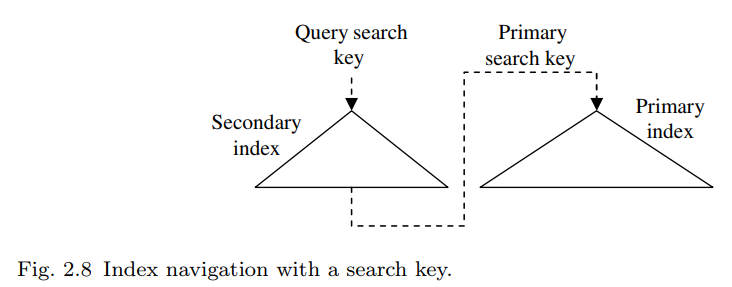

# Modern B-tree techniques

## Basics

### 关于B-tree的高度和算法

假设B-tree有$N$ records，$L$ records per leaf，那么B-tree拥有$N/L$个 leaf nodes。  
假设平均每个`branch node`拥有$F$个子节点, 那么`branch level`就是$log_F(N/L)$.  
比如一共9个叶子节点的（2-3）B-tree，每个branch node最多3个指针。  
$F=3$, $log_3 9 = 2$,一层branch 节点，加一层root，叶子节点这一层不算。  
`搜索`  
单值搜索复杂度计算时主要看二分查找的比较次数，直观上看需要：

- 在每个`branch node`需要比较的次数和每个node最多存放多少个指针相关, 可以记为: $log_2 F$，其中$F$为指针个数, 一共会经过$log_F(N/L)$个`branch node`, 因此一共进行了$log_F(N/L) \times log_2 (F)$此比较.  
- 在每个`leaf node`需要比较的次数和叶子节点中records的个数相关，可以记为: $log_2 (L)$, $L$为叶子节点records的个数.  
- 于是就有了总复杂度就是: $log_F(N/L) \times log_2 (F) + log_2 (L)$.  
可以整理为: $=log_2 (N/L) + log_2 (L) = log_2 (N)$  
- 因此影响比较次数的唯一因素就是`record count:` $N$  

如果是`range search`, 那么搜索就比较麻烦了，比如需要`父指针`, 此时可以使用`neighbor pointers`.  

- In order to exploit multiple asynchronous requests, e.g., for a B-tree index stored in a disk array or in network-attached storage, parent and grantparent nodes are needed.  
- Range scans relying on neighbor pointers are limited to one asynchronous prefetch at-a-time and therefor unsuitable for arrays of storage devices or for virtualized storage.

`插入`  
插入可能会导致`overflow`, 叶子会分裂成两个，parent需要插入一个新的node, 如果parent也`overflow`，那么这个过程一直向上传递, 如果传递到了root， 那么高度+1.  

上面说的这种分裂过程，`有的实现`会在传递到root的时候，会将老root节点作为新root，然后生成两个新的子node，将数据分布在这两个新的子node中.  

- This is a valuable technique if modifying the page identifier of the root node in the database catalogs in expensive or if the page identifier is cached in compiled query execution plans.  

在分裂时,选择哪个值作为parent的分割值是比较自由的, 当使用`variable-length-keys`的时候, 可以通过选择一个合适的值使得parent节点能够使用最少的分割值, 这样parent节点占用的内存最少.

`有些实现`会尽量延迟分裂操作,比如通过`load balancing among siblings`.  

`删除`  
`underflow`, 可以通过`load balancing`或者`merging with a sibling node`来使得除了root的所有节点都至少半满.  
`merging two sibling`可能会导致他们的parent `underflow`, 因此可能merge操作需要向上传递  
和`insert`一样，如果传递到root，那么高度-1.  
`有些实现`避免了`load balancing`以及`merging`的复杂度，而是不管`underflow`.接下来的插入或者`defragmentation`会解决`underflow`. 有文章认为periodic rebuilding of the tree is theoretically superior to standard $B^+$-trees, 并且在删除时做rebalancing 是有害的.  
`paper: Deletion without rebalancing in multiway search trees`

`更新`  
更新一般是删除原始数据和插入新数据两步.  
如果是`fixed-length fields`那么可以原地更新, 如果是`variable-length fields`那么更改可能会导致`overflow`或者`underflow`,那么行为类似于`insertion`或者`deletion`.  

`B-tree Creation`  

- random insertions
- prior sorting  

### B-trees In Database

- clustered index  

- non-clustered index  
each non-clustered index must contain a reference to a row or a record in the primary index.  
This reference can be search key in a primary index or it can be a record identifier including a page identifier.  
  
Both designs, have advantages and disadvantages. see `B-trees re-examined`

- reference by search key  
requires a root-to-leaf search in the primary index after each search in the secondary index.  
`B-tree keys must be unique`.  
Because each reference found in a secondary index must guide a query to exactly one record in the primary index--therefore, the search keys in the primary index must be unambiguous in the `reference-by-search-key` design.
- reference by record identifier  
faster access to records in the primary index after the search in the secondary index.  
However, when a leaf in the primary index splits, it's required many updates in all relevant secondary indexes.  
