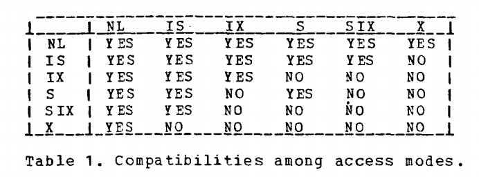
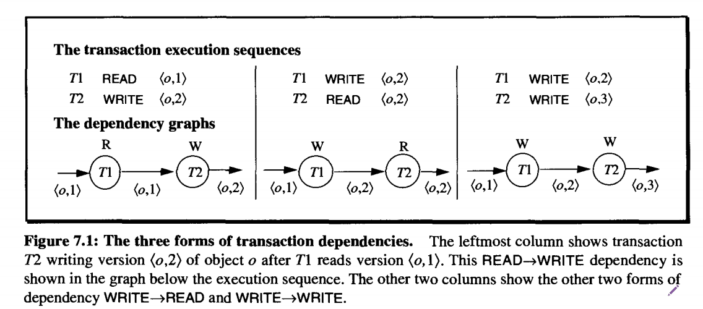
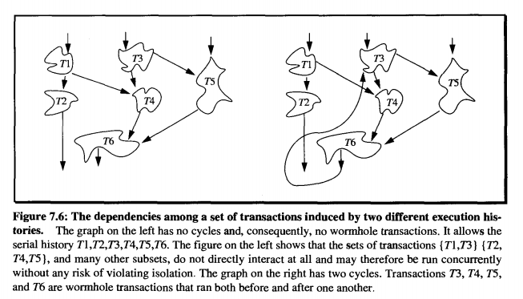
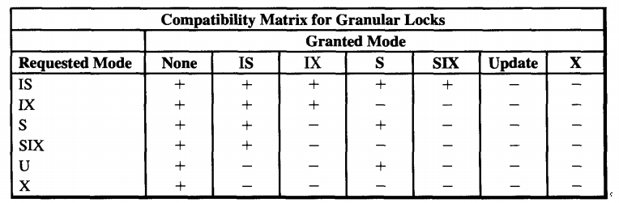
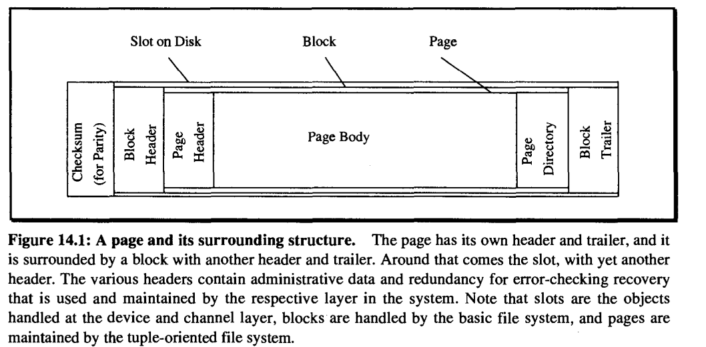
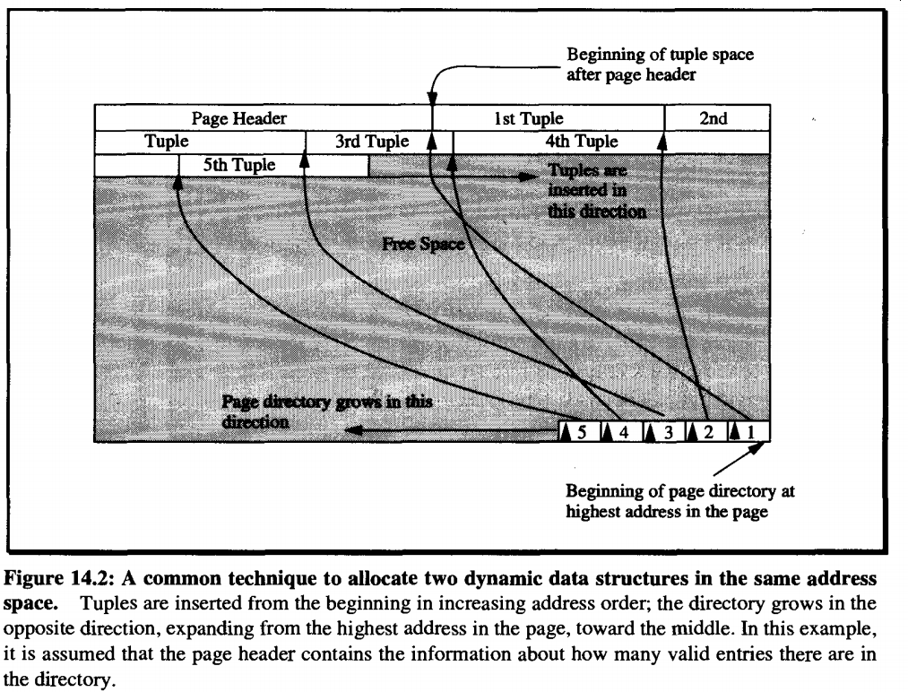
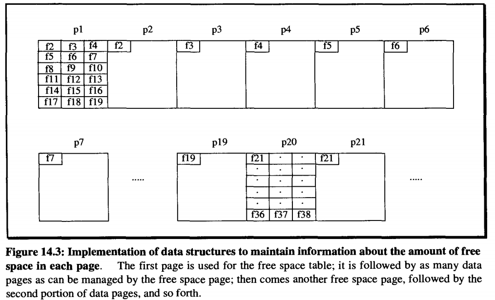
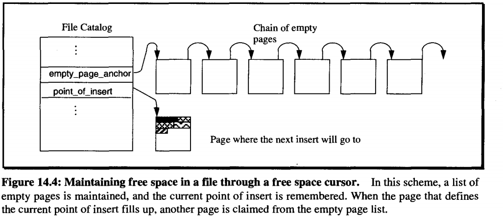

<link rel="stylesheet" type="text/css" href="../css/style.css">  

# Time, clocks, and the Ordering of Events in Distributed System

一个进程P就是分布式中的一个节点，每个进程内部的事件是可以排序的。  

## The Partial Ordering

定义关系`Happens before relation`, $a \rightarrow b$: $a$ , $b$ 是两个事件  

- 如果 $a$, $b$ 属于同一个进程P，并且 a 先，b 后，那么 $a \rightarrow b$.  
- 如果 $a$ 是进程P1中一个消息的发送事件, $b$ 是另一个进程P2中这个消息的接受事件, 那么$a \rightarrow b$.  
- 如果 $a \rightarrow b$, $b \rightarrow c$, 那么$a \rightarrow c$. `Means Transtive`  
- 如果 $a \cancel{\rightarrow} b$ 并且$b \cancel \rightarrow a$, 那么a,b是并发的.  
- $a \cancel \rightarrow a$ for any event. `Means irreflexive`.  

`Happens before relation` 是一个 `irreflexive`, `transtive` and `antisymmetric` partial ordering relation.  

## Logical Clocks

定义进程Pi在某个事件的时候会给这个事件分发一个逻辑时间.  
$C_i(a)$,表示 $P_i$ 进程给事件a分发的逻辑时间.  
$C(b) = C_j(b)$ 当b是属于 $P_j$ 的事件时成立.  

- 如果a和b属于同一个进程P, 并且a先,b后,那么$C_i(a) < C_i(b)$;  
- 如果a是$P_i$的发送事件,b是$P_j$中这个消息的接收事件,那么$C_i(a) < C_j(b)$;  

<BIG>Clock Condition</BIG>: <DEF>For any events a,b if $a \rightarrow b$ then $C(a) < C(b)$</DEF>

It is easy to see from our definition of the relation $\rightarrow$ that the <BIG>Clock Condition</BIG> is satisfied if the following two conditions hold.  
<DEF>C1. If a and b are events in process $P_i$, and a comes before b, then $C_i(a) < C_i(b)$</DEF>  
<DEF>C2. If a is the sending of a message by process $P_i$ and b is the receipt of that message by process $P_j$ then $C_i(a) < C_j(b)$</DEF>  

为了满足C1 和 C2, 分别提出了IR1 IR2.  
<DEF>IR1. Each process $P_i$ increments $C_i$ between any two successive events.</DEF>  
<DEF>IR2.  
(a) if event a is the sending of a message m by process $P_i$, then the message m contains a timestamp $T_m = C_i(a)$.  
(b) Upon receiving a message m, process $P_j$ sets $C_j$ greater than or equal to its present value and greater than $T_m$</DEF>.  

## Ordering the events totally

We use any artitary total ordering $\prec$ of the processes. More precisely, we define a relation $\implies$ as follows:  
<DEF>If a is an event in process $P_i$ and b is an event in process $P_j$ , then $a \implies b$ iff either  
</DEF>

- <DEF>(i) $C_i(a) < C_j(b)$ or </DEF>  
- <DEF>(ii) $C_i(a) = C_j(b)$ and $P_i \prec P_j$.</DEF>  

Relation $\implies$ defines a `total ordering relation`.  
The <BIG>Clock Condition</BIG> implies that if $a \rightarrow b$ then $a \implies b$.  

生成一个 Total Ordering 有什么用呢?  
paper中使用了一个mutual exclusion的例子来说明Total Ordering的用处.  
We wish to find an algorithm for granting the resource to a process which satisfies the following three conditions:  
<DEF>$(I)$ A process which has been granted the resource must release it before it can be granted to another process.</DEF>  
<DEF>$(II)$ Different requests for the resource must be granted in the order in which they are made.</DEF>  
<DEF>$(III)$ If every process which is granted the resource eventually releases it, then every request is evertually granted.</DEF>  

假设初始化时, the resource is granted to exactly one process.  
条件$II$并没有说明会先授权并发请求中的哪一个请求. 但是想要满足第二个条件并不简单。  
使用`central scheduling process` 不能满足条件$II$.  
看例子:  
$P_0$ is the scheduling process.  
Suppose $P_1$ sends a request to $P_0$ and then sends a message to $P_2$.  
Upon receiving the latter message, $P_2$ sends a request to $P_0$. It is possible for $P_2$'s request to reach $P_0$ before $P_1$'s request does. Condition $II$ is then violated if $P_2$'s request is granted first.  

<BIG>To solve this  problem</BIG>, we implement a system of clocks with rules $IR1$ and $IR2$, and use them to define a total ordering $\implies$ of all events.  

Assumptions we make:  
We assumes first of all that for any two processes $P_i$ and $P_j$, the messages sent from $P_i$ to $P_j$ are received in the same order as they are sent.  
Moreover, we assume that every message is eventually received.  

Each process maintains its own `request queue`.  
The `request queue` initially contains the single message $T_0:P_0$ `request resource`, where $P_0$ is the process initially granted the resource and $T_0$ is less than the initial value of any clock.  

****

# Granularity of Locks and Degrees of Consistency in a shared DataBase

## 1. Hierarchical Locks

$$DATABASE$$
$$\darr$$
$$AREAS$$
$$\darr$$
$$FILES$$
$$\darr$$
$$RECORDS$$
$$A ~ Sample ~ lock ~ hierarchy$$

- Each node has a unique parent.

<STT>1.1 Only using X and S locks</STT>

- If one requests X/S access to a particular node, then when the request is granted, the requestor has X/S access to that node and `implicitly to each of its descentdants`.  
- These two access mode lock an `entire subtree` rooted at the requested node.  

`The problem only with X/S locks`  
$$DB$$
$${\swarrow} ~~~~~~~~~~~ \downarrow ~~~~~~~~~~~~~~~~~~~~~~~ \downarrow ~~~~~~~~~~~ \searrow$$
$$AREA1 ~~~ AREA2 ~~~~~~~~~~~ AREA3 ~~~ AREA4$$
$$\swarrow ~~ \searrow ~~~~~~~~~~~~~~ \searrow ~~~~~~~~~~~ \swarrow ~~~~~~~~~~~~~~~~ \swarrow ~ \searrow$$
$$FILE1 ~~ FILE2 ~~ FILE3 ~~ FILE4 ~~ FILE5 ~~ FILE6 $$
$$\swarrow ~~ \searrow ~~~~~~~ \swarrow ~~ \searrow ~~~~~~~ \downarrow ~~~~~~~~~~~~~ \downarrow ~~~~~~~~ \swarrow ~~ \searrow ~~~~~~~~ \downarrow ~~~~~~~~$$
$$R1 ~~~~ R2 ~~~ R3 ~~~~~ R4 ~~~ R5 ~~~~~~~~~~ R6 ~~~ R7 ~~~~~~ R8 ~~~~ R9~~~~~~~$$

One requests a X lock on AREA1:  

- color the nodes and edges with $\textcolor{red}{red}$ when using X locks.
- color the nodes and edges with $\textcolor{orange}{orange}$ when using S locks.

$$\textcolor{white}{DB}$$
$$\textcolor{white}{\swarrow} ~~~~~~~~~~~ \downarrow ~~~~~~~~~~~~~~~~~~~~~~~ \downarrow ~~~~~~~~~~~ \searrow$$
$$\textcolor{red}{AREA1} ~~~ AREA2 ~~~~~~~~~~~ AREA3 ~~~ AREA4$$
$$\textcolor{white}{\swarrow} ~~ \searrow ~~~~~~~~~~~~~~ \searrow ~~~~~~~~~~~ \swarrow ~~~~~~~~~~~~~~~~ \swarrow ~ \searrow$$
$$\textcolor{white}{FILE1} ~~ FILE2 ~~ FILE3 ~~ FILE4 ~~ FILE5 ~~ FILE6 $$
$$\textcolor{white}{\swarrow} ~~ \searrow ~~~~~~~ \swarrow ~~ \searrow ~~~~~~~ \downarrow ~~~~~~~~~~~~~ \downarrow ~~~~~~~~ \swarrow ~~ \searrow ~~~~~~~~ \downarrow ~~~~~~~~$$
$$\textcolor{white}{R1} ~~~~ R2 ~~~ R3 ~~~~~ R4 ~~~ R5 ~~~~~~~~~~ R6 ~~~ R7 ~~~~~~ R8 ~~~~ R9~~~~~~~$$
这种情况下，AREA1被拿了X锁, 以AREA1为root的子树所有其他节点都implicitly 拿了X锁  
S锁，也是同样的道理.  

在上图的基础上, 如果另一个事务想获取FILE1的写锁，因为AREA1和FILE1不在同一层级上，锁管理器并不知道他们之间的关系，那么怎么确保FILE1的S锁不被授予呢? --> `Intention Lock`  

`Intention lock` is used to `tag`(lock) all ancestors of a node to be locked in share or X mode, These tags signal the fact that locking is being done at a `finer` level and thereby prevents implicit or explicit X or S locks on the ancestors.  
And thereby prevents implicit or explicit exclusive or share locks on the ancestors.  

- color intention lock with $\textcolor{cyan}{cyan}$

如果一个事务想写FILE1，那么可以这样加锁  

$$\textcolor{cyan}{DB}$$
$$\textcolor{cyan}{\swarrow} ~~~~~~~~~~~ \downarrow ~~~~~~~~~~~~~~~~~~~~~~~ \downarrow ~~~~~~~~~~~ \searrow$$
$$\textcolor{cyan}{AREA1} ~~~ AREA2 ~~~~~~~~~~~ AREA3 ~~~ AREA4$$
$$\textcolor{cyan}{\swarrow} ~~ \textcolor{white}{\searrow} ~~~~~~~~~~~~~~ \searrow ~~~~~~~~~~~ \swarrow ~~~~~~~~~~~~~~~~ \swarrow ~ \searrow$$
$$\textcolor{red}{FILE1} ~~ \textcolor{white}{FILE2} ~~ FILE3 ~~ FILE4 ~~ FILE5 ~~ FILE6 $$
$$\textcolor{white}{\swarrow} ~~ \textcolor{white}{\searrow} ~~~~~~~ \textcolor{white}{\swarrow} ~~ \searrow ~~~~~~~ \downarrow ~~~~~~~~~~~~~ \downarrow ~~~~~~~~ \swarrow ~~ \searrow ~~~~~~~~ \downarrow ~~~~~~~~$$
$$\textcolor{white}{R1} ~~~~ \textcolor{white}{R2} ~~~ \textcolor{white}{R3} ~~~~~ R4 ~~~ R5 ~~~~~~~~~~ R6 ~~~ R7 ~~~~~~ R8 ~~~~ R9~~~~~~~$$

FILE1被拿住X锁之后，R1和R2也被implicitly拿住了X锁.  

在上图的基础上，如果事务3想拿FILE2的S/X锁, 那么还是首先拿到DB和AREA1的I锁，再FILE2的S/X锁。  
$$\textcolor{cyan}{DB}$$
$$\textcolor{cyan}{\swarrow} ~~~~~~~~~~~ \downarrow ~~~~~~~~~~~~~~~~~~~~~~~ \downarrow ~~~~~~~~~~~ \searrow$$
$$\textcolor{cyan}{AREA1} ~~~ AREA2 ~~~~~~~~~~~ AREA3 ~~~ AREA4$$
$$\textcolor{red}{\swarrow} ~~ \textcolor{orange}{\searrow} ~~~~~~~~~~~~~~ \searrow ~~~~~~~~~~~ \swarrow ~~~~~~~~~~~~~~~~ \swarrow ~ \searrow$$
$$\textcolor{red}{FILE1} ~~ \textcolor{orange}{FILE2} ~~ FILE3 ~~ FILE4 ~~ FILE5 ~~ FILE6 $$
$$\textcolor{white}{\swarrow} ~~ \textcolor{white}{\searrow} ~~~~~~~ \textcolor{white}{\swarrow} ~~ \searrow ~~~~~~~ \downarrow ~~~~~~~~~~~~~ \downarrow ~~~~~~~~ \swarrow ~~ \searrow ~~~~~~~~ \downarrow ~~~~~~~~$$
$$\textcolor{white}{R1} ~~~~ \textcolor{white}{R2} ~~~ \textcolor{white}{R3} ~~~~~ R4 ~~~ R5 ~~~~~~~~~~ R6 ~~~ R7 ~~~~~~ R8 ~~~~ R9~~~~~~~$$

如果事务4想拿R2的读锁，那么它需要拿DB,AREA1和FILE1的I锁，因为FILE1已经被拿了X锁，所以会失败.  
I锁和X/S锁都不兼容.

## Access Modes and Compatibility

The notation of intention mode is refined to `intention share mode(IS)` and `intention exclusive mode (IX)` for two reasons:  

- IS mode只会在后代申请S或者IS锁，不会申请X锁，因此IS与S锁是兼容的.
- 如果已经获取到某个节点的IS锁,那么有必要的话也可以进行锁升级,升级为S锁.

如果一个trx想读AREA1整棵子树, 然后想更新R2, 那么使用`S,X,IS,IX`四种锁可能的加锁方式有:  

1. AREA1 加X锁, 其他所有子节点不加任何锁.

$$\textcolor{red}{AREA1} ~~~ AREA2 ~~~~~~~~~~~ AREA3 ~~~ AREA4$$
$$\textcolor{white}{\swarrow} ~~ \textcolor{white}{\searrow} ~~~~~~~~~~~~~~ \searrow ~~~~~~~~~~~ \swarrow ~~~~~~~~~~~~~~~~ \swarrow ~ \searrow$$
$$\textcolor{white}{FILE1} ~~ \textcolor{white}{FILE2} ~~ FILE3 ~~ FILE4 ~~ FILE5 ~~ FILE6 $$
$$\textcolor{white}{\swarrow} ~~ \textcolor{white}{\searrow} ~~~~~~~ \textcolor{white}{\swarrow} ~~ \searrow ~~~~~~~ \downarrow ~~~~~~~~~~~~~ \downarrow ~~~~~~~~ \swarrow ~~ \searrow ~~~~~~~~ \downarrow ~~~~~~~~$$
$$\textcolor{white}{R1} ~~~~ \textcolor{white}{R2} ~~~ \textcolor{white}{R3} ~~~~~ R4 ~~~ R5 ~~~~~~~~~~ R6 ~~~ R7 ~~~~~~ R8 ~~~~ R9~~~~~~~$$

2. AREA1 加IX锁, 给FILE1加X锁，给FILE2加S锁.  

- color IS lock with $\textcolor{green}{green}$
- color IX lock with $\textcolor{yellow}{yellow}$

$$\textcolor{yellow}{AREA1} ~~~ AREA2 ~~~~~~~~~~~ AREA3 ~~~ AREA4$$
$$\textcolor{red}{\swarrow} ~~ \textcolor{orange}{\searrow} ~~~~~~~~~~~~~~ \searrow ~~~~~~~~~~~ \swarrow ~~~~~~~~~~~~~~~~ \swarrow ~ \searrow$$
$$\textcolor{red}{FILE1} ~~ \textcolor{orange}{FILE2} ~~ FILE3 ~~ FILE4 ~~ FILE5 ~~ FILE6 $$
$$\textcolor{white}{\swarrow} ~~ \textcolor{white}{\searrow} ~~~~~~~ \textcolor{white}{\swarrow} ~~ \searrow ~~~~~~~ \downarrow ~~~~~~~~~~~~~ \downarrow ~~~~~~~~ \swarrow ~~ \searrow ~~~~~~~~ \downarrow ~~~~~~~~$$
$$\textcolor{white}{R1} ~~~~ \textcolor{white}{R2} ~~~ \textcolor{white}{R3} ~~~~~ R4 ~~~ R5 ~~~~~~~~~~ R6 ~~~ R7 ~~~~~~ R8 ~~~~ R9~~~~~~~$$

方案1很明显, R1不可能被别人读到了.并发度降低.  
方案2也有问题,如果AREA1有10000个FILE, trx1只写了FILE1，FILE1加X锁，读其余9999个FILE，那么这9999个FILE也需要加S锁，因此方案2 has high locking overhead.  

因此，如果一个事务要读很多node，但是只写很少的一部分，那么为了不对这些所有要读的node都加S锁，引入一个新的锁类型SIX，意图是同时拥有S锁和IX锁.  
拥有S锁的功能是为了不一一给要读的node加S锁,意义是加SIX锁的node会隐式的给这课子树加了S锁.  
拥有IX锁的功能是因为这个事务会写某些node, 并且会在更细粒度的node上加IX和X锁.  

因此应该这么加锁:  

- 首先整棵子树应当是`share mode`的, 这样可以允许其他事务读取不会被$trx_1$写的子node,而不需要额外加锁.
- $trx_1$需要修改的那棵子树应当是 `intention exclusive`模式的, 因为$trx_1$将要写入这课子树的某个节点, 将要写入的node加X锁.

引入`SIX`锁.  

- color SIX lock with $\textcolor{pink}{pink}$

$$\textcolor{pink}{AREA1} ~~~ AREA2 ~~~~~~~~~~~ AREA3 ~~~ AREA4$$
$$\textcolor{yellow}{\swarrow} ~~ \textcolor{white}{\searrow} ~~~~~~~~~~~~~~ \searrow ~~~~~~~~~~~ \swarrow ~~~~~~~~~~~~~~~~ \swarrow ~ \searrow$$
$$\textcolor{yellow}{FILE1} ~~ \textcolor{white}{FILE2} ~~ FILE3 ~~ FILE4 ~~ FILE5 ~~ FILE6 $$
$$\textcolor{white}{\swarrow} ~~ \textcolor{red}{\searrow} ~~~~~~~ \textcolor{white}{\swarrow} ~~ \searrow ~~~~~~~ \downarrow ~~~~~~~~~~~~~ \downarrow ~~~~~~~~ \swarrow ~~ \searrow ~~~~~~~~ \downarrow ~~~~~~~~$$
$$\textcolor{white}{R1} ~~~~ \textcolor{red}{R2} ~~~ \textcolor{white}{R3} ~~~~~ R4 ~~~ R5 ~~~~~~~~~~ R6 ~~~ R7 ~~~~~~ R8 ~~~~ R9~~~~~~~$$

$trx_2$如果想读R1,那么可以拿AREA1和FILE1的IS锁, 拿要读的node的S锁.  
但是如果想写R1, FILE1的IX锁是拿不到的,因为SIX锁和IX或者SIX锁不兼容.  
如果想读其他的FILE，那么可以在AREA1上拿IS锁，在其他的FILE上拿S锁.  
这里AREA1的上层DB节点应该拿IX锁(而不是SIX).因为其他的AREA当前事务并不读, 不需要加上S锁的性质.  

SIX锁拥有了S和IX锁的共同性质，只有S和IX都兼容的锁类型SIX才兼容.  



To summarize, we recognize six modes of access to a resource.  

- `NL`: Gives no access to a node, i.e. represents the absence of a request of a resource.
- `IS`: Gives `intention share` access to the requested node and allows the requester to lock descendant nodes in `S` or `IS` mode. (It does not implicit locking).
- `IX`: Gives `intention exclusive` access to the requested node and allows the requester to `explicitly` lock descendants in `X, S, SIX, IX or IS` mode. (It does no implicit locking.)
- `S`: Gives `share` access to the requested node and to all descendants of the requested node without setting further locks. (It implicitly sets `S` locks on all descendants of the requested node.)
- `SIX`: Gives `share` and `intention exclusive` access to the requested node. (In particular it implicitly locks all descendants of the node in `share` mode and allows the requestor to explicitly lock descendant nodes in `X, SIX or IX` mode.
- `X`: Gives `exclusive` access to the requested node and to all descendants of the requested node without setting further locks. (It implicitly sets `X` locks on all descendants. Locking lower nodes in `S` or `IS` mode would give no increased access.)

`IS` mode is the weakest `non-null` form of access to a resource. It carries fewer privileges than `IX` and `S` modes.  
`IX` mode allows `IS, IX, S, SIX and X` mode locks to be set on descendant nodes.  
While `S` mode allows read only access to all descendants of the node without further locking.  
`SIX` mode carries the privileges of `S` and of `IX` mode (hence the name SIX).  
`X` mode is the most privileged form of access and allows reading and writing of all descendants of a node without further locking.  
Hence the nodes can be ranked in the `partial order` of privileges.  
Note that it's not a `total order` since IX and S are incomparable.  

$$X$$
$$|$$
$$SIX$$
$$|$$
$$------$$
$$|~~~~~~~~~~~~~~~~~~~~~|$$
$$~~S~~~~~~~~~~~~~~~~~~~IX$$
$$|~~~~~~~~~~~~~~~~~~~~~|$$
$$------$$
$$|$$
$$IS$$
$$|$$
$$NL$$
$$The~partial~ordering~of~modes~by~their~privileges.$$

`Rules for requesting nodes:`  
这种隐式锁的模式需要每个事务都遵守一个加锁的规则才能保证, 因为如果某些事务直接在中间Node加锁,那么隐式锁的功能就被打破了.  
于是给出了一个加锁的协议:  

- (a) Before requesting an `S` or `IS` lock on a node, `all ancestor nodes` of the requested node must be held in `IX` or `IS` mode by the requestor.  
- (b) Before requesting an `X, SIX or IX` lock on a node, `all ancestor nodes` of the requested node must be held in `SIX or IX` mode by the requestor.  
- (c) Locks should be released either `at the end of the trx` (in any order) or `in leaf to root order`. In particular, if locks are not held to end of trx, one should not hold a lock after releasing its ancestors.

To paraphrase this, `Locks are requested root to leaf, and released leaf to root.  
Note that leaf nodes are never requested in intention mode since they have no descendants.
****

# Transactional Information System

## 3. Notions of Correctness for the Page Model

### 3.3 Syntax of Histories and Schedules

Use $c$ to annotate the termination opreation `commit`, use $a$ to annotate the termination operation `abort`.  
`Schedule`: schedules in which the outcome of some or even all trxs are open  
Schedules 是Histories的前綴, 因爲可能丟了termination operation.  

`History`: schedules in which the outcome of every trx is known  
History will always be complete in the sense that all operations of each trx appear, including a termination operation for every single trx.
Histories are also called `complete schedules`

---

<STT>DEFINITION 3.1 Schedules and Histories</STT>  
Let $T = \{t_1,...,t_n\}$ be a (finite) set of trxs, where each $t_i \in T$ has the form $t_i = (op_i, <_i)$, with $op_i$ denoting the set of operations of $t_i$ and $<_i$ denoting their ordering, $1 \le i \le n$.  

1. A history for $T$ is a pair $s = (op(s), <_s)$ such that:  
   (a) $op(s) \in \bigcup_{i=1}^n op_i ~ \cup ~ \bigcup_{i=1}^n \{a_i,c_i\}$ and $\bigcup_{i=1}^n op_i \in op(s)$, i.e., $s$ consists of the union of the operations from the given trxs plus a termination operation, which is either a $c_i$(commit) or an $a_i$(abort), for each $t_i \in T$;  
   (b) $(\forall ~ i, 1 \le i \le n) ~ c_i \in op(s) \Longleftrightarrow a_i \notin op(s)$, i.e., 要么是commit,要么是abort,只能选其一.  
   (c) $(\bigcup_{i=1}^n <_i) ~ \in ~ <_s$, i.e., all trxs orders are contained in the partial order given by s;  
   (d) $(\forall ~ i, 1 \le i \le n) (\forall ~ p \in op_i) ~ p <_s a_i ~ or ~ p <_s c_i$, i.e., commit或者abort总是在最后.  
   (e) every pair of operations $p,q \in op(s)$ from distinct trxs that access the same data item and have at least one write oepration among them is ordered in $s$ in such a way that either $p <_s q$ or $q <_s p$.  
2. A schedule is a prefix of history.  

---

a. needs a distinct termination operation for every trx.  
b. preserve all orders within the trxs  
c. has the termination steps as final steps in each trx.  
d. order conflicting operations  
e. a history is also called a complete schedule

---
<STT>DEFINITION 3.2 Serial History</STT>  
A history $s$ is serial if for any two trxs $t_i$ and $t_j$ in it, where $i \neq j$, all operations from $t_i$ are ordered in $s$ before all operations from $t_j$, or vice versa.

---

`Transaction sets of a schedule`  
1. $trans(s) := \{t_i | s ~ contains ~ steps ~ from ~ t_i\}$  
$trans(s)$ denotes the set of all trxs occuring partially or completely in $s$.  
1. $commit(s) := \{t_i \in trans(s) | c_i \in s\}$  
$s$ 中commit的事务集合.  
1. $abort(s) := \{t_i \in trans(s) | a_i \in s\}$  
$s$ 中abort的事务集合  
1. $active(s) := trans(s) - (commit(s) \cup abort(s))$  
$s$中没有结束的事务.  

因此对于每一个History $s$都有:  
$$trans(s) = commit(s) \cup abort(s)$$
$$active(s) = \empty$$

### 3.4 Correctness of Histories and Schedules

Our goal is to devise correctness criteria for schedules.  
If $S$ denotes `the set of all schedules`, such a criterion can formally be considered as a mapping  
$$\sigma : S \rightarrow \{0, 1\}$$
associating a Boolean value with each $s \in S(where ~ 0 ~ stands ~ for~ false ~ and ~ 1 ~ for ~ true)$.  
Thus, `correct schedules` will be those $s \in S$ for which $\sigma(s) = 1$ holds:  
$$correct(S) := \{s \in S ~| ~\sigma(s) = 1\}$$

A `concrete criterion` $\sigma$ should at least meet the following requirements:  

1. $correct(S) \neq \emptyset$: there are at least some correct schedules in $S$;
2. "$s \in correct(S)$" is efficiently decidable: it does not take a scheduler forever to determine whether what it has come up with is acceptable;  
3. $correct(S)$ is "sufficiently large".  

### 3.5 Herbrand Semantics of Schedules

First, we define the `semantics of steps` occurring in a schedule and then that of the `schedule` itself.  

<STT>Semantics of Steps</STT>  

For an arbitrary schedule $s$:  
1. a step $r_i(x) \in s$ of a trx $t_i \in trans(s)$ reads the value written by the $last ~ w_j(x) \in s, j \neq i$, that occurs before $r_i(x)$;  
1. a step $w_i(x) \in s$ writes a new value that potentially depends on the values of all data items that $t_i$ has read from the database or from other transactions in $active(s) \cup commit(s)$ prior to $w_i(x)$.  

Notice that the last writer of some data item $x$ is always well defined in the schedule or history, since situations such as:  
$$w_i(x) ~~~~ \longrightarrow ~~~~~~~ r_k(x)$$
$$~~~ \nearrow ~~~~~~$$
$$w_j(x) ~~~~~~~~~~~~~~~~~~~~~~~~~~~~$$
are disallowed by the fact that $w_i(x)$ and $w_j(x)$ must be ordered (according to the [<STT>DEFINITION 3.1 Schedules and Histories (e)</STT>](transactions_related.md#33-syntax-of-histories-and-schedules)).  

Note that not every read step is preceded by a write step in a schedule, for example, consider:  
$$s = r_1(x)r_2(y)w_1(x)r_2(x)...$$
In order to make the result of a read operation well defined even in such cases, we add a `fictitious initializing trx` $t_0$ in the beginning.  
$t_0$ writes all data items referenced in the schedule and then commits.  
Then the schedule just mentioned thereby becomes:
$$s = w_0(x)w_0(y)c_0r_1(x)r_2(y)w_1(x)r_2(x)...$$

----
<STT>DEFINITION 3.3 Herbrand Semantics of Steps</STT>  
Let $s$ be a schedule, The Herbrand semantics $H_s$ of steps $r_i(x), w_i(x) \in op(s)$ is recursively defined as follows:  
1. $H_s(r_i(x)) := H_s(w_j(x))$, where $w_j(x), j \neq i$, is the last write operation on $x$ in $s$ before $r_i(x)$.
1. $H_s(w_i(x)) := f_{ix}(H_s(r_i(y_1)),..., H_s(r_i(y_m)))$, where the $r_i(y_i), 1 \leq j \leq m$, represents all read operations of $t_i$ that occur in $s$ before $w_i(x)$, and where $f_{ix}$ is an uninterpreted m-ary function symbol.
----

As an example, the Herbrand semantics $H_s$ of the steps of the schedule
$$s = w_0(x)w_0(y)c_0r_1(x)r_2(y)w_2(x)w_1(y)c_2c_1$$
is as follows, where $f_{0x}()$ and $f_{0y}()$ are 0-ary functions (constants):
$$H_s(w_0(x)) = f_{0x}() ~~~~~~~~~~~~~~~~~~~~~~~~~~~~~~~~~~~~$$
$$H_s(w_0(y)) = f_{0y}() ~~~~~~~~~~~~~~~~~~~~~~~~~~~~~~~~~~~~$$
$$H_s(r_1(x)) = H_s(w_0(x)) = f_{0x}() ~~~~~~~~~~~~~~~$$
$$H_s(r_2(y)) = H_s(w_0(y)) = f_{0y}() ~~~~~~~~~~~~~~~$$
$$H_s(w_2(x)) = f_{2x}(H_s(r_2(y))) = f_{2x}(f_{0y}())$$
$$H_s(w_1(y)) = f_{1y}(H_s(r_1(x))) = f_{1y}(f_{0x}())$$

<STT>Semantics of Schedules</STT>  

----

<STT>DEFINITION 3.4 Herbrand Universe</STT>  
Let $D = \{x, y, z,...\}$ be a (finite) set of data items (representing the data of the underlying data server(s)).  
For  a trx $t$, let $op(t)$ denote the set of all steps of $t$.  
The `Herbrand universe` $HU$ for trxs $t_i, i > 0$, is the smallest set of symbols satisfying the following conditions:  
1. $f_{0x}() \in HU$ for each $x \in D$, where $f_{0x}$ is a 0-ary function symbol(i.e., a constant);
1. if $w_i(x) \in op(t_i), |\{r_i(y)|(\exists y \in D) r_i(y) <_{t_i} w_i(x)\}| = m$, and if $v_1, ..., v_m \in HU$, then $f_{ix}(v_1,...,v_m) \in HU$, where $f_{ix}$ is an m-ary function symbol.

----

<STT>DEFINITION 3.5 Schedule Semantics</STT>  
The semantics of a achedule $s$ is the mapping
$$H[s] : D \rightarrow HU$$
defined by
$$H[s](x) := H_s(w_i(x))$$
where $w_i(x)$ is the last operation from $s$ writing $x$, for each $x \in D$.

----
As an example, let $s = w_0(x)w_0(y)c_0 r_1(x)r_2(y)w_2(x)w_1(y)c_2c_1$ be as above.  
Then we have
$$H[s](x) = H_s(w_2(x)) = f_{2x}(f_{0y}())$$
$$H[s](y) = H_s(w_1(y)) = f_{1y}(f_{0x}())$$

### 3.6 Final State Serializability

----

<STT>DEFINITION 3.6 Final State Equivalence</STT>  
Let $s$ and $s'$ be schedules. $s$ and $s'$ are called final state equivalent, denoted $s \approx _f s'$, if $op(s) = op(s')$ and $H[s] = H[s']$.  
i.e., $s$ and $s'$ `comprise the same set of operations` and have the same `Herbrand semantics`.  

----

Intuitively, two schedules are `final state equivalent` if they result in the same final state for any given initial state.
For example,  
$$s = r_1(x)r_2(y)w_1(y)r_3(z)w_3(z)r_2(x)w_2(z)w_1(x)$$
$$s' = r_3(z)w_3(z)r_2(y)r_2(x)w_2(z)r_1(x)w_1(y)w_1(x)$$

For $s$ we got  
$$t_1: r_1(x)w_1(y)w_1(x)$$  
$$t_2: r_2(y)r_2(x)w_2(z)$$
$$t_3: r_3(z)w_3(z)$$

For $s'$ we got  
$$t_1: r_1(x)w_1(y)w_1(x)$$
$$t_2: r_2(y)r_2(x)w_2(z)$$
$$t_3: r_3(z)w_3(z)$$

这两个是一样的, 从上面的schedule我们可以提取出几个公式:  
主要通过找到第一个写入数据之前的所有读, 这些读的值都为$t_0$写入的值.  
$$H_s(r_1(x)) = H_s(r_2(x)) = f_{0x}()$$
$$H_s(r_2(y)) = f_{0y}()$$
$$H_s(r_3(z)) = f_{0z}()$$

$$H_{s'}(r_3(z)) = f_{0z}()$$
$$H_{s'}(r_2(y)) = f_{0y}()$$
$$H_{s'}(r_2(x)) = H_{s'}(r_1(x))= f_{0x}()$$


$s$ and $s'$ both have the same operations and comprise active transactions only.

$$H[s](x) = H_s(w_1(x)) = f_{1x}(H_s(r_1(x))) = f_{1x}(f_{0x}())$$
$$H[s'](x) = H_{s'}(w_1(x)) = f_{1x}(H_{s'}(r_1(x))) = f_{1x}(f_{0x}())$$
$$H[s](y) = H_s(w_1(y)) = f_{1y}(H_s(r_1(x))) = f_{1y}(f_{0x}())$$
$$H[s'](y) = H_{s'}(w_1(y)) = f_{1y}(H_{s'}(r_1(x))) = f_{1y}(f_{0x}())$$
$$H[s](z) = H_s(w_2(z)) = f_{2z}(H_s(r_2(y)), H_s(r_2(x))) = f_{2z}(f_{0y}(), f_{0x}())$$
$$H[s'](z) = H_{s'}(w_2(z)) = f_{2z}(H_{s'}(r_2(y)), H_{s'}(r_2(x))) = f_{2z}(f_{0y}(), f_{0x}())$$

于是 $s \approx _{f} s'$

看另一个例子:  

$$s = r_1(x)r_2(y)w_1(y)w_2(y)c_1c_2 \longrightarrow t_1对y的write不影响t_2的读$$
$$s' = r_1(x)w_1(y)r_2(y)w_2(y)c_1c_2 \longrightarrow t_1对y的write影响了t_2的读$$
Now we have:  
$$H[s](y) = H_s(w_2(y)) = f_{2y}(H_s(r_2(y))) = f_{2y}(f_{0y}())$$
$$H[s'](y) = H_{s'}(w_2(y)) = f_{2y}(H_{s'}(r_2(y))) = f_{2y}(H_{s'}(w_1(y))) = f_{2y}(f_{1y}(H_{s'}(r_1(x)))) = f_{2y}(f_{1y}(f_{0x}()))$$

Thus we have $s ~ \cancel \approx_f ~ s'$

To this end, it is useful to assume that a history $s$ has not only an initializing trx $t_0$ in the beginning but also a new trx $t_\infin$ in the end. $t_\infin$ reads all data items memtioned in $s$(and then commits). $t_\infin$ reads the new state produced by $s$.

---

<STT>DEFINITION 3.7 Reads-From Relation -- Useful, Alive, and Dead Steps</STT>  
Let $s$ be a schedule.  
1. Let $t_j \in trans(s)$, and let $r_j(x)$ be a read operation of $t_j$.  $r_j(x)$ reads $x$ in $s$ from $w_i(x), j \neq i$, if $w_i(x)$ is the last write operation on $x$ such that $w_i(x) <_s r_j(x)$.
2. The reads-from relation of $s$ is defined by
$$RF(s) := \{(t_i,x,t_j) ~ | ~ an ~ r_j(x) ~ reads ~ x ~ from ~ a ~ w_i(x)\}$$
3. A step $p$ `is directly useful` for a step $q$, denoted $p \rightarrow q$, if $q$ reads from $p$, or if $p$ is a read step and $q$ a subsequent write step from the same trx.  
Let $\stackrel{*}{\rightarrow}("useful")$ denote the reflexive and transtive closure of $\rightarrow$.
4. A step $p$ is `alive` in $s$ if it is `useful` for some step from $t_\infin$, i.e.,
$$(\exists q \in t_\infin) ~~~~ p \stackrel{*}{\rightarrow} q$$
and `dead` otherwise.  

5. The `live reads-from relation` of $s$ is defined by
$$LRF(s) := \{(t_i,x,t_j) ~ | ~ an ~ alive ~ r_j(x) ~ reads ~ x ~ from ~ a ~ w_i(x)\}$$

---

For example:  
$$s = r_1(x)r_2(y)w_1(y)w_2(y)c_1c_2$$
$$s' = r_1(x)w_1(y)r_2(y)w_2(y)c_1c_2$$
Then we have:  
$$RF(s) = \{(t_0,x,t_1), (t_0,y,t_2), (t_0,x,t_\infin), (t_2,y,t_\infin)\}$$
$$RF(s') = \{(t_0,x,t_1), (t_1,y,t_2), (t_0,x,t_\infin), (t_2,y,t_\infin)\}$$
回顾一下`useful`的定义, $p$ is useful to $q$ 记为: $p \rightarrow q$, 有两种情况  
1. $p$ and $q$ 属于不同事务, 那么$q$ reads from $p$.
1. $p$ and $q$ 属于相同事务, 那么$p$ is a read op, $q$ is a subsequent write op

在$s$ 和$s'$中, 都有
$$r_2(y) \rightarrow w_2(y) \rightarrow r_\infin(y)$$
$$r_2(y) \stackrel{*}{\rightarrow} r_\infin(y)$$
$r_2(y)$ is alive.  

in $s'$, additionally $r_1(x) \rightarrow w_1(y) \rightarrow r_2(y)$ holds.  Hence $r_1(x) \stackrel{*}{\rightarrow} r_\infin(y)$, $r_1(x)$ is alive.  
in $s$, $r_1(x) \rightarrow w_1(y)$, 因为之后还有一个$w_2(y)$, 于是有了$w_2(y) \rightarrow t_\infin(y)$而$w_1(y) ~ \cancel \rightarrow ~ t_\infin(y)$  
于是$r_1(x)$ is dead, not alive in $s'$  
- 一个read step is alive 的意义是此read step是某个之后的write step的参数.  
- 一个write step is alive的意义是
1. $t_\infin 读了此write$
2. 之后某个alive 的read读了此write的数据.

****
<STT>THROREM 3.1</STT>  
Let $s$  and $s'$  be histories, Then  
$$s \approx_f s' ~ iff ~ op(s) = op(s') ~ and ~ LRF(s) = LRF(s')$$
Proof Sketch  
For a given schedule $s$ we can construct a "step graph" $D(s) = (V,E)$ as follows:  
$$V := op(s)$$
$$E := \{(p,q)|p,q \in V, p \rightarrow q\}$$
From a step graph $D(s)$ a reduced step graph $D_l(s)$ can be derived by dropping all vertices (and their incident edges) that represent `dead steps`. Then the following can be proven:  
1. $LRF(s) = LRF(s') ~ iff ~ D_l(s) = D_l(s')$;
1. $s \approx_f s' ~ iff ~ op(s) = op(s') ~ and ~ D_l(s) = D_l(s')$
****
<STT>DEFINITION 3.8 Final State Serializability</STT>  
A history $s$ is final state serializable if there exists a serial history $s'$ such that $s \approx_f s'$  
Let $FSR$ denote the  class of all final state serializable histories.
****

判断两个schedules $s$, $s'$ 是否是Final state equivalent所需时间和$s$, $s'$的长度有关, 并且时间复杂度和长度是多项式关系.

但是判断一个history是否属于FSR却是比较困难的:  
首先需要整理出当前事务集合所有可能的串行化调度, 分别判断当前history是否和每一个串行化调度进行`Final State Equivalent`判断. 问题在于事务的所有可能串行化调度与事务的排列有关,与事务的个数是阶乘关系, 因此时间复杂度是指数关系.

### 3.7 View Serializability
$FSR$强调的是`alive` steps, 即$t_\infin$是useful的, 那些在事务中间的`dead reads`是不考虑在内的, 但是对于一个应用来说, 可能需要两个schedule的每一个读操作(无论alive or dead)都返回相同的结果, 即have the same `view` of the underlying data.

看$FSR$是否可以把`lost update`和`inconsistent read`的调度排除在外:

调度$s$
$$r_1(x)r_2(x)w_1(x)w_2(x)c_1c_2$$
是`lost update`的典型调度, 可以判断出:
$H[s](x) = H_s(w_2(x)) = f_{2x}(H_s(r_2(x))) = f_{2x}(f_0(x))$  
$$s' = t_1t_2: r_1(x)w_1(x)r_2(x)w_2(x)$$
$H[s'](x) = H_{s'}(w_2(x)) = f_{2x}(H_{s'}(r_2(x))) = f_{2x}(H_{s'}(w_1(x))) = f_{2x}(f_1x(H_{s'}(r_1(x)))) = f_{2x}(f_{1x}(f_{0x}()))$  
$$s'' = t_2t_1: r_2(x)w_2(x)r_1(x)w_1(x)$$
$H[s''](x) = H_{s''}(w_1(x)) = f_{1x}(H_{s''}(r_1(x))) = f_{1x}(H_{s''}(w_2(x))) = f_{1x}(f_{2x}(H_{s''}(r_2(x)))) = f_{1x}(f_{2x}(f_0x()))$  
$s ~ \cancel \approx_f ~ t_1t_2$, $s ~ \cancel \approx_f ~ t_2t_1$, 因此$s \notin FSR$, 因此`Final State Serializable`可以区分出`lost update`.  

调度$ss$
$$r_2(x)w_2(x)r_1(x)r_1(y)r_2(y)w_2(y)c1c2$$
是典型的`inconsistent read`调度, 可以的判断出:  
$H[ss](x) = H_{ss}(w_2(x)) = f_{2x}(H_{ss}(r_2(x))) = f_{2x}(f_{0x}())$  
$H[ss](y) = H_{ss}(w_2(y)) = f_{2y}(H_{ss}(r_2(x)), H_{ss}(r_2(y))) = f_{2y}(f_{0x}(), f_{0y}())$

看调度: $ss' = t_2t_1: r_2(x)w_2(x)r_2(y)w_2(y)r_1(x)r_1(y)$  
$H[ss'](x) = H_{ss'}(w_2(x)) = f_{2x}(H_{ss'}(r_2(x))) = f_{2x}(f_{0x}()) = H_{ss}(x)$  
$H[ss'](y) = H_{ss'}(w_2(y)) = f_{2y}(H_{ss'}(r_2(x)), H_{ss'}(r_2(y))) = f_{2y}(f_{0x}(), f_{0y}()) = H_{ss}(y)$  
于是`Final State Serializable`不能区分出`inconsistent read`.  

于是提出了`View Serializability`, 可以区分出`inconsistent read`.  

****
<STT>DEFINITION 3.9 View Equivalence</STT>  
Let $s$ and $s'$ be two schedules, $s$ and $s'$ are called view equivalent, denoted $s \approx_v s'$ if the following holds:  
1. $op(s) = op(s')$
2. $H[s] = H[s']$
3. $H_s(p) = H_{s'}(p)$ for all `read` or `write` steps $p$
****

<STT>THEOREM 3.2</STT>   
Let $s$ and $s'$ be schedules. The following three statements are pairwise euiqvalent:

1. $s \approx_v s'$
1. $D(s) = D(s')$
1. $RF(s) = RF(s')$

Proof (1) and (3) are equivalent:  
$\Longrightarrow$: Consider a read step $r_i(x)$ from $s$. Then
$$H_s(r_i(x)) = H_{s'}(r_i(x))$$
which means that if $r_i(x)$ reads from some step $w_j(x)$, the same holds in $s'$, and vice versa. Since $r_i(x)$ was chosen arbitrarily, it follows that $RF(s) = RF(s')$.

$\Longleftarrow$: If $RF(s) = RF(s')$, this in particular applies to $t_\infin$; hence $H[s] = H[s']$  
By the same token, for all other reads $r_i(x)$ in $s$, we have $H_s(r_i(x)) = H_{s'}(r_i(x))$  
Next, suppose that for some $w_i(x)$, $H_s(w_i(x)) \neq H_{s'}(w_i(x))$. Thus, the set of values read by $t_i$ prior to step $w_i(x)$ is different in $s$ and $s'$, a contradiction to our assumption that $RF(s) = RF(s')$.  

****
<STT>COROLLARY 3.2</STT>  
View equivalence of two schedules can be tested in time polynomial in the number of elements in $op(s)$.
****

<STT>DEFINITION 3.10 View serializability</STT>  
A history $s$ is view serializable if there exists a serial history $s'$ such that $s \approx_v s'$  
Let $VSR$ denote the class of all view-serializable histories.  
****
显然 $VSR \subseteq FSR$, actually this inclusion is strict  

****
<STT>THEOREM 3.3</STT>  
$VSR \subset FSR$  
证明很简单, 只需要举出一个反例就可以了.  
history: 
$$s = w_1(x)r_2(x)r_2(y)w_1(y)c_1c_2$$
$$s_1 = t_1t_2 = w_1(x)w_1(y)r_2(x)r_2(y)c_1c_2$$
$$s_2 = t_2t_1 = r_2(x)r_2(y)w_1(x)w_1(y)c_1c_2$$

可以得到:  
$H[s](x) = H_s(w_1(x)) = f_{1x}()$  
$H[s_1](x) = f_{1x}() = H[s](x)$  
$H[s_2](x) = f_{1x}() = H[s](x)$  
$H[s](y) = H_s(w_1(y)) = f_{1y}()$  
$H[s_1](y) = H[s_2](y) = H[s](y)$  
于是$s \approx_f s_1 \approx_f s_2$, $s \in FSR$  
下面判断是否$s \in? VSR$  
可以看到:  
$H_s(r_2(y)) = f_{0y}()$  
$H_s(r_2(x)) = H_s(w_1(x)) = f_{1x}()$  
$H_{s_1}(r_2(y)) = H_{s_1}(w_1(y)) = f_{1y}() \neq H_s(r_2(y))$  
$H_{s_2}(r_2(x)) = f_{0x}() \neq H_s(r_2(x))$   
于是有$s \cancel \approx_v s_1$ and $s \cancel \approx_v s_2$ then $s \notin VSR$  
于是有 $VSR \subset FSR$

****

<STT>THEOREM 3.4</STT>  
Let $s$ be a history without dead steps. Then $s \in VSR ~ iff ~ s \in FSR$.
****

$VSR$ 将`lost update`和`inconsistent read`排除了.  
`Dirty read`暂时为止无法排除在外, 因为history中的事务不包含abort的事务  

Testing a history 是否$s \subseteq VSR$ 是一个NP complete 问题.
除此之外, view serializability 还有一个问题, 就是 `monotonicity`.

Projection Operation:  
Let $s$ be a schedule, $T \subseteq trans(s)$. $\Pi_T(s)$ denotes the projection of $s$ onto $T$, that is, the schedule $s'$ with operations $op(s') = op(s) - \bigcup_{t\notin T}op(t)$ obtained by erasing from $s$ all steps not from trxs in $T$.

****
<STT>DEFINITION 3.11 Monotone Classes of Histories</STT>  
A class $E$ of histories is called `monotone` if the following holds: if $s$ is in $E$, then $\Pi_T(s)$ is in $E$ for each $T \subseteq trans(s)$. In other words, $E$ is closed under arbitrary projections.
****

If a projection of some history $s$ does not belong to a given class $E$ in a dynamic scheduling situation, then it does not make sense to process $s$ any further (or to extend it with additional operations).

下面举一个$VSR$不具备`monotone`属性的例子.  
$$s = w_1(x)w_2(x)w_2(y)c_2w_1(y)c_1w_3(x)w_3(y)c_3$$

可以得出: $s \approx_v t_1t_2t_3 \approx_v t_2t_1t_3$, thus $s \in VSR$. However, $\Pi_{\{t_1,t_2\}}(s)\notin VSR$  
说明: 因为没有读操作, 每个写操作都只取决于自己的函数, $t_\infin$的读都等于$t_3$的写, 因此去掉$t_3$之后, $s$ 中$x$和$y$的Final state不可能同时与$t_1, t_2$相同.


### 3.8 Conflict Serializability
****
<STT>DEFINITION 3.12 Conflicts and Conflict Relations</STT>  
Let $s$ be a schedule, $t, t' \in trans(s), t \neq t'$:  
1. Two data operations $p \in t$ and $q \in t'$ are in conflict in $s$ if they access the same data item and at least one of them is a write, i.e.,
$$(p = r(x) \wedge q = w(x)) \vee (p = w(x) \wedge q = r(x)) \vee (p = w(x) \wedge q = w(x))$$
2. $conf(s) := \{(p,q) ~ | ~ p,q ~ are ~ in ~ conflict ~ in ~ s ~ and ~ p <_s q\}$ is called the `conflict relation` of $s$
****
$conf(s)$中不考虑回滚的事务.  
$$s = w_1(x)r_2(x)w_2(y)r_1(y)w_1(y)w_3(x)w_3(y)c_1a_2$$
$t_1$ is commited, $t_2$ is aborted, and $t_3$ is still active, we have:  
$$conf(s) = \{(w_1(x), w_3(x)), (r_1(y), w_3(y)), (w_1(y), w_3(y))\}$$

****
<STT>DEFINITION 3.13 Conflict Equivalence</STT>  
Let $s$ and $s'$ be two schedules. $s$ and $s'$ are called `conflict equivalent`, denoted $s \approx_c s'$, if they have the `same operations` and the `same conflict relations`, i.e., if the following holds:  
1. $op(s) = op(s') and$
1. $conf(s) = conf(s')$.
****

Conflicting-step graph:  
Let a graph $D_2(s) := (V, E)$ be defined by $V = op(s)$ and $E = conf(s)$.  
Graph $D_2(s)$ is called the `conflicting-step-graph` of schedule $s$. Then we can prove that:  
$$s \approx_c s' \Longleftrightarrow D_2(s) = D_2(s')$$

<STT>DEFINITION 3.14 Conflict Serializability</STT>  
A history $s$ is `conflict serializable` if there exists a serial history $s'$ such that $s \approx_c s'$.  
Let $CSR$ denote the class of all conflict-serializable histories.  
容易验证Lost update 和 Inconsistent Read都会被$CSR$排除在外.  

****
<STT>THEOREM 3.8</STT>  
$CSR \subset VSR$  
Proof  
****
<STT>THEOREM 3.9</STT>  
1. The class $CSR$ is monotone.
1. $s \in CSR \Longleftrightarrow (\forall ~ T \subseteq trans(s)) ~ \Pi_T(s) \in VSR$(CSR is the largest monotone subset of VSR).

<STT>DEFINITION 3.15 Conflict Graph (Serialization Graph)</STT>  
Let $s$ be a schedule. The conflict graph, also known as the serialization graph, $G(s) = (V, E)$ of $s$, is defined by  
$V = commit(s)$,  
$(t, t') \in E \Longleftrightarrow t \neq t' \wedge (\exist p \in t)(\exist q \in t') (p,q) \in conf(s)$

<STT>THEOREM 3.10</STT>  
Let $s$ be a history, Then  
$$s \in CSR ~ iff ~ G(s) ~ is ~ acyclic$$
Proof

判断一个History是否属于CSR可以在多项式时间内完成  

****

# Transactional Processing Concepts And Techniques

## Concurrency Control

### 7. Isolation Concepts

#### 7.2 Induction to Isolation

<BIG>First Law of Concurrency Control:</BIG>  
Concurrent execution should not cause application programs to malfunction.  
<BIG>Second Law of Concurrency Control</BIG>  
concurrent execution should not have lower throughput or much higher response times than serial execution.  

#### 7.3 The Dependency Model of Isolation

Only write actions that may create a problem.  

<STT>7.3.1 Static versus Dynamic Allocation</STT>  
`Static Allocation`: Each transaction would declare its input-ouput set, and the trx scheduler would do the computation comparing the new transaction's needs to all the running transactions. If there was a conflit, initiation of the new transaction would be delayed until the conflicting trxs had completed.  
`Dynamic Allocation`: Each trx is viewed as a sequence of actions rather than as an input-output set.  
The requests of each action are scheduled on demand as they occur. When an action accesses a particular object, the object is dynamically allocated to that transaction.  

<STT>7.3.2 Transaction Dependencies</STT>  
Objects go through a sequence of `versions` as they are written by `actions`.  
If a trx `reads` an object, the trx `depends` on that object version.  
If a trx `writes` an object the resulting object version `depends` on the writing trx.  
If a trx `aborts` and goes through the undo logic, all its writes are undone. These cause the objects to get new-new versions(that is, the undo looks like an ordinary new update).  

$\langle o, 0 \rangle$ $o$: action object, $0$: version


The main result of the isolation theorems is that any dependency graph without cycles implies an `isolated` execution of trxs.  
On the other hand, if the dependency graph has cycles, the trxs were not executed in isolation.  
If the dependency graph has no cycles, then the trxs can be topologically sorted to make an equivalent execution history in thich each trx ran serially, one completing before the next began. This implies that each trx ran in isolation.  
If there is a cycle, such a sort is impossible, because there are at least two trxs, such that $T1$ ran before $T2$, and that $T2$ ran before $T1$.  

<STT>7.3.3 The Three Bad Dependencies</STT>

- Lost Update
- Dirty Reads
- Unrepeatable Read

<STT>7.3.4 The Case for a Formal Model of Isolation

- Intuitive Definition: used to describe the system behavior to application designers and users.
- Mathematical: to state and prove isolation properties.
- Operational: used to guide system implementations.

#### 7.4 Isolation: The Application Programmer's View

`Isolation: user's definition 1.` The trx processing system may run trxs in parallel, but it behaves as if it has run trxs `in sequence`.  
`Isolation:user's definition 2.` Trx $T$ is isolated from other trxs if:  
(0) $T$ does not overwrite dirty data of other trxs.  
(1) $T$'s writes are neither read nor written by other trxs until `COMMIT`.  
(2) $T$ does not read dirty data from other trxs.  
(3) Other trxs do not write (dirty) any data read by $T$ before $T$ completes.  
Clauses 0 and 1 preclude `lost updates`.  
Clause 2 isolates the trx from `dirty reads`.  
Clause 3 prevents `unrepeatable reads`.  

If all trxs observe the rules of the Definition 2, the following properties apply:  
`Isolated execution.` Any execution of the system is equivalent
`Durability.`  

#### 7.5 Isolation Theorems

`Sequence` of values is represented by a comma-separated list: $S = \langle a,b,c \rangle.$  
Sequences $S$ and $S'$ may be concatenated as $S||S'$.  
ith element of Sequence $S$ is $S[i]$.  
A subsequence $S'$ of sequence $S$ is represented in a manner similar to set notation by $S' = \langle S[i] ~|~ predicate (S[i]) \rangle$.  
$\langle Name, value \rangle$ ordered pairs are sequences of two elements;  

The `system state` $S$, consists of an `infinite` set of named objects, each with a value. $S$ is denoted $\{\langle name, value\rangle\}$

<STT>7.5.1 Actions and Transactions</STT>  
`actions of objects`: READ, WRITE, XLOCK, SLOCK, UNLOCK  
`generic actions`: BEGIN, COMMIT, ROLLBACK  

Trxs are represented symbolically by a sequence such as $\langle \langle t, a_i, o_i \rangle | i = 1, ...,n\rangle$;  
the ith step of trx t performed action $a_i$ on object $o_i$.  

$T$ can be translated into an `equivalent simple transaction` as follows:  
(1) Discard the `BEGIN` action.  
(2) If the trx ends with `COMMIT`, replace it with the following:  
$$\langle UNLOCK \: A ~ |~ if ~ SLOCK ~ A ~or ~XLOCK ~A ~appears ~in ~T ~for ~any ~object ~ A \rangle$$
(3) If the trx ends with `ROLLBACK`, replace it with the follwoing:  

$$\langle WRITE ~A ~| ~if ~WRITE ~A ~appears ~in ~T ~for~any~object~A\rangle ~|| ~$$  
$$\langle UNLOCK ~A~| ~if~SLOCK~A~or~XLOCK~A~Appears~in~T~for~any~object ~A \rangle$$

The idea here is that COMMIT action simply releases locks, while ROLLBACK action much first undo all changes and unlock.  

<STT>7.5.2 Well-Formed and Two-Phased Transactions</STT>  
`is covered by`: A READ or UNLOCK op by trx $T$ on obj $o$ is `covered by a lock` if 已经有一个SLOCK在前面发生了，并且没有UNLOCK过  
或者 A WRITE is `covered by a lock` if 在之前已经有一个XLOCK on $o$, 并且没有UNLOCK  
`well-formed`: 所有的 READ, WRITE, UNLOCK actions are coverd by locks and each lock 最终都释放了
`two-phase`: if all its `LOCK actions` precede all `UNLOCK actions`  

<STT>7.5.3 Transaction Histories</STT>  
Any sequence-preserving merge of the actions of a set of trxs into a single sequence is called a `history` for the set of trxs and is denoted:  
$$ H = \langle \langle t,a,o \rangle _i ~| ~i = 1, ...,n\rangle.$$
Each step of the history $\langle t,a,o \rangle$ is action $a$ by trx $t$ on object $o$.  

A history lists the order in which actions were `sucessfully completed`.  
比如, 记录时只在成功拿取到锁的时候记录这条拿锁动作.  

One-transaction-at-a-time histories are called `serial histories`.  

<STT>7.5.4 Legal Histories and Lock Compatibility</STT>  
Histroies that obey the locking constraints are called `legal`.  

As a second point, Histories are not constructed; they are a byproduct of the system behavior.  
For exmaple, locking systems only produce legal histories.  
Histories are mathematical abstractions that allow us to discuss various isolation mechanisms.  

<STT>7.5.5 Versions, Dependencies, and the Dependency Graph</STT>  
The `version of an object o at step k of a history` is an integer and is denoted $V(o,k)$.  
Initially, each object has version zero $(V(o,0) = 0)$.  

At step $k$ of history $H$, object $o$ has a version equal to the number of writes of that object before this step.  
$$V(o,k)~=~|~\{\langle t_j,a_j,o_j\rangle \in H ~ | ~ j < k ~ and ~ a_j ~ = WRITE ~ and ~ o_j = o\}~|$$

Each history $H$, for a set of trxs $\{T_i\}$ defines a dependency relation $DEP(H)$ as follows.  
Let $T_1$ and $T_2$ be any two distinct trxs, let $o$ be any obj, and let $i, j$ be any two steps of $H$ with $i < j$.  
Suppose step $H[i]$ involves action $a_1$ of $T_1$ on object $o$, and suppose there is no $WRITE$ of $o$ by any trx between these steps(there is no $\langle T', WRITE,o\rangle$ in $H[i+1],...H[j-1]$). Then $DEP(H)$ defines as:  
$$\langle T, \langle o,V(o,j)\rangle,T'\rangle \in DEP(H) ~ if ~a1~is~a~WRITE~and~a2~is~a~WRITE\\

~~~~~~~~~~~~~~~~~~~~~~~~~~~~~~~~~~~~~~~~~~~~~~~~~~~~~~~~~or~a1~is~a~WRITE~and~a2~is~a~READ\\
~~~~~~~~~~~~~~~~~~~~~~~~~~~~~~~~~~~~~~~~~~~~~~~~~~~~~~~~~or~a1~is~a~READ~and~a2~is~a~WRITE.$$

The dependency relation for a history defines a directed dependency graph.  
If $\langle T,\langle o,j\rangle,T'\rangle \in DEP(H)$, then the graph has an edge from node $T$ to node $T'$ labeled by $\langle o,j\rangle$

<STT>7.5.6 Equivalent and Isolated Histories: BEFORE, AFTER, and Wormholes</STT>  
Each history defines a dependency relation. Two histories for the same set of trxs are equivalent if they have the same dependency relation $(DEP(H) = DEP(H'))$.  
A history is said to be $isolated$ if it is equivalent to a serial history.  
The dependencies of a history define a `time order` of the trxs.  
This ordering is denoted by symbol $<<<_H$, or simply $<<<$.  
It's the smallest relation satisfying the equation:  
$$T <<<_H T'~ if ~ \langle T,o,T'\rangle \in DEP(H)~ for ~ some ~ object ~ version ~o, or\\
(T <<<_H T'' ~ and ~ \langle T'',o,T'\rangle \in DEP(H) ~for~some~trx~T'', and~object~o)$$

$T <<< T'$ if there is a path in the dependency graph from trx $T$ to trx $T'$.  

All equivalent histories define the same ordering.  
Each $<<<$ orering defines the set of all trxs that `run before` $T$;  
that is, trxs that directly or indirectly wrote inputs that were read or written by trx $T$.  
Similarly, all trxs that `run after` T are the ones that read or wrote objs written by $T$ or are ones that overwrote objs read by $T$. These definitions are:  
$$DEFORE(T) = \{T'~|~T'~<<<~T\}$$
$$AFTER(T) = \{T'~|~T~<<<~T'\}$$

If $T$ runs in a vacuum --for example, it's the only trx, or it reads and writes objs not accessed by any other trxs -- then its $BEFORE$ and $AFTER$ sets are empty.  
Then $T$ can be scheduled in any way.  

It's particularly interesting when some trx $T'$ is both before and after another trx $T$:  
$$T' \in BEFORE(T) ~\cap ~AFTER(T)$$
Such a transaction $T'$ is called a `wormhole trx`.  

<STT>7.5.7 Wormholes are Not Isolated</STT>  
Serial histories don't have wormholes.  
In graphical terms, if the dependency graph has a cycle in it, then the history is not equivalent to any serial history.  


If $<<<$ has no cycles, it is a partial order of the trxs.  
A particular history, $H$, such that $<<< ~= ~<<<_H$, implies a total order of the trxs extending the partial order $<<<$.  


<STT>7.5.8 Summary of Definitions</STT>  
An important point to note is that systems `do not build histories or dependency graphs`.  
They are purely mathematical constructs used to talk about the way systems operate.  

<BIG>Wormhole theorem:  A history is isolated iff it has no wormhole trxs. </BIG>  
<DEF>Proofs: (Isolated => no wormholes).</DEF> Using contradiction.  
Suppose an isolated history $H = \{T_i ~|~i = 1,...n\}$.  
By definition, $H$ is equivalent to some `serial execution history` $SH$ with the same set of trxs.  
For sake of contradiction, $H$ has a wormhole; that is there is some sequence of trxs $T,T',T'',...,T'''$ such that each is $BEFORE$ the other(i.e., $T<<<_H T'$), and the last is $BEFORE$ the first (i.e., $T'''<<<_H T$).  
Let $i$ be the minimum trx index such that $T_i$ is in this wormhole, and let $T_j$ be its `predecessor` in the wormhole(i.e., $T_j <<<_H T_i$).  
By the minimality of $i$, $T_j$ comes completely $AFTER$ $T_i$ in the execution history $SH$, so that $T_j <<<_{SH}T_i$ is impossible(recall that $SH$ is a serial history).  
But since $H$ and $SH$ are equivalent, $<<<_H = <<<_{SH}$; therefore, $T_j <<<_H T_i$ is also impossible.  

<DEF>(No wormholes => isolated).</DEF> 归纳法证明  
Let $n$ be the number of trxs.  
If $n < 2$, then any history is a serial history.  
Suppose the induction hypothesis is true for $n-1$ trxs, and consider some history $H$ of $n$ trxs that has no wormholes.  
Pick any trx $T$ and $T'$ such $T~<<<~T'$, and continue this construction as long as possible, building the sequence $S = \langle T,T',...\rangle$.  
If $S$ is infinite, then some trx $T''$ must appear in it twice. This implies that $T'' <<< T''$; thus $T''$ is a wornhole of H. But $H$ has no wormholes, $S$ cannot be infinite.  
Then suppose $T^*$ is the last trx in $S$, $T^*$ has the property $AFTER(T^*)=\emptyset$, since the sequence cannot be continued past $T^*$.  
Consider the history, $H' = \langle \langle t_i,a_i,o_i\rangle \in H~|~t_i \neq T^* \rangle$. $H'$ is the history $H$ with all the actions of trx $T^*$  removed. By the choice of $T^*$,  
$$DEP(H')=\{\langle T,\langle o,i\rangle,T'\rangle \in DEP(H)~|~T'\neq T^*\}$$
$H'$ has no wormholes(since $H$ has no wormholes, and $DEP(H') \in DEP(H)$).  
$H'$ is isolated and has an equivalent serial history $SH' = T_1||T_2||...||T_{n-1}$ for some numbering of the other trxs.  
The serial history $SH ~= ~SH'||T_n ~=~T_1||T_2||...||T_{n-1}||T^*$ is equivalent to H. To prove this, we need to prove $DEP(SH)=DEP(H)$. By construction,  
$$DEP(SH) = DEP(SH'||T_n)=DEP(SH')\cup\{\langle T',\langle o,i\rangle,T^*\rangle \in DEP(H)\}$$
By definition, $DEP(SH') = DEP(H')$, then  
$$DEP(SH) = \{\langle T,\langle o,i\rangle,T'\rangle \in DEP(H) | T' \neq T^*\}\ \cup \{\langle T',\langle o,i\rangle,T^*\rangle \in DEP(H)\}=DEP(H)$$

<BIG>Locking theorem: If all trxs are well-formed and two-phase, then any legal history will be isolated.</BIG>  
<DEF>Proofs</DEF> By Contradiction  
Suppose $H$ is a legal history of the exection of the set of trxs, each of which is `well-formed` and `two-phase`.  
For each trx, define $SHRINK(T)$ to be the index of the first unlock step of $T$ in history $H$.  
$$SHRINK(T) = min(i|H[i]= \langle T,UNLOCK,o\rangle for \enspace some \enspace obj)$$

First we need to prove:  
<BIG>lemma:</BIG> $if \enspace T <<< T', than \enspace SHRINK(T) < SHRINK(T').$  
Suppose $T <<< T'$, then there is an obj $o$ and some steps $i < j$ of history $H$, such that $H[i]=\langle T,a,o\rangle ,H[j]=\langle T',a',o\rang;$ either action $a$ or $a'$ is a $WRITE$.  
Suppose that $a$ is $WRITE$  
- Since $T$ is well-formed, then, step $i$ is covered by $T$ doing an $XLOCK$ on $o$.  
- Similarly, step $j$ is covered by $T'$ doing an $SLOCK$ or $XLOCK$ on $o$.  
- 以上两个锁是冲突的,因此不可能同时拿到, 因此一定存在$k1, k2$ such that:  
$$i <k1<k2<j \enspace and \enspace H[k1]=\lang T,UNLOCK,o \rang \enspace and \enspace either ~ H[k2] = \lang T',SLOCK,o\rang ~ or ~ H[k2]~=~\lang T',XLOCK,o\rang.$$
$$H[i] \rarr H[k1] \rarr H[k2] \rarr H[j]$$
$$H[i]=\langle T,WRITE,o \rangle$$
$$H[k1]=\lang T,UNLOCK,o \rang$$
$$H[k2]=\lang T',SLOCK/XLOCK,o\rang$$
$$H[j]=\lang T',READ/WRITE,o\rang$$

$T$ and $T'$ are two-phase, so:  
$$SHRINK(T) \leq k1 < k2 < j < SHRINK(T')$$  
$T$的第一个解锁 $\leq$ $T$对$o$的解锁 $<$ $T'$对$o$的加锁 < $T'$对$o$的操作 < $T'$的第一个解锁.  

Suppose that $a$ is $READ$, $a'$ is $WRITE$  
同样存在$k1,k2$ such that:  
$$i < k1 < k2 < j$$
$$H[i]=\lang T, READ,o\rang$$
$$H[k1]=\lang T, UNLOCK,o\rang$$
$$H[k2]=\lang T', XLOCK,o\rang$$
$$H[j]=\lang T', WRITE, o\rang$$
$T$ and $T'$ are two-phase, so:  
$$i < SHRINK(T) \leq k1 < k2 < j < SHRINK(T')$$

Remember that the contradiction: History $H$ is not isolated, then there must be a wormhole in $H$.  
Then there must exist a sequence of trxs $\lang T_1, T_2,T_3,...,T_n \rang$, such that each is before the other(i.e., $T_i <<<_H T_{i+1})$, and the last is before the first (i.e., $T_n <<<_H T_1$).  
Using the lemma, this in trun means that:  
$$SHRINK(T_1) < SHRINK(T_2) <...<SHRINK(T_n)<SHRINK(T_1)$$
But since $SHRINK(T_1) < SHRINK(T_1)$ is a contradiction, so $H$ cannot have any wormholes.  

`Degenerate Trxs`: 
- Useless Lock: Locks something that it never reads or writes.
- Orphan unlock: Unlocks something that it has not locked.
- Orphan lock: Ends without unlocking some of its locks(impossible if it ends with COMMIT or ROLLBACK).  


<BIG>Locking theorem(converse): If a trx is not well-formed or is not two-phase, then it's possible to write another trx such that the resulting pair is a wormhole, legal but not isolated.</BIG>  
<DEF>Proofs:</DEF>  
<DEF>Not well-formed => legal but not isolated</DEF>  

<DEF>Not two-phase => legal but not isolated</DEF>

`Rollback theorem: ` an update trx that does not UNLOCK and then a ROLLBACK is not two-phase.  
Proofs:  

<STT>7.5.9 Summary of the Isolation Theorems</STT>  

#### 7.6 Degrees of Isolation
The `user's definition` of the four degrees of isolation are:  
- Degree 0. A $0^\circ$ isolated trx does not overwrite another trx's dirty data if the other trx is $1^\circ$ or greater.  
`写`: 不会overwrite $1^\circ, 2^\circ, 3^\circ$ 的事务未提交的数据, 但是会overwrite $0^\circ$ 未提交的事务.  
如果两个$0^\circ$的事务同时写一个数据, 那么就表现为某个事务的写入数据被覆盖了, `Lost Updates`  
`读`: 没有任何限制, 别人未提交也可以读, `Dirty Reads`.  
- Degree 1. A $1^\circ$ isolated trx has no lost updates.  
`写`: 没有`Lost Updates`, 因此需要对写入加限制, 别人没有提交不能直接覆盖别人写过的数据.  
`读`: 没有任何限制, 存在`Dirty Reads`  
- Degree 2. A $2^\circ$ isolated trx has no lost updates and no dirty reads.  
没有脏读, 但是有不可重复读  
- Degree 3. A $3^\circ$ trx has no lost updates and has repeatable reads. This is "true" isolation.

The `lock protocols` for the four degrees of isolation are:  
- Degree 0. Lock protocol is `well-formed` with respect to writes. -> `anarchy`  
写数据的时候加锁, 写完就放锁, 不等到COMMIT. 那么可能一放锁就被别人改了, `Lost Updates`.  
读数据没有锁, 随便读, `Dirty Reads`  
- Degree 1. Lock protocol is `two-phase` with respect to exclusive locks and `well-formed` with respect to writes. -> `browse`  
X锁走2PL, S锁不走2PL, 写数据加锁.  
写入数据时有了限制, 首先写入之前加X锁, 并且不能提前释放锁,必须在2PL第二阶段才能放X锁. 因此`No Lost Update`  
读数据没有限制, `Dirty Reads`  
- Degree 2. Lock protocol is `two-phase` with respect to exclusive locks and `well-formed`. -> `cursor stability`  
X锁走2PL, 读写都加锁. 但是读数据没有走2PL  
写入数据跟上一个一样， 因此 `No Lost Updates`  
读数据也加锁，但是提前释放，因此`No Dirty Reads`, 别人修改完提交事务再读值会变，因此有`Unrepeatable Reads`.  
- Degree 3. Lock protocol is `two-phase` and `well-formed`. `-> isolated, serializable, repeatable reads`  
读写都走2PL， 都加锁  
完美，`No Lost Updates`, `No Dirty Reads`, `Repeatable Reads`

<STT>7.6.1 Degrees of Isolation Theorem</STT>  
<DEF>If a trx observes the $0^\circ,1^\circ,2^\circ,or~3^\circ$ lock protocol, then any legal history will give that trx $1^\circ,2^\circ,or~3^\circ$ isolation, as long as other trxs are at least $1^\circ$</DEF>  
意思是每个用户可以自己选择自己的隔离级别(至少是`browse mode` 即$1^\circ$), 并且不会导致其他并发事务`malfunction`, 不会有不一致的输入.  

<STT>7.6.2 SQL and Degrees of Isolation</STT>  
SQL Isolation LEVEL 与这里的隔离级别对应关系.  
*SET TRANSACTION ISOLATION LEVEL [READ UNCOMMITTED]*  

$~~~~~~~~~~~~~~~~~~~~~~~~~~~~~~~~~~~~~~~~~~~~~~~~~~~~~~~~~~~~~~~~~~$*[READ COMMITTED]*  
*$~~~~~~~~~~~~~~~~~~~~~~~~~~~~~~~~~~~~~~~~~~~~~~~~~~~~~~~~~~~~~~~~~~$[REPEATABLE READ]*  
*$~~~~~~~~~~~~~~~~~~~~~~~~~~~~~~~~~~~~~~~~~~~~~~~~~~~~~~~~~~~~~~~~~~$[SERIALIZABLE]*  
`Read Uncommitted` => `browse`, is allowed only for read-only trxs.  
`Read Committed` => `cursor stability`.  
`Repeatable Read` is degree $2.9999^\circ$ isolation($3^\circ$ without phantom protection)  
`Serializable` => $3^\circ$

<STT>7.6.3 Pros and Cons of Low Degrees of Isolation</STT>  


<STT>7.6.4 Exotic SQL Isoaltion--Read-Past and Notify Locks</STT>  
`Read Past Locking`  
Degree 0 and 1 isolation are implemented using `read-through` locking: a cursor scanning the db sess uncommitted updates. It is sometimes desirable to skip all uncommitted updates.->`read-past` locking  
Reads skip over(read past) dirty data rather than wait.  
A `read-past` cursor only returns records that have no exclusive mode locks set on them.  

`Notify Locks`  
Like trigger. A program wants to wait for some predicated set to become nonempty.  
$$notify~from~TABLE\_A ~where ~name~=~"jim";$$

#### 7.7 Phantoms and Predicate Locks
前提是当前处于Degree $3^\circ$  REPEATABLE-READ, IOSLATED, SERIALIZABLE  
`Phantoms`  
比如一个读操作: SELECT * FROM t1 WHERE c1 > 1 and c1 < 20;  
读操作会返回所有现有的符合条件的行, 比方说就1行$c1 = 2$;  
这个读操作是`well-formed` and `two-phase`, 因此先扫描所有符合条件的行,找到一行,加锁,读取数据,读完不放锁. 事务结束才放锁.  
此时某个事务插入一个条件符合where条件的行,如$c1=3$的行， 此行数据没有被之前的事务加锁，导致下次第一个事务再次读取的时候发现数据不一样了，感觉像不可重复读，但是当前处于REPEATABLE-READ隔离级别.  
如果把SELECT改成DELETE也可能出现一样的情况， 删除的数据已经不存在了，锁自然就没了，因此可以在删除事务未提交前，这个锁不释放.  

于是提出了`Predicate Locks`  
`Predicate Lock`锁一个符合条件的集合.  
$$\lang T, [SLOCK|XLOCK], predicate\rang$$
Two predicate locks $\lang, t,mode,p\rang$, $\lang t',mode',p'\rang$ are compatible if:  
$t=t'$(a trx does not conflict with itself, or)  
both modes are SHARE, or  
the predicate $(p~and~P')$ is FALSE(no object satisfies both predicates).  
If predicate locks are used, no additional locks is required(no record or page locks are needed).  

<STT>7.7.1 The Problems with Predicate Locks</STT>  
- Execution Cost
- Pessimism
- Source 

`Precision Locks`

#### 7.8 Granular Locks

<STT>7.8.1 Tree Locking and Intent Lock Modes</STT>  
[参见 Granularity of locks and degrees of consistency in a shared database](#granularity-of-locks-and-degrees-of-consistency-in-a-shared-database).  

<STT>7.8.2 Update Mode Locks</STT>  
`Update mode locks` are introduced to avoid a common form of `deadlock`.  
$trx_1$ 读取给需要读取的一行数据加S锁, 然后读取这一行,  
$trx_2$ 同时也给这一行加S锁, 读取这一行,  
接下来 $trx_1$ 写想拿这一行的X锁, 进行写操作, 很明显拿不到于是陷入等待, 因为$trx_2$拿着S锁.  
同样$trx_2$也想写, 于是陷入等待$trx_1$, 死锁就发生了.  
这样的行 is called `hotspots`.  

`UPDATE lock mode` converts many deadlocks into lock waits.  
`Update lock mode` 的锁兼容矩阵是非对称的, 如`update is campatible with share, but share is not compatible with update`  



When an SQL cursor is declared with the clause `FOR UPDATE`, record locks acquired by cursor are acquired in `UPDATE` mode rather than in `SHARED` mode. If the cursor updates the data, the update mode lock is converted to an exclusive lock, which is held to transaction commit.  
If the cursor moves without updating the data, `UPDATE` mode lock is downgraded to `SHARED` mode for degree 3 isolated transactions(repeatable read transactions), and released by degree 2 isolated transactions (cursor stability trxs).  
This downgrading is done to avoid update mode locks delaying other trxs that are scanning the database.

<STT>7.8.3 Granular Locking Summary</STT>  
<STT>7.8.4 Key-Range Locking</STT>  
Review the phantom problem:  
Suppose the file has a sorted list of records with key values W, Y, Z.  
There are four operations of interest on sorted lists:  
- `Read unique`. Read a unique record (say X), given its key.
- `Read next`. Read the next record, Y, after the record W.
- `Insert`. Insert record X between W and Y.
- `Delete`. Delete record Y.

If trx T performs:  
1. `read unique` of record X, and it's not found, T must prevent others from inserting phantom record X until T commits.
1. If T is at record W and does a `read next` to get record Y, then W and Y cannot change;  
in addition, no one may insert a new record (phantom record X) between W and Y, until T commits.
1. If T `deletes` record Y, no other trx should insert a phantom Y, until T commits.  
In addition, no other trx should notice that the original Y is missing and that Z is now immediately after X, until T commits.

These operations raise two issues here:  
1. the `existence` of records, X and Y
2. the `ordering` of records, W,X,Y,Z.

Key Range locking is denoted by the first key in the range and by the first key after the range.  
如字母排序的集合, key-range lock [R,S), 使用R作为key-range lock的名字  

key-range locks 一般作为record的锁, 因此上层如FILE, 以及其他的node也需要加上意向锁.  

下面说一个key-range lock的加锁例子, 使用fixed key-range lock.  
Suppose the set of records is partitioned into 3 key ranges: $[A,N)$, $[N,X)$, $[X,\infin)$  

$trx_1$ 获取当前FILE的I锁,  
- 假设`unique read X`, 那么需要S锁range$[X,\infin)$  
S锁锁住X  
- `read next from W to Y`会住两个range: $[N,X), [X,\infin)$  
S锁锁住N和X(当前可能不存在N)  
- `insert of record X` and `delete of Y` 会锁住$[X,\infin]$  
X锁锁住X

<STT>7.8.5 Dynamic Key-Range Locks: Previous-Key and Next-Key Locking</STT>  
`previous-key locking` and `next-key locking`是key-range locking的一个变种, 他们为每一个record都分配了一个key-range  
`previous-key`: A trx requests a lock on the key value of W to lock key range $[W,X)$  
`next-key`: uses the half-open interval $(W,X]$ to lock anything after W up to X.

举一个例子:  
The initial key ranges for a `previous-key` locking scheme:  
$$[A,W),[W,Y),[Y,Z),[Z,\infin)$$
After the insert $X$, $[W,Y)$分裂成了两个
$$[A,W),[W,X),[X,Y)[Y,Z),[Z,\infin)$$
After the delete of $Y$, $[W,Y),[Y,Z)$合并成了一个
$$[A,W),[W,Z),[Z,\infin)$$

`Let us go through the cases one by one.`  
- `Read unique.`  
If `Read unique` `finds` the record $X$, it gets a `shared` lock for trx $T$ on that record key.That lock prevents anyone else from updating or deleting the record until $T$ commits.  
Actually, since the shared lock on $X$ is a key-range lock on $[X,Y)$, it also prevents inserts in that key range.  
If the record is `not found`, the read operation must prevent a phantom insertion of X by another trx prior to T's commit.因此需要锁住一个range, 具体锁住哪个range,取决于当前已有的key, 如当前只有$W,Y,Z$, 那么会锁住$[W,Y)$以防止插入X.  
其实找$W$很好找, 因为在尝试读$X$的时候,就会开始查找,因为没有找到X,所以返回的就是$W$  
于是 A shared-mode lock on key $W$ is requested to prevent others from inserting, deleting, or updating any record in the key range $[W,Y)$ until T commits.  
- `Read next`  
Trx T is currently reading record $W$ and reqeusts the subsequent record $Y$ in the ordered list.  
Currently, T holds a lock on $W$, thereby holds a lock on the key-range $[W,Y)$.  
然后T requests a key-range lock on $[Y,Z)$
- `Insert`  
插入会导致key-range 分裂.  
插入X会导致$[W,Y)$分裂成为$[W,X), [X,Y)$  
具体操作时需要用X锁先锁住$[W,Y)$, 然后使用X锁锁住$[X,Y)$, 如果此时其他事务要读$[X,Y)$之间的值,那么就会尝试拿$[X,Y)$的锁,但是当前拿了X锁, 其他事务必须等到当前事务commit.  
- `Delete`  
Delete merges two key ranges.  
如删除Y, 那么首先X锁锁住Y(key-range $[Y,Z)$), 然后X锁锁住W (key range $[W,Y)$)  
当这两个锁都获得之后,开始删除操作.  

这里可能会有个怪异的现象, 就是当等待获取某一个key-range的锁的时候, 当等待结束的时候,却发现,这个key-range不见了, 如:  
当前$trx_1$插入X, 那么在$trx_1$插入结束后,在释放$[X,Y)$的锁之前,  
$trx_2$尝试读取key previous to Y, 那么$trx_2$会尝试拿去key-range $[X,Y)$的锁, 但是需要等待.  
如果$trx_1$回滚了, 那么key-range $[X,Y)$就会消失, 回退到$[W,Y)$.  
为了解决这个问题, 每此获取锁等待结束之后需要`revalidate` the key-range, 如果当前等待的key-range已经发生改变,那么需要释放这个锁,尝试获取新的key-range的锁.  

`如果当前key-range locking protocol is followed, 那么幻读就没有了.  `

有一些关于key-range locking 的refinements, 如`instant locks`和`exotic lock modes`, `B-tree locking`

<STT>7.8.6 Key-Range Locks Need DAG Locking</STT>  
<STT>7.8.7 The DAG Locking Protocol</STT>  
<STT>7.8.8 Formal Definition of Granular Locks on a DAG</STT>  

### 8 Lock Manager

### 9 Log Manager

#### 9.1 Log Manager Overview

Each log Record has a `header` that contains the `names of the resource manager` and the `transaction that wrote the record`, along with `housekeeping information` understood by the log manager. 日志的内容包含Resource Manager 生成的UNDO-REDO信息  
日志记录有一个唯一键, called `log sequence number(LSN)`.  
用SQL表示日志表的定义:  
```sql
create domain LSN    unsigned integer(64);   --log seuqnce number(file #, bra)
create domain RMID   unsigned integer;       --resource manager identifier
create domain TRID   char(12);               --transaction identifier
create table log_table (
   lsn               LSN,        --the record's log sequence number
   prev_lsn          LSN,        --the lsn of the previous record in log
   timestamp         TIMESTAMP,  --time log record was created
   resource_manager  RMID,       --resource manager that wrote this record
   trid              TRID,       --id of the transaction that wrote this record
   tran_prev_lsn     LSN,        --prev log record of this transaction (or 0)
   body              varchar,    --log data: rm understands it
   primary key(lsn)              --lsn is the primary key
   foreigh key (prev_lsn)
      references log_table(lsn)  --
   foreigh key (tran_prev_lsn)   --transaction's prev log rec is also in table
      references log_table(lsn)
)  entry sequenced;              --inserts go at end of file
```

查找某一个resource manager生成的日志记录可以用SQL查找:  
```sql
select *
from a_log_table
where resource_manager = :rmid
order by lsb descending;
```
`prev_lsn`可以用于反向遍历, 前向遍历时只需要通过当前自己的lsn和自己的长度计算出下一个lsn的位置.  
事务在UNDO的时候,需要找到当前日志记录的前一条日志记录(同一个事务内的多条记录), 于是就可以用`tran_prev_lsn`进行直接读取.  

#### 9.2 Log Tables
The log is implemented using `sequential files`. Recently generated files(say four or five) are `kept online` and filled one after the other.  
The files are usually `duplexed`, so that no single storage failure can damage the log.  
如: LOGA000000000 and LOGB000000000  
Log manager maintains a single record to describe each log:  
```c
struct log_files {
   filename    a_prefix;   /* directory for "a" log files*/
   filename    b_prefix;   /* directory for "b" log files*/
   long        index;      /* index of current log file*/
};
```
两个日志可能会有一个问题:  
如果正常记录过程中A,B两个日志, A失败了, 然后B继续, 然后B失败了,A重启了,B未恢复,那么就会导致丢失日志记录, 想要解决这个问题,就得增加日志个数了, 使用多数派去解决了.  

LSN:  
```c
typedef struct {
   long file;  //number of log file in log directory
   long rba;   //relative byte address of(first byte) record in file
} LSN;         //Definition of LogSequence Numbers(LSN)
LSN NullLSN = {0,0};  // null LSN is used to end pointer chains.
```
LSN可以转化为unsigned 8-byte整数,并且是单调递增的。如果一个日志记录A在日志记录B之后创建，那么: $LSN(A) > LSN(B)$

#### 9.3 Public Interafce to the Log

Authorization to Access the Log Table
日志文件包含了所有的数据信息，因此在访问时需要做访问权限检查，然后权限检查是比较费时的操作，因此可以提供open和close接口，在open时进行权限检查。  
```c
enum ACCESS {READ, WRITE};
bool logtable_open(ACCESS mode); // 打开之后就可以读(log_read)了.
void logtable_close();
```

Reading the Log Table  
读操作需要提供以下几点：  
1. 可以只读取头
2. 可以只读取log record body的一部分

先定义`log record header`  
```c
// generic header of all log records
typedef struct {
   LSN         lsn;           // lsn of the record
   LSN         prev_lsn;      // the lsn of the previous record in log
   TIMESTAMP   timestamp;     // UTC time log record was created
   RMID        rmid;          // id of the RM wrote this record
   TRID        trid;          // id of the rxn that wrote this record
   LSN         tran_prev_lsn; // prev log record of this txn
   long        length;        // length of log record body
   char        body[];        // dummy body of log record
} log_record_header;

// Read log record header and up to n bytes of the log record body starting at offset into buffer
// return number of bytes read as function value

long log_read_lsn(LSN                  lsn,     //lsn of the record to read
                  log_record_header*   header,  //header fileds of record to be read
                  long                 offset,  //offset into body to start read
                  pointer              buffer,  //buffer to receive log data
                  long                 n);      //length of buffer
```
`log_max_lsn`可以返回当前最大的lsn，即日志的结尾.  
```c
long log_max_lsn(void);
```

可以用以上介绍的几个函数实现查找日志中某个RMID的日志个数:  
```sql
SELECT count(*) from log_table where resource_manager = :rmid;
```
```c
long count(RMID rmid) {
   log_record_header header;
   LSN lsn;
   char buffer[1];
   long rec_count = 0;
   int n = 1;
   if (!log_table_open(READ)) panic();
   lsn = log_max_lsn();
   while (lsn != NullLSN) {
      n = log_read_lsn(lsn, &header, 0L, &buffer, 1L); //buffer其实就是意思一下，并不想读取内容
      if (header.rmid == rmid)
         rec_count += 1;
      lsn = header.prev_lsn;
   }
   logtable_close();
   return rec_count;
}
```
写操作: `log_insert`, `log_flush`  
The log manager `allocates space` for the record at the end of the log.  
It then fills in the `log record header`(using the parameters along with the caller's `resource manager ID` and `transaction ID`) and adds the record's `LSN`,  
the `transaction's previous log record LSN`, and the `current timestamp`. Then the log manager fills in the log record body by moving n bytes from the passed record. The routine `returns the LSN of the resulting log record`.  
```c
LSN log_insert(char *buffer, long n);
```
刷盘操作函数: `log_flush`  
```c
// lazy option allows the log manager either to defer the log write, perhaps waiting for the last page to fill, or to do periodic writes.
LSN log_flush(LSN lsn, Bollean lazy);
```
当前接口可能存在的问题:  
1. Data Copy, 没有提供可以直接访问buffer内存指针的接口，而是通过拷贝buffer给调用者。因为如果不拷贝，那么外部调用者就可以直接存取内部header，body等数据地址，并且可能需要加锁。对于Log Manager来说违反了封装性.  
1. Incremental Insert, 没有提供增量插入日志记录的接口，无论日志记录大小有多大，都必须一次性插入完成，因为如果提供增量插入接口，那么有可能导致恢复时读取到部分完成的记录，建议的做法是将一个大日志记录拆分成多个小记录

#### 9.4 Implementation Detials of Log Reads and Writes

`Log Anchor`  
The log anchor describes the active status of the log table.  
It contains:  
- the log table name
- the array of open files
- various lSNs

```c
// anchor record used by log manager as base of addressability
typedef struct {
  filename        tablename;      // name of the log table
  struct          log_files;      // A & B file prefix names and active file #
  xsemaphore      lock;           // semaphore regulating log write access
  LSN             prev_lsn;       // LSN of most recently written record
  LSN             lsn;            // LSN of next record
  LSN             durable_lsn;    // max lsn recorded in durable storage
  LSN             TM_anchor_lsn;  // lsn of TM's most recent checkpoint
  struct {                        // array of open log partitions
    long          partno;         // partition number
    int           os_fnum;        // operating system file number
  } part[MXOPENS]
} log_anchor;
```
并发访问日志的最后结尾需要锁保护,即`log lock`,日志一旦写入不可更改.  
因此`log lock`保护的是日志结尾的访问以及，保护描述日志结尾的元数据信息.  

TM记录了一些和日志有关的live txns信息: 当前事务写入的第一个和最后一个记录.  
```c
// TM内部结构中记录了日志相关的信息
typedef struct {
  TRID      trid;
  LSN       min_lsn;    // lsn of its first record
  LSN       max_lsn;    // lsn of its most recent log record
  // stuff
} TransCB;
```
LOG MANAGER在插入日志记录时，会调用TM的`log_transaction`函数:  
```c
//Log Manager tells the TM about a new log record
LSN log_transaction(LSN new_lsn) {
  TransCB *trans = MyTransP();
  LSB prev;
  prev = trans->max_lsn;
  trans->max_lsn = new_lsn;
  if (trans->min_lsn == NullLSN)      // 如果是第一条记录更新min_lsn
    trans->min_lsn = new_lsn;
  return prev;                        // 返回上一个记录的lsn
}
```

`Log Insert`  
假设log record不会跨越多个page或者多个文件, 以下是`log_insert`的可能实现:  
- acquires the log lock
- using the buffer manager, fixes the log page in the buffer pool
- allocates space for the record in the page
- fills in the record
- updates the log anchor
- unfixes the page in the buffer pool, unlocks the semaphore
- returns the resulting LSN

```c
LSN log_insert(char *buffer, long n) {
  pointer               log_page;
  log_record_header*    header;
  LSN                   lsn;
  long                  part, i, rec_len;
  
  rec_len = sizeof(log_record_header) + n;          // 计算当前记录长度
  // 拿锁
  Xsem_get(&log_anchor.lock);                       // log the log end in X mode
  lsn = log_anchor.lsn;
  // find page and allocate space in it
  for (part = 0; part <= MAXOPENS; part++) {
    if (log_anchor.part[part].partno == lsn.file)   // find the file number in the array
      break;
  }
  if (part == MAXOPENS) panic();
  log_page = page_fix(log_anchor.part[part].os_fnum, lsn.rba);
  header = log_record_allocate(log_page, rec_len);  // allocate space in the page
  if (header == NULL) {/* overflow logic*/}
  // fill in log record header & body
  header->lsn = lsn;
  header->prev_lsn = log_anchor.prev_lsn;
  header->timestamp = timestamp();
  header->rmid = ClientRMID();
  header->trid = MyTRID();
  header->tran_prev_lsn = log_transaction(lsn);
  header->length = n;
  for (i = 0; i < n; i++) {
    header->body[i] = buffer[i];
  }
  page_unfix(log_page);
  // update the anchors
  log_anchor.prev_lsn = lsn;
  log_anchor.lsn.rba += rec_len;
  Xsem_give(&log_anchor.lock);
  return lsn;
}
```

`Allocate and FLush Log Daemons`  
Allocating a file is `time-consuming` and `involves authorization`, `space allocation`, and even `disc I/O`.  
因此,在`log_insert`的时候不应该做file allocation. 而是由`log manager daemon`代劳.  

`log manager daemon`是一个异步处理进程，提前allocate files，定期检查当前文件是否已经`半满`, if so, it allocates the next file.  
当当前文件满的时候，下一个文件已经准备好了.  
一般来说，日志写入文件可以由`buffer manager`完成，在一些高性能的系统中，也会使用另一个单独的进程来完成，`log flush daemon`, 写日志的时候，其实不需要立马写盘，`log flush daemon`会定期的将日志刷盘.  
使用`log flush daemon`可以防止损坏已经写入的数据,并且提高效率.  

`Careful Writes: Serial and Ping-Pong`  
A problem:  
一般,日志会写入到两个文件中(A,B),假设当前日志的最后一页包含一些数据,那么下一条日志记录就会写到这些已经存在的数据之后,写入时需要overwrites旧数据, 如果在此时出现故障,那么可能出现损坏。  
可以通过`serial writes`来解决，写完A再写B.  
不过如果当前页是第一次写，那么没必要一个一个写入，因为不会覆盖任何内容.  
并且，最好数据刷盘时只在页面已经满了的时候刷,因为如果不满的页刷入磁盘，紧接着页满了之后就会又刷一遍.  
`ping-pong algorithm`: 假设当前半满的页是i,那么在刷页的时候，刷到i+1页上，然后再写回i????

`Group Commit, Batching, Boxacrring`  


### 14. The Tuple-Oriented File System

#### 14.2 Mapping Tuples into Pages

本节讨论页如何组织以分配空间给tuples. 并且生成稳定的tuple ID.

首先说明几个术语, A `page` contains a number of `records`, and each `record` is the pyhsical representation of a `tuple`, or of an entry in a table, or of some other object maintanied by the `tuple-oriented` file system.

`tuple-oriented` files是基于`basic file system`实现的.
`basic file system` 提供访问以不同大小extents组织的固定大小的block.

正如13章中说的, 大多数情况下`slots, blocks, pages`都可以认为是同一个概念.
`records`和`tuples`也可以认为是一样的.

##### 14.2.1 Internal Organization of Pages

文件组织最重要的一点就是如何将`tuples`映射到`page`.
需要做到能够快速的从page中`存储`和`获取`tuples.
首先定义page的header.

```c
typedef struct {
   FILENO   fileno; /*file where the page lives*/
   uint     pageno; /*page number within the file*/
} PAGEID, *PAGEIDP;

/*A page can contain information of different categories*/
enum PAGE_TYPE {DATA, INDEX, FREESPACE, DIRECTORY, CLUSTER, TABLE}
/*
DATA        page contains tuples of exactly one file(relation)
INDEX       page contains the node of an index file
FREESPACE   page contains parts of a freespace management table
DIRECTORY   page contains meta data about this file or other files.
CLUSTER     page contains tuples of more than one relation
TABLE       page contains table with administrative data(e.g. addressing)
*/

/*This enumerated data type is used to distinguish the different states a page can be in*/
enum PAGE_STATE {VALID, INVALID, INDOUBT, SHADOW};

/*The following structure defines the standard header of each page.*/
typedef struct {
   PAGEID         thatsme;          // identifies the page
   PAGE_TYPE      page_type;
   OBJID          object_id;        //internal id of the relation, index, etc.
   LSB            safe_up_to;       // page LSN for the WAL-protocol
   PAGEID         previous;         // often pages are members of doubly linked lists
   PAGEID         next;
   PAGE_STATE     status;            
   int            no_entries;       // number of entries in page dir
   int            unused;           // number of unused bytes which are not part of contiguous freespace 
   int            freespace;        // number of contiguous free bytes for payload
   char           stuff[];
} PAGE_HEADER, *PAGE_PTR;
```

下图介绍了`slots`和`blocks`, `pages`在实际存储上的关系.



每一页可以是不同类型的(attribute page_type), 每种类型大小可以是不同的, 每一页都需要一个`local page directory`来管理记录的存取.
最简单的方法就是页内的每一条记录(tuple)都都使用一条entry来管理.
每一条entry指向对应记录的开始. 14.2讨论此方法的细节.
数组是个固定的数据结构, 如果一开始就分配页内可以容纳的最多条记录个数个entry, 那么在long records场景下, 会浪费很多空间.

图14.2给出了一个解决方法: page header总是在最前面, 之后是tuples, page directory在最后, 以反方向增长. 其实就是两个stack相向增长. 这种设计方法在操作系统的地址空间管理上也有使用. `free space management`需要确保这两个栈不会重叠.



此设计方法导致我们不知道当前有多少条记录,`directory table`有多少条entry.
因此在上面的PAGE_HEADER定义中使用了`no_entries`来记录有多少条记录(entry, 记录个数和entry个数相同).

还有另一种方法就是directory table的最后一条设置为NULL.
不过这样的话, 在查找时可能需要遍历整个directory table, 而如果知道大小就可以直接使用二分查找了.

page directory 的定义:

```c
struct {
  char    not_needed[PAGESIZE];   // covers the whole page
  Uint    offset_in_page[];       // offset of a tuple in the page
} PAGE_DIR, *PPAGE_DIR;
```

此定义使用了`negative addressing`方法.
首先page dir的基地址是页之后的第一个字节. 第一个entry就是此地址-4.
因此第i个tuple的地址就是`PAGE_DIR.offset_in_page[-i]`.

除了locating an entry, page management 还需要跟踪页内的哪些部分是空闲的, 即新的记录应该被存放在什么位置.
有四种场景会影响页内的空闲空间:

1. Inserting a single tuple
2. Deleting a tuple
删除并不会自动增大空闲空间，因为通常被删除的记录左右都还有其他记录，因此此记录可能是一个孤立的空间, 不能和其他连续的空闲空间一起分配.
3. Updating a tuple
update 操作可能会放大或者缩小一行记录.
4. Bulk loading of tuples into a relation
5. Reorganizing
页内的空间需要被重新组织成连续的空间, 放置在page内中间位置. 在tuples和directory之间.

当进行update操作导致tuple缩小时，数据还是呆在原来的地方，头部的变量`unused`会增大此次update操作释放的空间大小. 如果tuple增大了,那么需要区分以下三种场景:

1. Simple, 如果当前freespace大于tuple放大后的长度,那么原本的空间会释放(`unused`会增大), 新的tuple会被插入到tuple列表的最后.
2. Complex, 如果freespace不够,但是freespace+unused+(old length of tuple)够,由于一些非常明显的原因,一会会提到,这个tuple应当还是存放在它原本呆的那个page内, 因此`A local compaction is performed`. 即将所有的tuple都重组一下,把最后的空间空出来.不过如果整个页内有一个大于新tuple大小的`HOLE`,也可以特殊对待一下,直接塞进去就行. 当然如果原tuple就是整个页内的最后一条tuple,并且freespace+(old_length of tuple)够长的也可以特殊对待一下.
3. Impossible, 如果当前页无法塞进去新的tuple,那么看具体文件组织方式,有两种方式:(1) 在另一页中放; (2) 把能塞到原先位置的塞在原来的位置,其他的部分塞到新的页中(fragmentation).

当删除一个tuple时, `unused`会增大删除的tuple的长度. 如果`unused/freespace`大于某个阈值,那么`internal garbage collection`将会启动.

当插入tuple时, 会选择有足够空闲空间的页塞进去.
如果找不到这样的页, `An exception must by raised`, 当前文件大小不够了.
可以这么处理(1) `garbage collection in all pages` (2) try to extend the file (3) allocate a new file for this relation.
当然这已经不是`page management`的范围了, 之后部分会讨论此问题.

`Bulk inserts`时如果文件有足够的空页可以很方便的处理. tuples可以顺序的插入到空页中.
Load操作一般有个参数`PCTFREE`用来指定页中的一部分空间不应该用于Loading. 使用这个参数有两点好处: (1) 留一部分空余空间,在update操作需要扩充时可以不至于将tuple移到另一个page中; (2) 在某些文件组织中, tuple的位置取决于key的值, 那么之后load的tuples将会此页放置到新的同一页中.

##### 14.2.2 Free Space Administration in a File

如何跟踪一个文件中每个page的空闲空间呢?
不同的文件组织需要不同的空闲空间管理方式，本节只讨论那些和文件组织类型无关的管理方式.

考虑一个INSERT SQL语句. 当对应的行转化为文件组织上的内容之后, 首先需要确认当前行存放到那个页上?
此问题还是由文件组织方式来确认, 因此当前假设存放在任何地方就行, 显然, 需要有一个能够快速寻找出一个有足够空间存储当前行的页的方法.

一般有两个方法:

- free space table
- free space cursor

`14.2.2.1 Free Space Table`

Free space table 是一张表, 存储在某个提前定义好的位置. 每一条记录对应一页. 每一条记录包含了该页的空闲空间大小.

假设一页可以包含`e`条记录. 并且假设需要`F`个页来存储Free space table. 一共有`P`个页, 可以有下面的不等式:
$$F \times e \ge P - F$$
即刨去Free Space Table需要的页之外, 剩下的所有页面都需要在Free Space Table有一条记录.

在文件开头连续的分配F个页来存储此表并`不是一个好主意`.
因为当文件扩大时, 扩大此表就麻烦了. 可能需要全部`reorganize`.

下图这种实现方式可以做到更好的扩展





图中可以看出, 首先是p1, 用来存放表信息, 存放了18页(p2-p19)的记录信息, 接下来是第20页, 又存放了18页(p21-p38).

最简单的表内记录方式就是仅仅记录page是否是空的.那么只需要1 bit就够了. 需要考虑的是这个信息的更新需要包括在`事务处理内`, 14.4将会有更多细节讨论关于锁和日志以及保持空闲空间记录一致性. 

`14.2.2.2 Free Space Cursor`



这种方式没有使用一张表而是使用两个指针来维护空闲页和当前使用的页.

`14.2.2.3 Summary`
第一种方式Free Space Table维护了实时的空间占用信息,删除插入更新大小时都需要相应更新表内的记录, 并且需要使用事务保护.

第二种方式占用的空间小, 当时并没有维护全局空间占用信息. 比较适合顺序插入的场景.

##### 14.2.3 Tuple Identification

tuples 需要一个ID来区分不同的tuple, 以及可以通过ID快速的找到其位置.

此ID需要确保两点:
- uniqueness
- stability, 即使用尽量短的,固定长度的ID. 而不是某个表中用户定义的key.

在crash recovery和archive recovery时, 所使用的recovery log需要和对应的数据库内的对象相对应.
Therefore, the temporal range of available log files also determines when and under which circumstances an identifier of a deleted object can safely be reused.

Tuple identification can be done in four different ways, 接下来会一一介绍.
和使用哪种技术无关的tuple identifier定义可以是以下这样:
```c
typedef struct {
   NODEID      at_node;    // node where the tuple is located
   FILEID      in_file;    // to which file does belong
   TUPLENAME   local_id;   // this is the value identifying the tuple relative to the file in_file
} TUPLEID, *TUPLEIDP;
```

此定义指出一个tuple ID定义有三层, NODEID指出在分布式系统中此tuple在哪儿, FILEID指出在当前Node上是哪个文件. TUPLENAME则指出所在文件内的唯一名字.

`14.2.3.1 Relative Byte Addresses(RBAs)`

tuple在文件中的第一个地址有PAGEID和在page内的相对地址, 这两个信息肯定是唯一的.
这种方式访问很快, 因为可以直接访问到此tuple的开始地址.
唯一的问题是`not stable`.
tuples可能会被relocated, 因为update操作可能会导致大小增大.

`14.2.3.2 Tuple Identifiers(TIDs)`

```c
typedef struct {
   NODEID   at_node;
   FILEID   in_file;
   PAGEID   in_page;
   Uint     dir_index;  // index of the tuple's directory entry
} TUPLEID, *TUPLEIDP;
```

Tuple ID的方式在处理relocate的tuple时增加了一层间接层.
对move的tuple可以在tuple内容中填写一个指针, 在找到这个内容之后, 再进行一次寻址.
因此在获取tuple时可能需要多一倍的时间.
整体上存取需要的时间和当前文件中有多少这样的moved tuples.
如果这种tuple比较多的话, 那么就需要reorganization. 而reorganization是很严重的问题.
因为此操作相当繁重.

Log Dependencies

Reorganization会assign新的TID给relocated tuples, 而`pyhsiological logging`要求在日志中的TID必须在数据库中依然是有效的.
一种方法是在开始reorganization之前锁住整张表.
reorganization 的输出会被写到另一个文件中, 写完之后再替换回来就可以了.此方法的缺点是会导致整张表有比较长的时间是不可写的.

第二个方法是将`organization`操作当成是普通正常的事务操作, TID modifications have to be loggedand that the modified entries of the page directory must be locked exclusively according to the two-phase locking protocol.

`14.2.3.3 Database keys`

`Database Keys`是一种间接寻址方式, 可以不用做`reorganizing`.
All tuple identifiers, once assigned, remain stable for the lifetime of the tuple.


`14.2.3.4 Primary Keys`


